# R3MES Kullanım Şemaları

Bu dokümantasyon, R3MES ekosistemindeki farklı kullanıcı rollerinin sistemle nasıl etkileşime girdiğini, hangi işlemleri yapabileceklerini ve bunları nasıl gerçekleştireceklerini detaylı şemalarla açıklar.

## Genel Bakış

R3MES ekosisteminde dört ana kullanıcı rolü bulunmaktadır:

1. **Kurucu (Founder/Creator)**: Network'ün başlangıç konfigürasyonunu yapan, genesis state'i oluşturan
2. **Miner**: AI model eğitimi yaparak gradient submit eden, token kazanan
3. **Validator**: Transaction validation ve consensus'a katılan, network'ü güvende tutan
4. **Developer**: Kod geliştiren, test eden, sistem üzerinde çalışan

Her rol için aşağıda detaylı şemalar, workflow'lar ve kullanım kılavuzları bulunmaktadır.

---

## Rol Seçim Rehberi

Aşağıdaki akış diyagramı, hangi rolün size uygun olduğunu belirlemenize yardımcı olur:

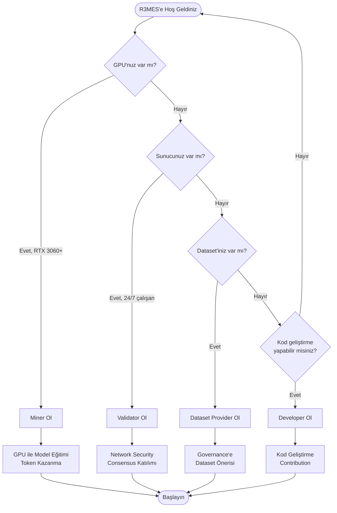

---

## 1. Kurucu (Founder/Creator) Kullanım Şeması

Kurucu, R3MES network'ünün ilk kurulumunu yapan, genesis state'i oluşturan ve network parametrelerini ayarlayan kişidir.

### 1.1 Kurucu Workflow

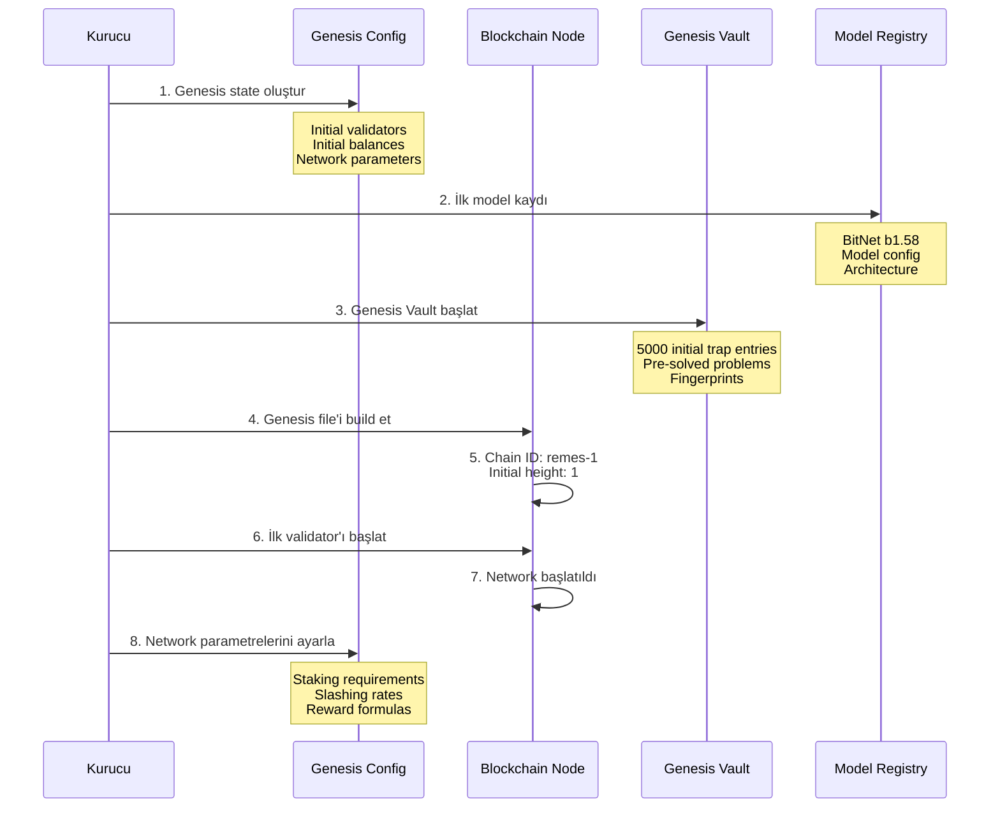

### 1.2 Genesis State Yapısı

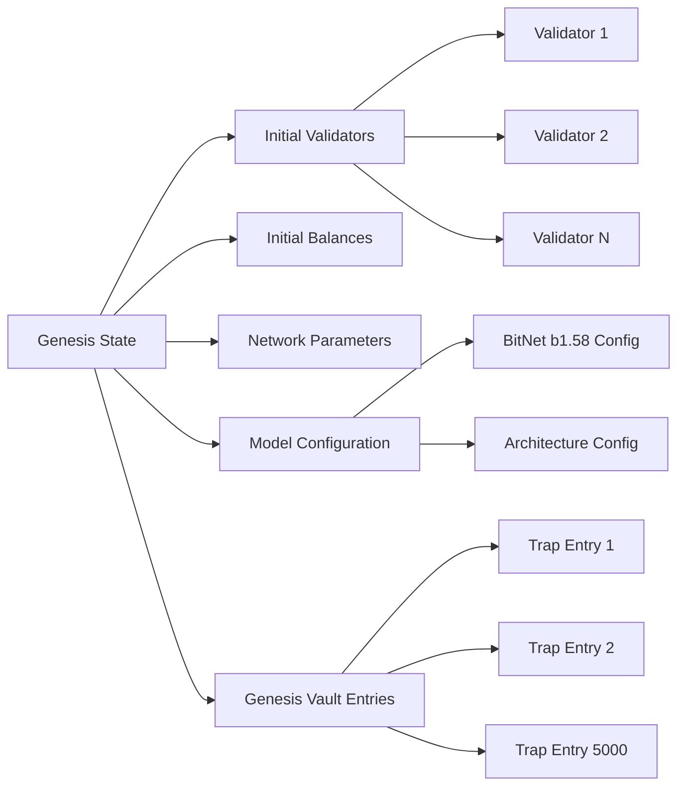

### 1.3 Kurucu İşlemleri

#### Genesis State Oluşturma

```bash
# Genesis file oluştur
./build/remesd init mynode --chain-id remes-1

# Genesis'teki parametreleri düzenle
# ~/.remesd/config/genesis.json
```

**Yapılandırılacak Parametreler:**
- Initial validator addresses ve stakes
- Initial token distribution
- Network parameters (block time, epoch duration)
- Model configuration (BitNet b1.58)
- Genesis vault entries (5000 trap jobs)

#### İlk Model Kaydı

```bash
# Model kayıt transaction'ı
./build/remesd tx remes register-model \
  --model-type MODEL_TYPE_BITNET \
  --model-version "b1.58" \
  --architecture-config "..." \
  --from founder \
  --chain-id remes-1 \
  --yes
```

#### Genesis Vault Başlatma

Genesis vault, 5000 önceden çözülmüş problem içerir. Bu problemler trap job olarak kullanılır.

```go
// Genesis vault entry structure
type GenesisVaultEntry struct {
    EntryID             uint64
    ExpectedGradientHash string
    ExpectedFingerprint  TopKFingerprint  // Top-K indices + values
    GpuArchitecture      string
    Encrypted            bool
    EncryptionKey        []byte  // Optional AES-256-GCM
}
```

---

## 2. Miner Kullanım Şeması

Miner, AI model eğitimi yaparak gradient submit eden ve token kazanan kullanıcıdır.

### 2.1 Miner Kayıt ve Başlangıç Workflow

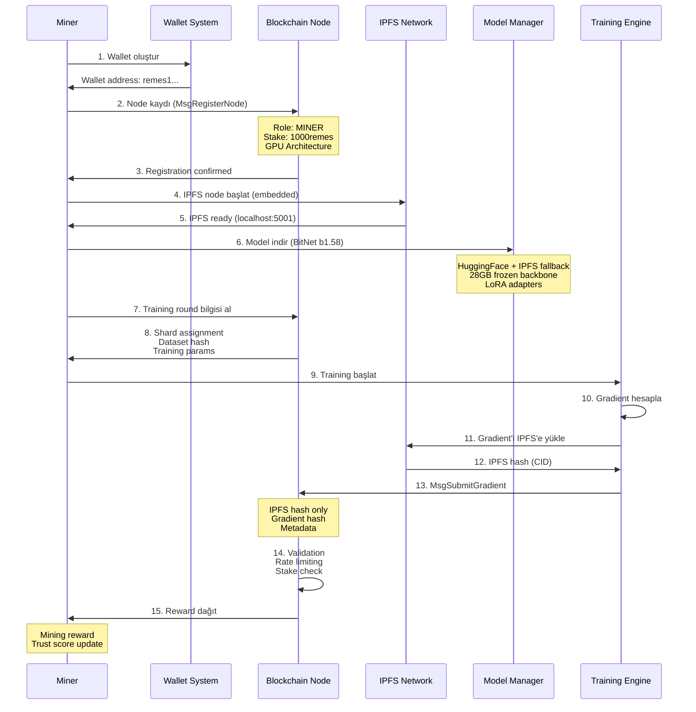

### 2.2 Gradient Submission Detaylı Akış

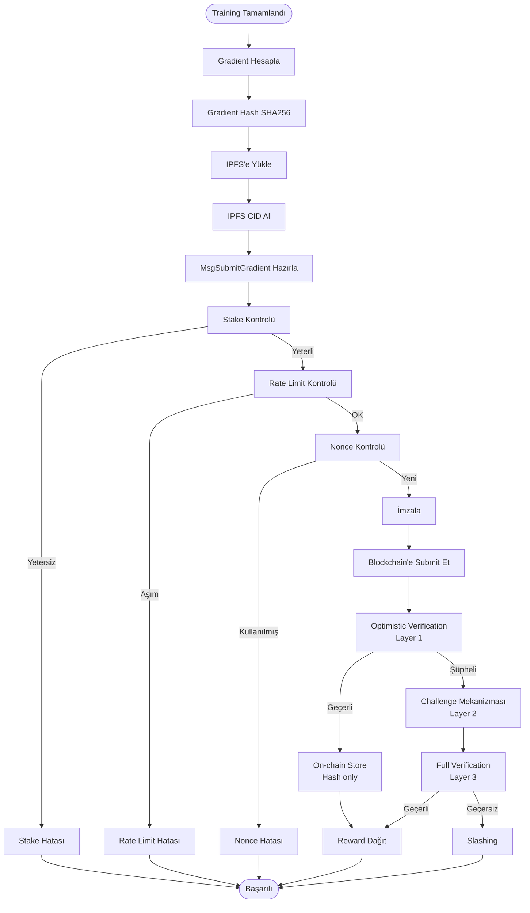

### 2.3 Miner İşlemleri

#### Node Kaydı

```bash
# Miner node kaydı
./build/remesd tx remes register-node \
  --node-address remes1abc... \
  --node-type NODE_TYPE_MINER \
  --roles MINER \
  --stake 1000remes \
  --resources "gpu:nvidia,ram:16gb" \
  --from miner \
  --chain-id remes-1 \
  --yes
```

#### PyPI ile Miner Kurulumu

```bash
# Miner engine kurulumu
pip install r3mes

# Setup wizard
r3mes-miner setup

# Mining başlatma
r3mes-miner start --continuous
```

#### Gradient Submission

```python
# Python miner engine içinde
gradient_hash = compute_gradient_hash(gradients)
ipfs_hash = upload_to_ipfs(gradients)  # Direct upload

# Submit to blockchain
msg = MsgSubmitGradient(
    miner="remes1abc...",
    ipfs_hash=ipfs_hash,
    gradient_hash=gradient_hash,
    model_version="b1.58",
    training_round_id=123,
    shard_id=23,
    token_count=2048,  # MUST be 2048
    nonce=next_nonce(),
    signature=sign_message(msg)
)

response = submit_transaction(msg)
```

### 2.4 Miner Dashboard Kullanımı

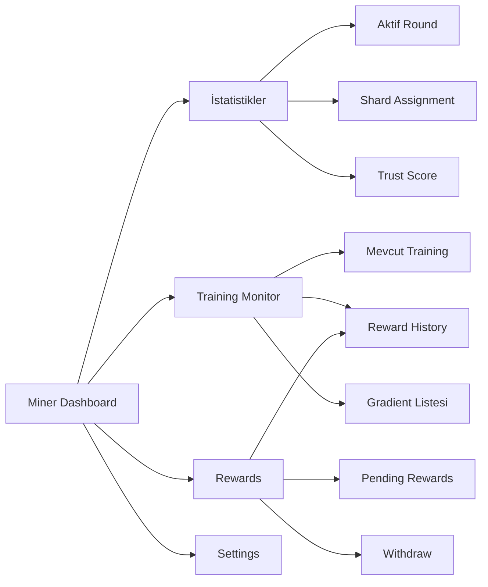

---

## 3. Validator Kullanım Şeması

Validator, transaction validation ve consensus'a katılan, network'ü güvende tutan node operatörüdür.

### 3.1 Validator Setup ve Consensus Workflow

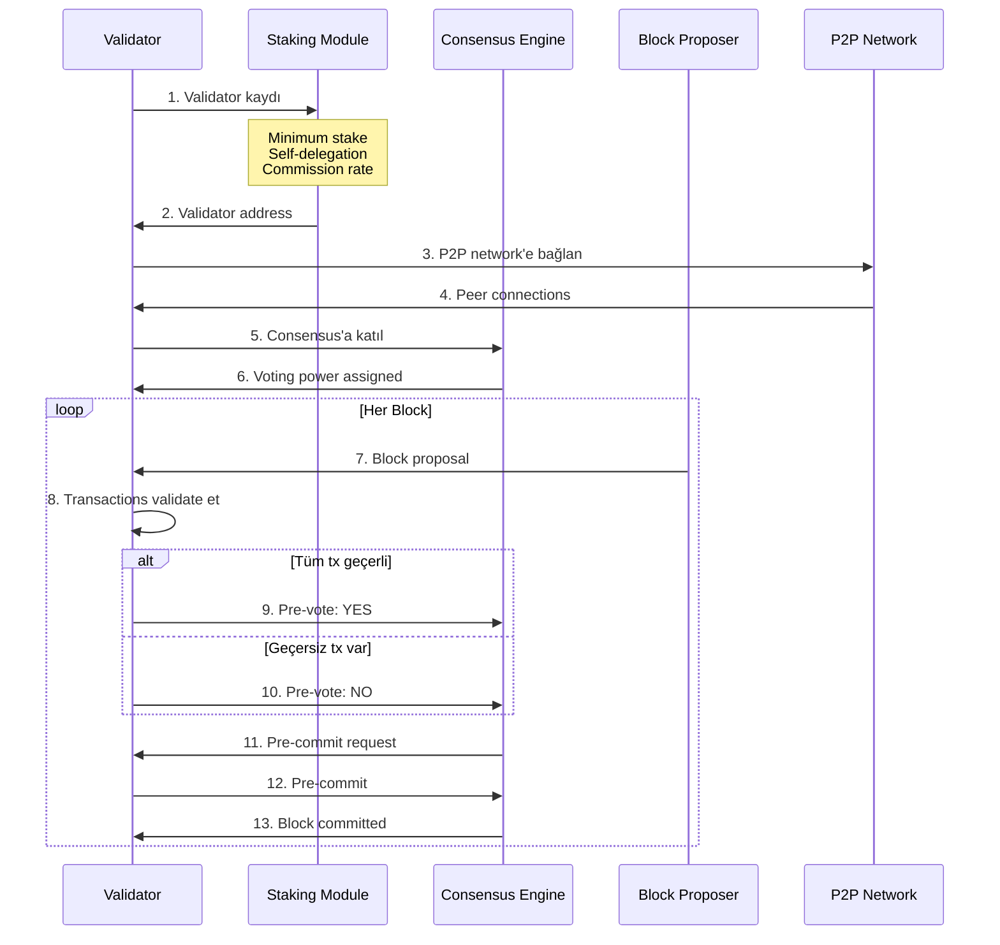

### 3.2 Trap Job Oluşturma Workflow

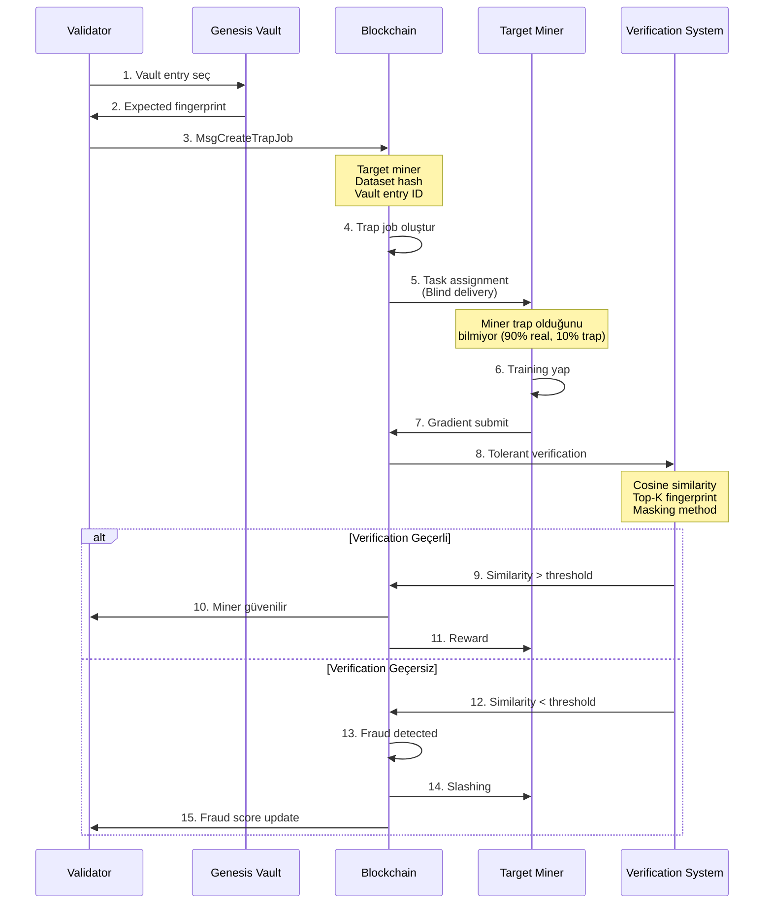

### 3.3 Validator İşlemleri

#### Validator Kaydı

```bash
# Validator node kaydı
./build/remesd tx remes register-node \
  --node-address remes1validator... \
  --node-type NODE_TYPE_VALIDATOR \
  --roles VALIDATOR \
  --stake 10000remes \
  --resources "cpu:8cores,ram:32gb,disk:500gb" \
  --from validator \
  --chain-id remes-1 \
  --yes

# Validator'ı staking modülüne kaydet
./build/remesd tx staking create-validator \
  --amount 10000remes \
  --pubkey $(./build/remesd tendermint show-validator) \
  --moniker "MyValidator" \
  --commission-rate "0.1" \
  --commission-max-rate "0.2" \
  --commission-max-change-rate "0.01" \
  --min-self-delegation "1000" \
  --from validator \
  --chain-id remes-1 \
  --yes
```

#### Trap Job Oluşturma

```bash
# Trap job oluştur (sadece validator'lar yapabilir)
./build/remesd tx remes create-trap-job \
  --target-miner remes1miner... \
  --dataset-ipfs-hash QmXxxx... \
  --vault-entry-id 123 \
  --from validator \
  --chain-id remes-1 \
  --yes
```

#### Governance Oylama

```bash
# Proposal'a oy ver
./build/remesd tx gov vote 1 yes \
  --from validator \
  --chain-id remes-1 \
  --yes
```

### 3.4 Validator Monitoring

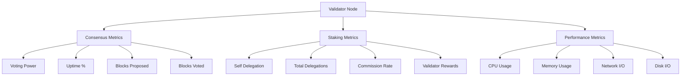

---

## 4. Developer Kullanım Şeması

Developer, R3MES kodunu geliştiren, test eden ve sisteme katkıda bulunan kişidir.

### 4.1 Development Environment Setup

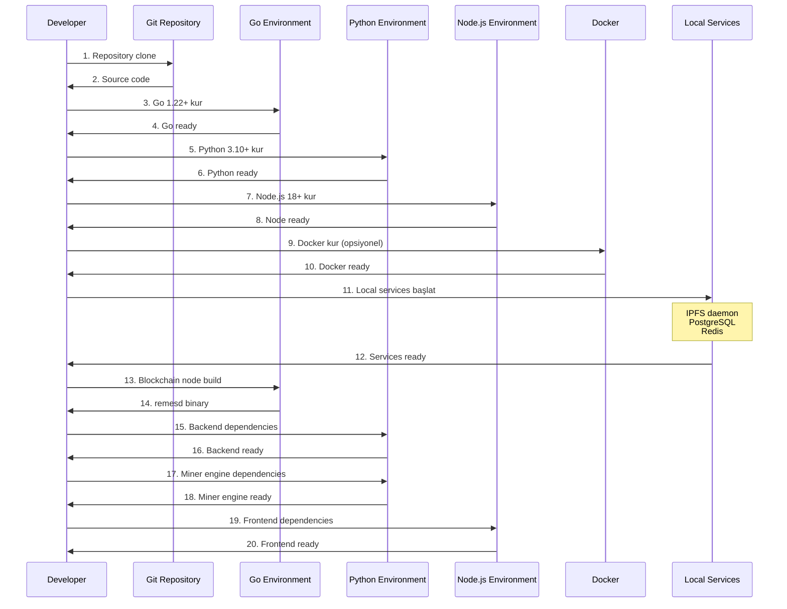

### 4.2 Development Workflow

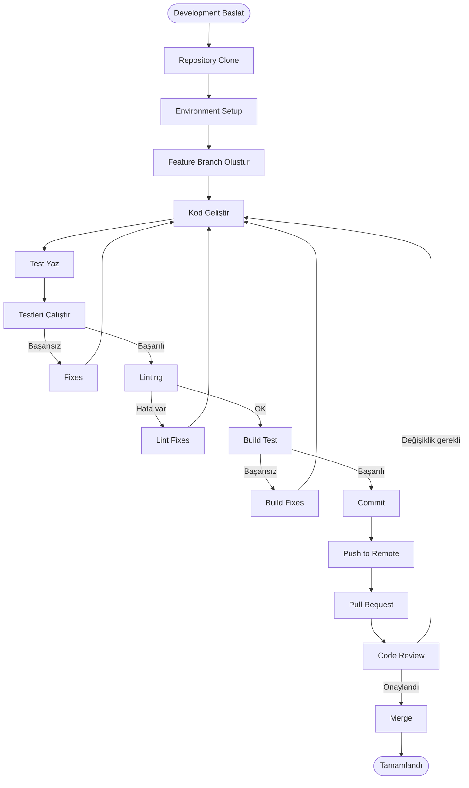

### 4.3 Developer İşlemleri

#### Local Development Setup

```bash
# 1. Repository clone
git clone https://github.com/r3mes/r3mes.git
cd r3mes

# 2. Blockchain node build
cd remes
go mod download
make build

# 3. Backend setup
cd ../backend
python3 -m venv venv
source venv/bin/activate
pip install -r requirements.txt

# 4. Miner engine setup
cd ../miner-engine
python3 -m venv venv
source venv/bin/activate
pip install -r requirements.txt
pip install -e .

# 5. Frontend setup
cd ../web-dashboard
npm install

# 6. Services başlat (Docker)
docker-compose up -d postgres redis ipfs

# 7. Local node başlat
cd remes
./build/remesd start --home ~/.remesd-local
```

#### Debug Mode Kullanımı

```bash
# Debug mode environment variables
export R3MES_DEBUG_MODE=true
export R3MES_DEBUG_LEVEL=verbose
export R3MES_DEBUG_COMPONENTS=blockchain,backend,miner
export R3MES_DEBUG_LOG_LEVEL=TRACE
export R3MES_DEBUG_LOG_FORMAT=json
export R3MES_DEBUG_LOG_FILE=~/.r3mes/debug.log

# Debug script ile başlat
./scripts/debug/start_debug_mode.sh
```

#### Testing

```bash
# Go tests
cd remes
go test ./x/remes/keeper/... -v

# Python tests
cd backend
pytest tests/ -v

# Miner engine tests
cd miner-engine
pytest tests/ -v

# Integration tests
cd tests/integration
python test_full_workflow.py
```

### 4.4 API Development

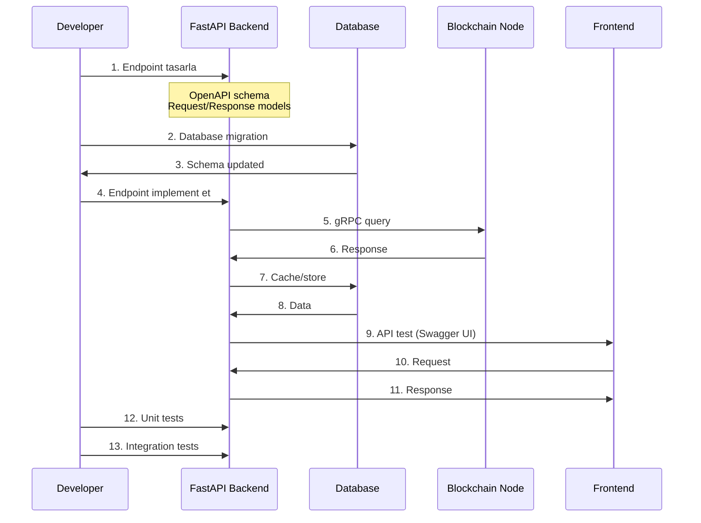

### 4.5 Contributing Workflow

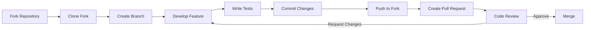

---

## Ortak İşlemler ve Araçlar

### Transaction Types

Tüm kullanıcılar aşağıdaki transaction türlerini kullanabilir:

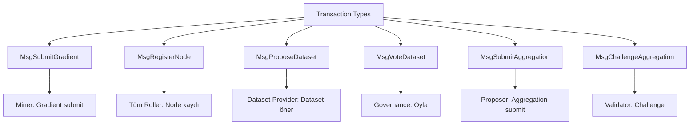

### CLI Araçları

```bash
# Wallet yönetimi
r3mes wallet create
r3mes wallet import <mnemonic|private_key>
r3mes wallet balance <address>

# Miner işlemleri
r3mes miner start
r3mes miner stop
r3mes miner status

# Node işlemleri
r3mes node start
r3mes node stop
r3mes node status

# Governance işlemleri
r3mes governance vote <proposal_id> <yes|no>
r3mes governance proposals
```

### Web Dashboard

Tüm kullanıcılar web dashboard'u kullanabilir:

- **Ana Sayfa**: Network overview
- **Chat**: AI inference (backend servisi)
- **Mine**: Miner console (miner'lar için)
- **Wallet**: Wallet yönetimi
- **Network**: Network statistics ve governance
- **Settings**: Kullanıcı ayarları
- **Help**: Dokümantasyon ve destek
- **Onboarding**: İlk kurulum rehberi

### API Endpoints

Tüm kullanıcılar REST API'yi kullanabilir:

```bash
# User info
GET /user/info/{wallet_address}

# Network stats
GET /network/stats

# Blocks
GET /blocks

# Chat (inference)
POST /chat

# Metrics
GET /metrics
```

---

## Sonuç

Bu dokümantasyon, R3MES ekosistemindeki farklı rollerin sistemle nasıl etkileşime girdiğini ve hangi işlemleri yapabileceklerini detaylı şemalarla açıklar. Her rol için özel workflow'lar, transaction akışları ve kullanım kılavuzları sağlanmıştır.

Daha detaylı bilgi için ilgili dokümantasyonlara bakınız:

- [User Onboarding Guides](./09_user_onboarding_guides.md)
- [Blockchain Infrastructure](./01_blockchain_infrastructure.md)
- [Governance System](./06_governance_system.md)
- [API Reference](./13_api_reference.md)
- [Debug Mode](./17_debug_mode.md)
