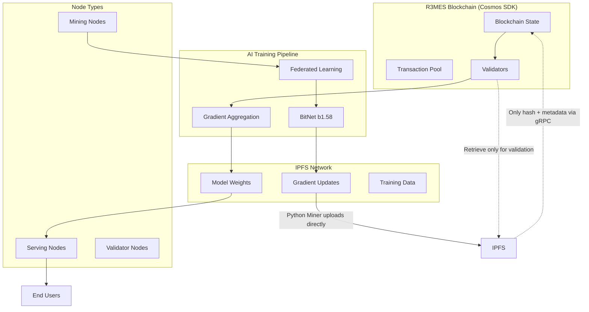

# R3MES Architecture Overview

**Version**: 1.0.0  
**Last Updated**: 2025-12-24  
**Part of**: [ARCHITECTURE_INDEX.md](ARCHITECTURE_INDEX.md)

---

## Overview

R3MES implements a revolutionary Proof of Useful Work (PoUW) consensus mechanism that transforms energy-intensive mining into productive AI model training. The system combines three cutting-edge technologies:

1. **BitNet b1.58 Architecture**: 1-bit quantized neural networks with LoRA (Low-Rank Adaptation) default training - frozen backbone weights combined with small trainable adapters for efficient training and minimal bandwidth requirements
2. **Transparent Distributed Training**: Decentralized training using governance-approved public datasets with verifiable contributions
3. **Cosmos SDK**: Custom blockchain with IPFS integration and economic incentives for data availability

The protocol creates a self-sustaining ecosystem where miners earn R3MES tokens by training AI models using verified datasets, serving nodes provide inference services, and validators maintain network security through a three-layer optimistic verification system (GPU-to-GPU fast path, high-stakes challenge, and CPU Iron Sandbox final arbiter).

**Consensus Architecture Clarification**: R3MES uses Tendermint consensus for block production and finality. PoUW is not a consensus mechanism but rather a block content validation and token inflation system. Traditional Cosmos SDK validators produce blocks, while PoUW determines the validity of training contributions and reward distribution within those blocks.

---

## High-Level System Architecture

---

## Network Topology

The R3MES network consists of three distinct node types with clear role separation:

1. **Mining Nodes**: Dedicated to BitNet model training using transparent distributed learning
2. **Serving Nodes**: Specialized for AI inference and model serving
3. **Validator Nodes**: Focused on transaction validation and consensus

This separation ensures optimal resource utilization and prevents performance conflicts between training, serving, and validation operations.

---

## R3MES Hybrid Architecture: Production-Ready Scalability

The R3MES protocol implements a hybrid architecture combining three critical scalability solutions:

1. **Sharded Pipeline & Off-Chain Storage**: Layer-based subnet architecture for bandwidth optimization
2. **Epoch-Based Async Rollup**: Window-based asynchronous gradient submission with lazy aggregation
3. **Three-Layer Optimistic Verification**: Fast GPU-to-GPU path (Layer 1), high-stakes challenge (Layer 2), and CPU Iron Sandbox final arbiter (Layer 3) with mandatory containerized execution and deterministic seed locking

### 1. Layer-Based Sharding (Subnet Architecture)

**Problem**: Full model downloads (28GB+) create network congestion when all miners download everything simultaneously.

**Solution**: Divide the network into specialized subnets, each training a subset of model layers.

**Key Benefits**:
- **90% Bandwidth Reduction**: Each miner downloads ~1-3GB for assigned layers instead of 28GB full model
- **Parallel Training**: Subnets train in parallel (pipeline parallelism)
- **Scalability**: Supports thousands of miners without network saturation
- **IPFS Integration**: IPFS handles data distribution, blockchain handles coordination

**Workflow**:
1. Subnet 1 trains layers 0-10, produces activations, stores on IPFS
2. Subnet 1 submits activation hash to blockchain (only hash, not full data)
3. Subnet 2 downloads activations from IPFS using hash, trains layers 11-20
4. Process continues through all subnets sequentially
5. Final subnet produces complete model update

For detailed implementation, see [ARCHITECTURE_COMPONENTS.md](ARCHITECTURE_COMPONENTS.md).

### 2. Window-Based Async Rollup (Epoch Extension)

**Problem**: Cosmos produces blocks every 5 seconds, but AI training takes minutes. Synchronous updates would block the chain.

**Solution**: Asynchronous gradient submission within training windows, with lazy aggregation at window boundaries.

**Key Benefits**:
- **Non-Blocking**: Blockchain never blocks on training (async submission)
- **Single Aggregation**: One aggregation transaction per window (not per miner)
- **Immediate Credit**: Miners get credit immediately, model updates at window boundaries
- **Scalability**: Supports thousands of concurrent miners

**Workflow**:
1. **Window Opens** (Block N): Training window starts, miners begin training assigned layers
2. **Async Submission** (Blocks N to N+100): 
   - Python miners train LoRA adapters and compute gradients
   - Python miners upload gradients DIRECTLY to IPFS (active role)
   - Python miners send ONLY IPFS hash + metadata via gRPC to Go node
   - Go node stores only hash + metadata on-chain (KB scale, not MB/GB scale)
   - Blockchain stores credit records (hash + miner attribution)
   - No model update occurs yet (non-blocking)
3. **Window Closes** (Block N+100): Window boundary reached
4. **Lazy Aggregation**: Assigned aggregator node (proposer):
   - Retrieves gradient hashes from blockchain
   - Downloads gradients from IPFS on-demand (passive retrieval)
   - Performs weighted averaging/aggregation off-chain
   - Stores aggregated result on IPFS
   - Submits single aggregation transaction to blockchain (only hash)
5. **Model Update**: Blockchain updates global model hash, notifies all miners

For detailed implementation, see [ARCHITECTURE_COMPONENTS.md](ARCHITECTURE_COMPONENTS.md).

### 3. Three-Layer Optimistic Verification System

**Problem**: Hardware differences, especially between GPU architectures, cause non-deterministic floating-point computation results. Traditional approaches requiring CPU verification for all hash mismatches create bottlenecks.

**Solution**: **Three-Layer Optimistic Verification System** with **Strict Deterministic Quantization-Aware Training (QAT)**, mandatory signed Docker containers, deterministic CUDA kernels, and **CPU Iron Sandbox** as final arbiter only for genuine disputes.

**Three-Layer Verification Flow**:

1. **Layer 1: GPU-to-GPU Verification (Optimistic - Default)**
   - **Speed**: ~1 block (fast path)
   - **Cost**: Minimal (hash comparison)
   - **Slashing**: None on acceptance (optimistic)
   - **Success Rate**: ~95% of cases
   - **Trigger**: All gradient submissions go through Layer 1 first
   - **Process**: Direct hash comparison for same GPU architecture, optimistic acceptance if match

2. **Layer 2: High-Stakes Challenge (Dispute Resolution)**
   - **Speed**: ~5 blocks (verifier response time)
   - **Cost**: Challenger must bond 10x base reward (e.g., 5,000 R3MES tokens)
   - **Slashing**: None until Layer 3 confirms fault
   - **Trigger**: If Layer 1 hash mismatch AND challenger disputes
   - **Random Verifier**: VRF-based selection, stake-weighted
   - **Bond Distribution**:
     - If challenge valid: Challenger gets bond back + fraud detection bounty (10-20x base reward)
     - If challenge invalid: Challenger loses bond (distributed to miner + validator)

3. **Layer 3: CPU Iron Sandbox (Final Arbiter)**
   - **Speed**: ~50 blocks (CPU computation)
   - **Cost**: High (CPU computation, validator panel)
   - **Slashing**: Only if CPU verification confirms fault
   - **Trigger**: Only if Layer 2 consensus supports challenge (random verifier agrees with challenger)
   - **Panel**: 3-validator panel (VRF selection, 2/3 consensus required)
   - **Result**: Final and binding
   - **Execution Mode**: CPU-only (GPU mode NEVER allowed for disputes)

**MANDATORY RULES**:
1. **Layer 1 First**: All gradient submissions go through Layer 1 (GPU-to-GPU) optimistic verification first
2. **Layer 2 Bond Requirement**: Challengers must bond 10x base reward to dispute Layer 1 results
3. **Layer 3 Trigger Condition**: CPU Iron Sandbox (Layer 3) is ONLY triggered if Layer 2 random verifier agrees with challenger
4. **Exact Hash Matching**: Always require 100% bit-exact gradient hash matching - no tolerance
5. **CPU Mode Enforcement**: Layer 3 validator panel MUST use CPU mode (not GPU) for dispute resolution to achieve bit-exact determinism
6. **Deterministic Kernels Required**: All miners MUST use NVIDIA cuEvol/Deterministic Algorithms for reproducible GPU computations
7. **No Slashing Until Layer 3**: Slashing only occurs after Layer 3 CPU verification confirms fault

For detailed security documentation, see [ARCHITECTURE_SECURITY.md](ARCHITECTURE_SECURITY.md).

---

## Hybrid Architecture Integration

The three solutions work together:

1. **Sharding** reduces bandwidth per miner (90% reduction)
2. **Async Rollup** prevents blockchain blocking (non-blocking submission)
3. **Iron Sandbox** ensures verification accuracy (deterministic execution)

**Complete Workflow Example**:
1. Window opens at Block 1000, subnet assignments distributed
2. Subnet 1 miners download only layers 0-10 (1GB instead of 28GB)
3. Miners train asynchronously:
   - Python miners upload gradients DIRECTLY to IPFS (active role)
   - Python miners send **only IPFS hash + metadata** via gRPC to Go node (KB scale)
   - Go node stores only hash on-chain, **never holds gradient data in memory**
4. Window closes at Block 1100, proposer performs lazy aggregation:
   - Proposer retrieves gradients from IPFS on-demand (passive role)
   - Aggregation happens off-chain (Python/Go proposer)
   - Only aggregated result hash submitted to blockchain
5. If dispute arises, three-layer verification system handles it:
   - Layer 1: GPU-to-GPU hash comparison (optimistic acceptance if match)
   - Layer 2: High-stakes challenge with bond requirement (if mismatch)
   - Layer 3: CPU Iron Sandbox verification (only if Layer 2 consensus supports challenge)
6. Model updates, next window begins

This hybrid architecture makes R3MES truly production-ready and scalable to thousands of miners while maintaining security and determinism.

---

## Related Documentation

- **[ARCHITECTURE_COMPONENTS.md](ARCHITECTURE_COMPONENTS.md)**: Detailed component documentation
- **[ARCHITECTURE_SECURITY.md](ARCHITECTURE_SECURITY.md)**: Security mechanisms and verification
- **[ARCHITECTURE_ECONOMICS.md](ARCHITECTURE_ECONOMICS.md)**: Economic model and incentives
- **[ARCHITECTURE_IMPLEMENTATION.md](ARCHITECTURE_IMPLEMENTATION.md)**: Implementation guide

---

**Last Updated**: 2025-12-24

