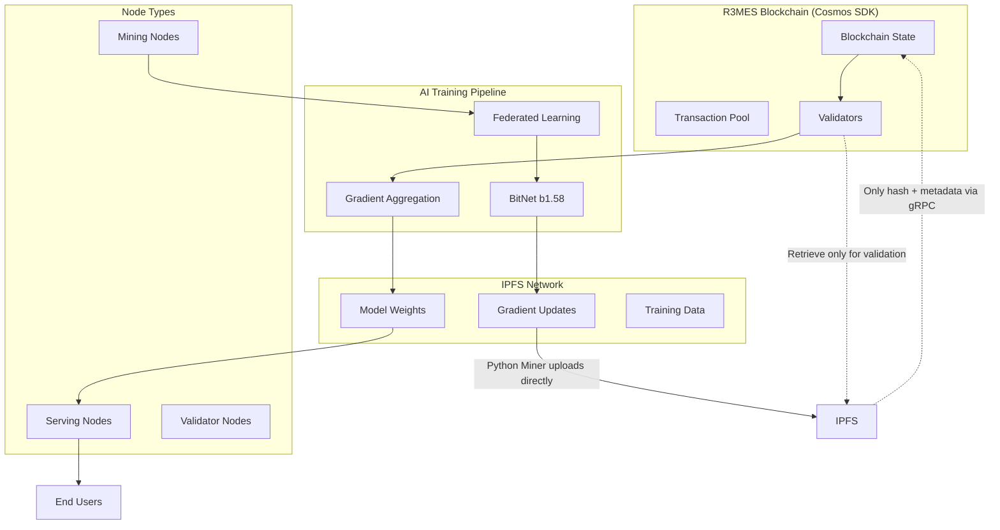

# R3MES PoUW Protocol - Design Document

## Overview

R3MES implements a revolutionary Proof of Useful Work (PoUW) consensus mechanism that transforms energy-intensive mining into productive AI model training. The system combines three cutting-edge technologies:

1. **BitNet b1.58 Architecture**: 1-bit quantized neural networks with LoRA (Low-Rank Adaptation) default training - frozen backbone weights combined with small trainable adapters for efficient training and minimal bandwidth requirements
2. **Transparent Distributed Training**: Decentralized training using governance-approved public datasets with verifiable contributions
3. **Cosmos SDK**: Custom blockchain with IPFS integration and economic incentives for data availability

The protocol creates a self-sustaining ecosystem where miners earn R3MES tokens by training AI models using verified datasets, serving nodes provide inference services, and validators maintain network security through a three-layer optimistic verification system (GPU-to-GPU fast path, high-stakes challenge, and CPU Iron Sandbox final arbiter).

**Consensus Architecture Clarification**: R3MES uses Tendermint consensus for block production and finality. PoUW is not a consensus mechanism but rather a block content validation and token inflation system. Traditional Cosmos SDK validators produce blocks, while PoUW determines the validity of training contributions and reward distribution within those blocks.

## Architecture

### High-Level System Architecture



### Network Topology

The R3MES network consists of three distinct node types with clear role separation:

1. **Mining Nodes**: Dedicated to BitNet model training using transparent distributed learning
2. **Serving Nodes**: Specialized for AI inference and model serving
3. **Validator Nodes**: Focused on transaction validation and consensus

This separation ensures optimal resource utilization and prevents performance conflicts between training, serving, and validation operations.

### R3MES Hybrid Architecture: Production-Ready Scalability

The R3MES protocol implements a hybrid architecture combining three critical scalability solutions:

1. **Sharded Pipeline & Off-Chain Storage**: Layer-based subnet architecture for bandwidth optimization
2. **Epoch-Based Async Rollup**: Window-based asynchronous gradient submission with lazy aggregation
3. **Three-Layer Optimistic Verification**: Fast GPU-to-GPU path (Layer 1), high-stakes challenge (Layer 2), and CPU Iron Sandbox final arbiter (Layer 3) with mandatory containerized execution and deterministic seed locking

#### 1. Layer-Based Sharding (Subnet Architecture)

**Problem**: Full model downloads (28GB+) create network congestion when all miners download everything simultaneously.

**Solution**: Divide the network into specialized subnets, each training a subset of model layers.

```go
// Subnet configuration for layer-based sharding
type SubnetConfig struct {
    SubnetID        uint64   `json:"subnet_id"`
    LayerRange      LayerRange `json:"layer_range"`      // e.g., layers 0-10, 11-20, etc.
    AssignedMiners  []string `json:"assigned_miners"`    // Miners assigned to this subnet
    ActivationHash  string   `json:"activation_hash"`   // IPFS hash of layer activations
    NextSubnetID    uint64   `json:"next_subnet_id"`     // Subnet that receives activations
    Status          string   `json:"status"`             // "active", "aggregating", "completed"
}

type LayerRange struct {
    StartLayer uint64 `json:"start_layer"`
    EndLayer   uint64 `json:"end_layer"`
}

// Subnet-based training workflow
type SubnetTrainingWorkflow struct {
    WindowID        uint64   `json:"window_id"`
    Subnets         []SubnetConfig `json:"subnets"`
    ActivationChain []string `json:"activation_chain"`  // IPFS hashes linking subnet outputs
    GlobalSeed      []byte   `json:"global_seed"`       // Deterministic seed from block hash
}

// Subnet assignment based on miner resources and stake
func AssignMinerToSubnet(minerAddress string, totalSubnets uint64, blockHash []byte) uint64 {
    seed := append([]byte(minerAddress), blockHash...)
    hash := sha256.Sum256(seed)
    subnetID := binary.BigEndian.Uint64(hash[:8]) % totalSubnets
    return subnetID
}

// Activation transmission between subnets
type ActivationTransmission struct {
    FromSubnetID    uint64   `json:"from_subnet_id"`
    ToSubnetID      uint64   `json:"to_subnet_id"`
    ActivationHash  string   `json:"activation_hash"`   // IPFS hash of layer activations
    LayerOutput     string   `json:"layer_output"`       // Compressed activation data
    Timestamp       int64    `json:"timestamp"`
    Signature       []byte   `json:"signature"`         // Subnet proposer signature
}
```

**Workflow:**
1. **Subnet 1** trains layers 0-10, produces activations, stores on IPFS
2. **Subnet 1** submits activation hash to blockchain (only hash, not full data)
3. **Subnet 2** downloads activations from IPFS using hash, trains layers 11-20
4. Process continues through all subnets sequentially
5. Final subnet produces complete model update

**Bandwidth Reduction:**
- Traditional: Each miner downloads 28GB full model → Network congestion
- Sharded: Each miner downloads ~1-3GB for assigned layers → 90% bandwidth reduction
- Blockchain: Only manages hash traffic (KB), not full data (GB)

**Benefits:**
- Parallel training across subnets (pipeline parallelism)
- Reduced per-miner bandwidth requirements
- Scalable to thousands of miners without network saturation
- IPFS handles data distribution, blockchain handles coordination

#### 2. Window-Based Async Rollup (Epoch Extension)

**Problem**: Cosmos produces blocks every 5 seconds, but AI training takes minutes. Synchronous updates would block the chain.

**Solution**: Asynchronous gradient submission within training windows, with lazy aggregation at window boundaries.

```go
// Training window structure
type TrainingWindow struct {
    WindowID        uint64    `json:"window_id"`
    StartHeight     int64     `json:"start_height"`
    EndHeight       int64     `json:"end_height"`       // StartHeight + 100 blocks (~8-10 minutes)
    Status          string    `json:"status"`            // "collecting", "aggregating", "finalized"
    GradientHashes  []string  `json:"gradient_hashes"`   // IPFS hashes submitted during window
    AggregatorNode  string    `json:"aggregator_node"`   // Proposer assigned to aggregate
    AggregationHash string    `json:"aggregation_hash"`  // Final aggregated result on IPFS
    ModelUpdateHash string    `json:"model_update_hash"` // Updated model weights on IPFS
}

// Async gradient submission (non-blocking) - Python miner uploads directly to IPFS
type AsyncGradientSubmission struct {
    WindowID       uint64   `json:"window_id"`
    MinerAddress   string   `json:"miner_address"`
    GradientHash   string   `json:"gradient_hash"`       // IPFS hash - Python miner uploaded gradient directly to IPFS
    SubnetID       uint64   `json:"subnet_id"`          // Which subnet this belongs to
    LayerRange     LayerRange `json:"layer_range"`       // Which layers were trained
    Timestamp      int64    `json:"timestamp"`
    CreditRecord   bool     `json:"credit_record"`      // On-chain credit, not immediate update
    
    // NOTE: This struct contains only IPFS hash, not gradient data
    // Python miner uploaded gradient data directly to IPFS before creating this submission
}

// Lazy aggregation at window boundary
type LazyAggregation struct {
    WindowID         uint64   `json:"window_id"`
    AggregatorNode   string   `json:"aggregator_node"`
    CollectedGradients []string `json:"collected_gradients"` // All gradient hashes in window
    AggregationMethod string   `json:"aggregation_method"`   // "weighted_average", "median", "trimmed_mean"
    ResultHash       string   `json:"result_hash"`          // IPFS hash of aggregated result
    MerkleRoot       []byte   `json:"merkle_root"`          // Merkle root for verification
    SubmissionHeight int64    `json:"submission_height"`   // When aggregation submitted to chain
}
```

**Workflow:**
1. **Window Opens** (Block N): Training window starts, miners begin training assigned layers
2. **Async Submission** (Blocks N to N+100): 
   - **Python miners** train LoRA adapters and compute gradients
   - **Python miners upload gradients DIRECTLY to IPFS** (active role, not via gRPC)
   - **Python miners send ONLY IPFS hash + metadata** via gRPC (MsgSubmitGradient) to Go node
   - **Go node stores only hash + metadata** on-chain (KB scale, not MB/GB scale)
   - Blockchain stores credit records (hash + miner attribution)
   - No model update occurs yet (non-blocking)
   - **Memory Efficient**: Go node never holds gradient data in memory during submission
3. **Window Closes** (Block N+100): Window boundary reached
4. **Lazy Aggregation**: Assigned aggregator node (proposer):
   - Retrieves gradient hashes from blockchain
   - **Downloads gradients from IPFS on-demand** (passive retrieval for aggregation)
   - Performs weighted averaging/aggregation off-chain
   - Stores aggregated result on IPFS
   - Submits single aggregation transaction to blockchain (only hash, not aggregated data)
5. **Model Update**: Blockchain updates global model hash, notifies all miners

**Benefits:**
- Blockchain never blocks on training (async submission)
- Single aggregation transaction per window (not per miner)
- Miners get credit immediately, model updates at window boundaries
- Scalable to thousands of concurrent miners

#### 3. Three-Layer Optimistic Verification System (Deterministic Execution Enforcement with GPU Architecture Tolerance)

**Problem**: Hardware differences, especially between GPU architectures (Pascal, Ampere, Blackwell, etc.), cause non-deterministic floating-point computation results. Traditional approaches requiring CPU verification for all hash mismatches create bottlenecks.

**Solution**: **Three-Layer Optimistic Verification System** with **Strict Deterministic Quantization-Aware Training (QAT)**, mandatory signed Docker containers, deterministic CUDA kernels, and **CPU Iron Sandbox** as final arbiter only for genuine disputes - optimizing for speed while maintaining security.

**Three-Layer Verification Flow:**

1. **Layer 1: GPU-to-GPU Verification (Optimistic - Default)**
   - **Speed**: ~1 block (fast path)
   - **Cost**: Minimal (hash comparison)
   - **Slashing**: None on acceptance (optimistic)
   - **Success Rate**: ~95% of cases
   - **Trigger**: All gradient submissions go through Layer 1 first
   - **Process**: Direct hash comparison for same GPU architecture, optimistic acceptance if match

2. **Layer 2: High-Stakes Challenge (Dispute Resolution)**
   - **Speed**: ~5 blocks (verifier response time)
   - **Cost**: Challenger must bond 10x base reward (e.g., 5,000 R3MES tokens)
   - **Slashing**: None until Layer 3 confirms fault
   - **Trigger**: If Layer 1 hash mismatch AND challenger disputes
   - **Random Verifier**: VRF-based selection, stake-weighted
   - **Bond Distribution**:
     - If challenge valid: Challenger gets bond back + fraud detection bounty (10-20x base reward)
     - If challenge invalid: Challenger loses bond (distributed to miner + validator)

3. **Layer 3: CPU Iron Sandbox (Final Arbiter)**
   - **Speed**: ~50 blocks (CPU computation)
   - **Cost**: High (CPU computation, validator panel)
   - **Slashing**: Only if CPU verification confirms fault
   - **Trigger**: Only if Layer 2 consensus supports challenge (random verifier agrees with challenger)
   - **Panel**: 3-validator panel (VRF selection, 2/3 consensus required)
   - **Result**: Final and binding
   - **Execution Mode**: CPU-only (GPU mode NEVER allowed for disputes)

```go
// Signed Docker container requirement
type SignedContainerSpec struct {
    ImageName       string            `json:"image_name"`        // "r3mes/training:v1.0"
    ImageHash       string            `json:"image_hash"`        // SHA256 of Docker image
    Signature       []byte            `json:"signature"`        // Protocol team signature
    RequiredVersion string            `json:"required_version"` // "ubuntu22.04-cuda12.1-pytorch2.1.0"
    LockedPackages  map[string]string `json:"locked_packages"`  // Exact versions required
    Checksum        []byte            `json:"checksum"`          // Environment integrity hash
}

// Global seed locking from block hash
type GlobalSeedLock struct {
    WindowID        uint64   `json:"window_id"`
    BlockHash       []byte   `json:"block_hash"`        // Block hash at window start
    DerivedSeed     uint64   `json:"derived_seed"`      // Deterministic seed from hash
    PyTorchSeed     uint64   `json:"pytorch_seed"`     // torch.manual_seed(seed)
    NumPySeed       uint64   `json:"numpy_seed"`        // np.random.seed(seed)
    CUDASeed        uint64   `json:"cuda_seed"`         // torch.cuda.manual_seed_all(seed)
    Timestamp       int64    `json:"timestamp"`
}

// GPU architecture information for deterministic execution
type GPUArchitecture struct {
    Architecture    string   `json:"architecture"`     // "pascal", "volta", "turing", "ampere", "ada", "blackwell"
    ComputeCapability string `json:"compute_capability"` // e.g., "8.0", "8.6", "8.9"
    TensorCoreSupport bool   `json:"tensor_core_support"` // Whether Tensor Cores are available
    DeterministicMode bool   `json:"deterministic_mode"`  // Whether deterministic algorithms are enabled
    CUDAVersion      string   `json:"cuda_version"`       // e.g., "12.1"
}

// Deterministic verification configuration (no tolerance - exact matching only)
type DeterministicVerification struct {
    GPUArchitecture      GPUArchitecture `json:"gpu_architecture"`
    RequireExactMatch    bool            `json:"require_exact_match"`     // Always true - no tolerance
    GradientHashMatch    bool            `json:"gradient_hash_match"`     // 100% bit-exact matching required
    CPUFallbackEnabled   bool            `json:"cpu_fallback_enabled"`    // CPU Iron Sandbox for disputes
    DeterministicKernels bool            `json:"deterministic_kernels"`   // NVIDIA cuEvol/Deterministic required
}

// CPU Iron Sandbox verification for disputes (MANDATORY when hash mismatch occurs)
type CPUVerification struct {
    ChallengeID          string   `json:"challenge_id"`
    DisputedGradient     string   `json:"disputed_gradient"`     // IPFS hash of disputed result
    ValidatorPanel       []string `json:"validator_panel"`       // 3 randomly selected validators
    ExecutionMode        string   `json:"execution_mode"`         // MUST be "CPU" for disputes (bit-exact)
    ExpectedResult       []byte   `json:"expected_result"`         // Pre-computed CPU result hash
    VerificationDeadline int64    `json:"verification_deadline"`  // 50 blocks to verify
    ConsensusResult      string   `json:"consensus_result"`       // "valid", "invalid", "inconclusive"
    HashMismatchDetected bool     `json:"hash_mismatch_detected"` // Whether gradient hash mismatch occurred
    RequiresDeterministicExecution bool `json:"requires_deterministic_execution"` // CPU mode for bit-exact results
}
```

**Enforcement Mechanisms:**

1. **Container Validation**:
   ```python
   # Miner must use signed container
   docker_image = "r3mes/training:v1.0"
   image_hash = verify_signature(docker_image, protocol_signature)
   if not image_hash:
       reject_submission("Invalid container signature")
   ```

2. **Seed Locking**:
   ```python
   # Inside Docker container
   global_seed = derive_seed_from_block_hash(window_id, block_hash)
   torch.manual_seed(global_seed)
   torch.cuda.manual_seed_all(global_seed)
   np.random.seed(global_seed)
   # All randomness now deterministic
   ```

3. **GPU Architecture-Aware Gradient Verification with Floating-Point Precision Handling**:
   ```go
   // GPU architecture-aware gradient verification
   // Handles floating-point precision differences between GPU architectures (Ampere vs Ada, etc.)
   func VerifyGradientWithGPUArchitecture(minerGradientHash string, validatorGradientHash string, 
                                         minerGPU GPUArchitecture, validatorGPU GPUArchitecture) VerificationResult {
       // Step 1: Check if same GPU architecture - direct hash comparison
       if minerGPU.Architecture == validatorGPU.Architecture {
           // Same architecture: Require exact hash match (bit-exact)
           if minerGradientHash == validatorGradientHash {
               return VerificationResult{
                   Valid: true,
                   Reason: "exact_hash_match_same_architecture",
                   HashMatch: true,
               }
           }
           // Same architecture but hash mismatch - likely fraud or non-deterministic execution
           return VerificationResult{
               Valid: false,
               Reason: "hash_mismatch_same_architecture",
               RequiresCPUVerification: true, // MANDATORY CPU fallback
               HashMatch: false,
           }
       }
       
       // Step 2: Different GPU architectures - check architecture whitelist
       minerConfig := GetGPUArchitectureConfig(minerGPU.Architecture)
       validatorConfig := GetGPUArchitectureConfig(validatorGPU.Architecture)
       
       if !minerConfig.Whitelisted || !validatorConfig.Whitelisted {
           return VerificationResult{
               Valid: false,
               Reason: "unsupported_gpu_architecture",
               HashMatch: false,
           }
       }
       
       // Step 3: Different architectures - MANDATORY CPU verification (no tolerance)
       // Floating-point differences (0.0000001) between Ampere and Ada are expected
       // CPU Iron Sandbox provides bit-exact resolution
       return VerificationResult{
           Valid: false,
           Reason: "cross_architecture_verification_required",
           RequiresCPUVerification: true, // MANDATORY for cross-architecture disputes
           HashMatch: false,
           CrossArchitecture: true,
       }
   }
   
   // GPU architecture detection from gradient metadata
   func DetectGPUArchitecture(metadata GradientMetadata) GPUArchitecture {
       return GPUArchitecture{
           Architecture:      metadata.GPUArchitecture,
           ComputeCapability: metadata.ComputeCapability,
           DeterministicMode: true, // Assumed if using signed containers
           CUDAVersion:       "12.1", // From container spec
       }
   }
   
   // Architecture-specific comparison (only compare same architectures directly)
   func ShouldCompareDirectly(minerGPU GPUArchitecture, validatorGPU GPUArchitecture) bool {
       return minerGPU.Architecture == validatorGPU.Architecture
   }
   ```

4. **MANDATORY CPU Verification Panel for Disputes**:
   ```go
   // MANDATORY RULE: When hash mismatch occurs, CPU Iron Sandbox verification is REQUIRED
   func InitiateCPUVerification(disputedGradient string, hashMismatchDetected bool, 
                                minerGPU GPUArchitecture, validatorGPU GPUArchitecture) CPUVerification {
       validators := selectRandomValidators(3) // VRF-based selection
       
       // MANDATORY: Execution mode MUST be CPU for bit-exact determinism
       return CPUVerification{
           ChallengeID:              generateChallengeID(),
           DisputedGradient:         disputedGradient,
           ValidatorPanel:           validators,
           ExecutionMode:            "CPU", // MANDATORY: Must be CPU mode for disputes
           VerificationDeadline:     currentHeight + 50, // 50 blocks to verify
           HashMismatchDetected:     hashMismatchDetected,
           RequiresDeterministicExecution: true, // CPU mode ensures bit-exact results
       }
   }
   
   // MANDATORY RULE: Validators MUST run in CPU mode for dispute resolution
   // CPU mode provides bit-exact deterministic results across all hardware
   func ExecuteCPUVerification(challenge CPUVerification) CPUVerificationResult {
       // MANDATORY: Force CPU execution mode
       if challenge.ExecutionMode != "CPU" {
           panic("CPU verification MUST use CPU mode - ExecutionMode violation")
       }
       
       // Validators download disputed gradient from IPFS
       disputedGradient := retrieveGradientFromIPFS(challenge.DisputedGradient)
       
       // Each validator runs computation in CPU mode (bit-exact)
       validatorResults := make([]CPUResult, 0, len(challenge.ValidatorPanel))
       for _, validator := range challenge.ValidatorPanel {
           result := runComputationCPU(disputedGradient, validator) // CPU mode enforced
           validatorResults = append(validatorResults, result)
       }
       
       // Consensus: 2/3 validators must agree
       consensusResult := reachConsensus(validatorResults)
       
       return CPUVerificationResult{
           ChallengeID:     challenge.ChallengeID,
           ConsensusResult: consensusResult,
           ValidatorResults: validatorResults,
       }
   }
   
   // MANDATORY RULE: If hash mismatch occurs, CPU Iron Sandbox verification is automatically triggered
   func HandleGradientDispute(minerGradientHash string, validatorGradientHash string,
                              minerGPU GPUArchitecture, validatorGPU GPUArchitecture) DisputeResolution {
       // First attempt: Exact hash matching (deterministic verification)
       verificationResult := VerifyGradientDeterministic(minerGradientHash, validatorGradientHash, 
                                                        minerGPU, validatorGPU)
       
       if verificationResult.Valid {
           return DisputeResolution{
               Status: "resolved_exact_match",
               Action: "accept_gradient",
           }
       }
       
       // MANDATORY: Hash mismatch detected - CPU Iron Sandbox verification REQUIRED
       if verificationResult.RequiresCPUVerification {
           cpuChallenge := InitiateCPUVerification(
               minerGradientHash,
               true,  // hash mismatch detected
               minerGPU,
               validatorGPU,
           )
           
           cpuResult := ExecuteCPUVerification(cpuChallenge)
           
           // CPU verification is final - bit-exact determinism
           if cpuResult.ConsensusResult == "valid" {
               return DisputeResolution{
                   Status: "resolved_cpu_iron_sandbox",
                   Action: "accept_gradient",
                   CPUVerificationResult: cpuResult,
               }
           } else {
               return DisputeResolution{
                   Status: "resolved_cpu_iron_sandbox",
                   Action: "reject_gradient_slash_miner",
                   CPUVerificationResult: cpuResult,
               }
           }
       }
       
       // Should never reach here if RequiresCPUVerification is true
       panic("CPU Iron Sandbox verification required but not triggered")
   }
   ```

**Deterministic Flags in Container**:
```python
# PyTorch deterministic configuration
torch.backends.cudnn.deterministic = True
torch.backends.cudnn.benchmark = False
torch.use_deterministic_algorithms(True, warn_only=False)

# NumPy deterministic
np.random.seed(global_seed)

# Environment variables
os.environ['PYTHONHASHSEED'] = str(global_seed)
os.environ['CUBLAS_WORKSPACE_CONFIG'] = ':4096:8'  # Deterministic CUDA
```

**Benefits:**
- **Optimistic Fast Path**: Layer 1 enables ~95% of cases to complete in ~1 block without slashing
- **High-Stakes Challenge Protection**: Layer 2 bond requirement (10x base reward) prevents frivolous disputes and DoS attacks
- **CPU Iron Sandbox Final Arbiter**: Layer 3 provides bit-exact deterministic resolution only for genuine disputes
- **Strict Deterministic Quantization**: Fixed-point arithmetic and deterministic CUDA kernels ensure bit-exact results across all GPU architectures
- **Exact Hash Matching**: 100% gradient hash match requirement eliminates floating-point non-determinism issues
- **NVIDIA cuEvol/Deterministic Algorithms**: Required deterministic CUDA kernels ensure reproducible results
- **Apache Arrow Flight Integration**: Zero-copy tensor transfer reduces latency and serialization overhead
- **Signed Containers**: Prevent tampering and ensure software version consistency
- **Seed Synchronization**: Global seed locking ensures deterministic execution across all miners
- **Validator Panel Consensus**: 2/3 validator agreement required for Layer 3 CPU Iron Sandbox verification results

**MANDATORY RULES:**
1. **Layer 1 First**: All gradient submissions go through Layer 1 (GPU-to-GPU) optimistic verification first
2. **Layer 2 Bond Requirement**: Challengers must bond 10x base reward to dispute Layer 1 results
3. **Layer 3 Trigger Condition**: CPU Iron Sandbox (Layer 3) is ONLY triggered if Layer 2 random verifier agrees with challenger
4. **Exact Hash Matching**: Always require 100% bit-exact gradient hash matching - no tolerance
5. **CPU Mode Enforcement**: Layer 3 validator panel MUST use CPU mode (not GPU) for dispute resolution to achieve bit-exact determinism
6. **Deterministic Kernels Required**: All miners MUST use NVIDIA cuEvol/Deterministic Algorithms for reproducible GPU computations
7. **No Slashing Until Layer 3**: Slashing only occurs after Layer 3 CPU verification confirms fault

### Hybrid Architecture Integration

The three solutions work together:

1. **Sharding** reduces bandwidth per miner (90% reduction)
2. **Async Rollup** prevents blockchain blocking (non-blocking submission)
3. **Iron Sandbox** ensures verification accuracy (deterministic execution)

**Complete Workflow Example:**
1. Window opens at Block 1000, subnet assignments distributed
2. Subnet 1 miners download only layers 0-10 (1GB instead of 28GB)
3. Miners train asynchronously:
   - **Python miners upload gradients DIRECTLY to IPFS** (active role)
   - Python miners send **only IPFS hash + metadata** via gRPC to Go node (KB scale)
   - Go node stores only hash on-chain, **never holds gradient data in memory**
4. Window closes at Block 1100, proposer performs lazy aggregation:
   - Proposer retrieves gradients from IPFS on-demand (passive role)
   - Aggregation happens off-chain (Python/Go proposer)
   - Only aggregated result hash submitted to blockchain
5. If dispute arises, three-layer verification system handles it:
   - Layer 1: GPU-to-GPU hash comparison (optimistic acceptance if match)
   - Layer 2: High-stakes challenge with bond requirement (if mismatch)
   - Layer 3: CPU Iron Sandbox verification (only if Layer 2 consensus supports challenge)
6. Model updates, next window begins

This hybrid architecture makes R3MES truly production-ready and scalable to thousands of miners while maintaining security and determinism.

## Components and Interfaces

### 1. Blockchain Layer (Cosmos SDK)

**Core Modules:**
- `x/remes`: Main PoUW module handling gradient submissions, aggregation coordination, mining rewards, and distributed learning coordination with Merkle proof verification
- `x/bank`: Token transfers and balance management (Cosmos SDK standard module)
- `x/staking`: Validator staking and consensus participation (Cosmos SDK standard module)
- `x/gov`: Protocol governance and parameter updates (Cosmos SDK standard module)
- `x/slashing`: Slashing penalties for malicious behavior (Cosmos SDK standard module)
- **Note**: IPFS integration, serving infrastructure, and dataset governance are implemented within `x/remes` module rather than separate modules for simplicity and efficiency

**Key Message Types:**
```go
type MsgSubmitGradient struct {
    Miner       string            // Miner address
    IPFSHash    string            // IPFS content hash (CID) - Python miner uploaded gradient directly to IPFS
    Metadata    GradientMetadata  // Gradient metadata (not full gradient data)
    ProofOfWork []byte            // Proof of work / training proof
    Timestamp   int64             // Submission timestamp
    
    // NOTE: This message contains NO gradient data - only hash + metadata
    // Python miner uploads gradient data directly to IPFS before sending this message
    // Go node stores only hash on-chain, never holds gradient data in memory
}

type GradientMetadata struct {
    LayerCount      uint64    `json:"layer_count"`
    GradientSize    uint64    `json:"gradient_size"`   // Size in bytes
    DataShardID     uint64    `json:"data_shard_id"`
    ModelVersion    uint64    `json:"model_version"`   // Model version (e.g., 1 for BitNet v1, 2 for BitNet v2)
    TrainingEpoch   uint64    `json:"training_epoch"`
    QualityScore    float64   `json:"quality_score"`
    GPUArchitecture string    `json:"gpu_architecture"` // "ampere", "ada", "blackwell", "pascal", etc.
    ComputeCapability string  `json:"compute_capability"` // e.g., "8.0", "8.6", "8.9"
    Signature       []byte    `json:"signature"`       // Miner signature on metadata
}

type MsgSubmitGradient struct {
    Miner       string            // Miner address
    IPFSHash    string            // IPFS content hash (CID) - Python miner uploaded gradient directly to IPFS
    Metadata    GradientMetadata  // Gradient metadata (not full gradient data)
    ProofOfWork []byte            // Proof of work / training proof (cryptographic proof of training)
    Nonce       uint64            // Unique nonce to prevent replay attacks
    Signature   []byte            // Miner's signature on the entire message (prevents Python code bypass)
    Timestamp   int64             // Submission timestamp
    
    // NOTE: This message contains NO gradient data - only hash + metadata
    // Python miner uploads gradient data directly to IPFS before sending this message
    // Go node stores only hash on-chain, never holds gradient data in memory
}

type MsgSubmitAggregation struct {
    Proposer         string
    AggregatedHash   string
    MerkleRoot       []byte
    GradientHashes   []string
    ParticipantCount uint64
}

type MsgChallengeAggregation struct {
    Challenger      string
    AggregationHash string
    SampleIndices   []uint64
    Deposit         sdk.Coin
}

type MsgProposeDataset struct {
    Proposer    string
    DatasetHash string
    Metadata    DatasetMetadata
    Deposit     sdk.Coin
}

type MsgVoteDataset struct {
    Voter      string
    ProposalID uint64
    Vote       VoteOption
}

type MsgRegisterNode struct {
    NodeAddress string
    NodeType    NodeType // Mining, Serving, Validator, Proposer
    Resources   ResourceSpec
}

type MsgRequestInference struct {
    User     string
    Query    string
    FeeLimit sdk.Coin
}

type MsgSubmitAsyncGradient struct {
    WindowID     uint64
    Miner        string
    GradientHash string
    SubnetID     uint64
    LayerRange   LayerRange
    Timestamp    int64
}

type MsgSubmitSubnetActivation struct {
    FromSubnetID   uint64
    ToSubnetID     uint64
    ActivationHash string
    WindowID       uint64
    Signature      []byte
}

type MsgSubmitLazyAggregation struct {
    WindowID         uint64
    Aggregator       string
    AggregationHash  string
    GradientHashes   []string
    MerkleRoot       []byte
    ParticipantCount uint64
}

type MsgInitiateCPUVerification struct {
    ChallengeID      string
    DisputedGradient string
    ValidatorPanel   []string
    Deposit          sdk.Coin
}
```

### 2. BitNet Implementation Layer with Deterministic Quantization-Aware Training (QAT)

R3MES protokolü, **Deterministic Quantization-Aware Training (QAT)** tabanlı eğitimi varsayılan mekanizma olarak kullanır. Bu yaklaşım, miners'ların fixed-point arithmetic veya strictly deterministic CUDA kernels kullanmasını gerektirir ve activations için bit-exact results sağlar. Ana model (backbone) ağırlıklarını dondurur ve yalnızca küçük LoRA adaptörlerini eğitir, böylece 28GB+ latent weight transferleri yerine yalnızca birkaç MB boyutunda adaptörlerin paylaşılması gerektir.

**BitLinear Layer with Deterministic Quantization and LoRA Adapters:**
```python
class BitLinear(nn.Module):
    def __init__(self, in_features, out_features, precision='fp16', deterministic_threshold=0.1, lora_rank=8):
        super().__init__()
        self.in_features = in_features
        self.out_features = out_features
        self.deterministic_threshold = deterministic_threshold  # Fixed-point deterministic threshold from on-chain parameters
        self.lora_rank = lora_rank
        
        # Frozen backbone weights (quantized {-1, 0, +1} only - never updated)
        self.register_buffer('frozen_weight', torch.zeros(out_features, in_features, dtype=torch.int8))
        self.register_buffer('weight_scale', torch.ones(out_features))
        
        # LoRA adapters (trainable, small rank matrices)
        # LoRA: W = W_frozen + (alpha/rank) * B * A
        # Where B is [out_features, rank] and A is [rank, in_features]
        self.lora_A = nn.Parameter(torch.zeros(lora_rank, in_features, dtype=torch.float16))
        self.lora_B = nn.Parameter(torch.zeros(out_features, lora_rank, dtype=torch.float16))
        self.lora_alpha = nn.Parameter(torch.tensor(float(lora_rank), dtype=torch.float16))
        
        # Initialize LoRA adapters
        nn.init.kaiming_uniform_(self.lora_A, a=math.sqrt(5))
        nn.init.zeros_(self.lora_B)
        
    def forward(self, x):
        # Frozen backbone computation with deterministic quantized weights
        backbone_output = self.deterministic_bitwise_matmul(x, self.frozen_weight)
        
        # LoRA adaptation: (alpha/rank) * x @ A.T @ B.T
        lora_scaling = self.lora_alpha / self.lora_rank
        lora_output = torch.matmul(torch.matmul(x, self.lora_A.t()), self.lora_B.t()) * lora_scaling
        
        return backbone_output + lora_output
    
    def deterministic_bitwise_matmul(self, x, quantized_w):
        """Deterministic bitwise matrix multiplication using fixed-point arithmetic for {-1, 0, +1} weights"""
        # Use deterministic CUDA kernels for bit-exact results across GPU architectures
        # Separate positive and negative weights for XNOR operations
        pos_mask = (quantized_w == 1).float()
        neg_mask = (quantized_w == -1).float()
        
        # Deterministic accumulation using fixed-point arithmetic (no floating point variations)
        # Use cuEvol/Deterministic Algorithms for bit-exact reproducibility
        with torch.backends.cudnn.flags(enabled=False, benchmark=False, deterministic=True):
            pos_result = torch.matmul(x, pos_mask.t())
            neg_result = torch.matmul(x, neg_mask.t())
        
        return pos_result - neg_result
        
        # Note: Production implementation requires NVIDIA cuEvol/Deterministic Algorithms
        # and custom CUDA kernels with fixed-point arithmetic for bit-exact results
        # across different GPU architectures (Pascal, Ampere, Blackwell, etc.)
    
    def apply_gradients(self, optimizer):
        """Apply gradients ONLY to LoRA adapters - backbone remains frozen"""
        # Gradients only update lora_A and lora_B parameters
        # Backbone weights are never modified
        optimizer.step()
        
    def get_lora_adapters(self):
        """Extract LoRA adapters for network transmission (MB instead of GB)"""
        return {
            'lora_A': self.lora_A.cpu().detach(),
            'lora_B': self.lora_B.cpu().detach(),
            'lora_alpha': self.lora_alpha.cpu().detach(),
            'rank': self.lora_rank
        }
```

**Python Miner Gradient Submission Flow (Direct IPFS Upload with Authentication):**
```python
# Python Miner Side - Direct IPFS Upload with Comprehensive Authentication
class PythonMinerEngine:
    def __init__(self, private_key, miner_address):
        self.ipfs_client = IPFSClient()  # Python IPFS client (active)
        self.grpc_client = BlockchainGRPCClient()  # gRPC client to Go node
        self.private_key = private_key  # Miner's private key for signing
        self.miner_address = miner_address
        self.nonce = 0  # Nonce counter for replay prevention
        self.tls_client_cert = self.load_tls_certificate()  # TLS client cert for mTLS
        
    def submit_gradient(self, gradient_data, metadata):
        """Submit gradient: Upload to IPFS directly, send only hash to Go node with authentication"""
        # Step 1: Detect GPU architecture
        gpu_arch = self.detect_gpu_architecture()  # "ampere", "ada", "blackwell", etc.
        
        # Step 2: Upload gradient data DIRECTLY to IPFS (Python side)
        ipfs_hash = self.ipfs_client.add_gradients(gradient_data)  # Direct upload
        
        # Step 3: Generate cryptographic proof-of-work
        proof_of_work = self.generate_proof_of_work(gradient_data, metadata)
        
        # Step 4: Get current nonce from blockchain (prevents replay attacks)
        current_nonce = self.grpc_client.GetMinerNonce(self.miner_address)
        self.nonce = current_nonce + 1
        
        # Step 5: Create gradient metadata with GPU architecture info
        gradient_metadata = GradientMetadata(
            layer_count=metadata.layer_count,
            gradient_size=len(gradient_data),
            data_shard_id=metadata.data_shard_id,
            model_version=metadata.model_version,  # Model version (e.g., 1, 2)
            training_epoch=metadata.training_epoch,
            quality_score=metadata.quality_score,
            gpu_architecture=gpu_arch["architecture"],  # "ampere", "ada", etc.
            compute_capability=gpu_arch["compute_capability"],  # "8.0", "8.6", etc.
            signature=self.sign_metadata(metadata)  # Sign metadata with private key
        )
        
        # Step 6: Create message and sign it (CRITICAL: Prevents Python code bypass)
        msg = MsgSubmitGradient(
            miner=self.miner_address,
            ipfs_hash=ipfs_hash,  # Only hash, not gradient data
            metadata=gradient_metadata,
            proof_of_work=proof_of_work,
            nonce=self.nonce,  # Unique nonce for replay prevention
            timestamp=int(time.time())
        )
        
        # Step 7: CRITICAL - Sign the entire message with miner's private key
        # This prevents malicious users from bypassing Python code and sending fake signals
        msg.signature = self.sign_message(msg, self.private_key)
        
        # Step 8: Send via gRPC with TLS mutual authentication (mTLS)
        # gRPC call - only hash + metadata (KB scale), not gradient data (MB scale)
        # TLS mTLS ensures miner identity verification
        response = self.grpc_client.SubmitGradient(msg, tls_cert=self.tls_client_cert)
        return response
    
    def detect_gpu_architecture(self):
        """Detect GPU architecture for floating-point precision handling"""
        import torch
        if not torch.cuda.is_available():
            return {"architecture": "cpu", "compute_capability": "0.0"}
        
        device = torch.cuda.current_device()
        compute_capability = torch.cuda.get_device_capability(device)
        compute_capability_str = f"{compute_capability[0]}.{compute_capability[1]}"
        
        # Map compute capability to architecture
        arch_map = {
            (6, 0): "pascal",
            (6, 1): "pascal",
            (7, 0): "volta",
            (7, 5): "turing",
            (8, 0): "ampere",
            (8, 6): "ampere",
            (8, 9): "ada",
            (9, 0): "blackwell",
        }
        
        architecture = arch_map.get(compute_capability, "unknown")
        
        return {
            "architecture": architecture,
            "compute_capability": compute_capability_str
        }
    
    def sign_message(self, msg, private_key):
        """Sign message with miner's private key to prevent bypass attacks"""
        import hashlib
        import ecdsa  # Or use secp256k1 for Cosmos SDK compatibility
        
        # Serialize message (excluding signature field)
        msg_bytes = self.serialize_message(msg)
        msg_hash = hashlib.sha256(msg_bytes).digest()
        
        # Sign with private key
        signing_key = ecdsa.SigningKey.from_string(private_key, curve=ecdsa.SECP256k1)
        signature = signing_key.sign(msg_hash)
        
        return signature
    
    def generate_proof_of_work(self, gradient_data, metadata):
        """Generate cryptographic proof-of-work for training verification"""
        import hashlib
        import time
        
        # Combine gradient hash, metadata, and timestamp
        gradient_hash = hashlib.sha256(gradient_data).hexdigest()
        combined = f"{gradient_hash}{metadata.data_shard_id}{metadata.model_version}{int(time.time())}"
        
        # Proof-of-work: Find nonce that creates hash with leading zeros
        target_difficulty = 4  # 4 leading zeros
        nonce = 0
        while True:
            attempt = f"{combined}{nonce}".encode()
            hash_result = hashlib.sha256(attempt).hexdigest()
            if hash_result.startswith("0" * target_difficulty):
                return {
                    "nonce": nonce,
                    "hash": hash_result,
                    "difficulty": target_difficulty
                }
            nonce += 1
            if nonce > 1000000:  # Safety limit
                break
        
        # Fallback: Return hash without proof-of-work if difficulty too high
        return {"hash": hashlib.sha256(combined.encode()).hexdigest(), "difficulty": 0}
```

**Off-Chain Distributed Learning Coordinator with Multi-Proposer System:**
```python
class OffChainDistributedCoordinator:
    def __init__(self, global_model, aggregation_threshold=0.6):
        self.global_model = global_model
        self.threshold = aggregation_threshold
        self.pending_gradient_hashes = []  # Only hashes, not full gradient data
        self.ipfs_client = IPFSClient()  # Python IPFS client for proposer aggregation
        self.proposer_rotation = ProposerRotation()
        
    def aggregate_gradients_multiproposer(self, gradient_hashes, round_id):
        """Perform gradient aggregation - retrieve from IPFS only when needed"""
        # Select multiple proposers using VRF
        proposers = self.proposer_rotation.select_proposers(round_id, count=3)
        
        # Each proposer downloads gradients from IPFS for aggregation (on-demand)
        commitments = []
        for proposer in proposers:
            # Download gradients from IPFS (proposer side, not Go node)
            gradient_data_list = []
            for gradient_hash in gradient_hashes:
                gradient_data = self.ipfs_client.retrieve_gradients(gradient_hash)
                gradient_data_list.append(gradient_data)
            
            # Compute aggregation
            aggregation = self.compute_aggregation(gradient_data_list, proposer.seed)
            commitment = self.commit_aggregation(aggregation, proposer.nonce)
            commitments.append(commitment)
        
        # Reveal phase - proposers reveal their aggregations
        revealed_aggregations = []
        for i, proposer in enumerate(proposers):
            if self.verify_commitment(commitments[i], proposer):
                revealed_aggregations.append(proposer.aggregation)
        
        # Filter out trap jobs before aggregation to prevent model poisoning
        filtered_aggregations = self.filter_trap_jobs(revealed_aggregations)
        
        # Use median or trimmed mean to prevent manipulation
        final_aggregation = self.robust_combine(filtered_aggregations)
        
        # Store aggregated result on IPFS (proposer side, not Go node)
        aggregated_hash = self.ipfs_client.store_gradients(final_aggregation)
        merkle_tree = self.create_merkle_tree(gradient_hashes)
        
        return {
            'aggregated_hash': aggregated_hash,
            'merkle_root': merkle_tree.root,
            'proposer_proofs': [p.proof for p in proposers],
            'statistical_summary': self.compute_stats(revealed_aggregations)
        }
    
    def verify_gradient_inclusion_statistical(self, gradient_hash, merkle_proof, merkle_root, tolerance=0.05):
        """Multi-dimensional statistical verification - retrieve from IPFS on-demand"""
        if not self.verify_merkle_proof(gradient_hash, merkle_proof, merkle_root):
            return False
        
        # Download gradient from IPFS only when verification needed (passive retrieval)
        gradient_data = self.ipfs_client.retrieve_gradients(gradient_hash)
        expected_gradients = self.compute_expected_gradients(gradient_data.metadata)
        actual_gradients = gradient_data.gradients
        
        # Multi-dimensional verification to prevent manipulation
        checks = [
            self.verify_gradient_norm(actual_gradients, expected_gradients, tolerance),
            self.verify_cosine_similarity(actual_gradients, expected_gradients, min_similarity=0.95),
            self.verify_layer_wise_norms(actual_gradients, expected_gradients, tolerance),
            self.verify_random_projection_fingerprint(actual_gradients, expected_gradients)
        ]
        
        # Require majority of checks to pass
        return sum(checks) >= 3
    
    def filter_trap_jobs(self, aggregations):
        """Filter out trap job results to prevent model poisoning"""
        filtered = []
        for aggregation in aggregations:
            # Check if this aggregation contains trap job markers
            if not self.contains_trap_job_results(aggregation):
                filtered.append(aggregation)
            else:
                # Log trap job detection for slashing evidence
                self.log_trap_job_detection(aggregation.proposer_id, aggregation.gradient_hash)
        
        return filtered
    
    def contains_trap_job_results(self, aggregation):
        """Detect if aggregation contains trap job gradients"""
        # Trap jobs are marked with special metadata flags
        for gradient_hash in aggregation.gradient_hashes:
            gradient_metadata = self.ipfs_client.get_gradient_metadata(gradient_hash)
            if gradient_metadata.get("is_trap_job", False):
                return True
        return False
```

### 3. IPFS Integration Layer

**Content Addressing:**
- Model weights stored as DAG (Directed Acyclic Graph)
- Gradient updates compressed using protocol buffers
- Training data sharded and distributed deterministically

**Storage Interface (Passive Role - Validation Only):**
```go
// IPFSManager in Go operates in passive mode - only retrieves data for validation
// Python miners handle all gradient storage directly to IPFS
type IPFSManager interface {
    // Model storage/retrieval (used by validators and serving nodes)
    StoreModel(model *BitNetModel) (string, error)
    RetrieveModel(hash string) (*BitNetModel, error)
    
    // PASSIVE: Only retrieve gradients for validation/verification
    // Python miners upload gradients directly to IPFS, Go never stores gradients
    RetrieveGradients(hash string) ([]Gradient, error) // Validation only - passive retrieval
    
    // NOTE: StoreGradients removed - Python miners upload directly to IPFS
    // Go node receives only IPFS hash via gRPC (MsgSubmitGradient)
}
```

**Data Flow Architecture:**

1. **Python Miner Side (Active IPFS Upload):**
   - Miner trains LoRA adapters and computes gradients
   - Miner uploads gradient data **directly to IPFS** using Python IPFS client
   - IPFS returns content hash (CID)
   - Miner sends **only hash + metadata** via gRPC (MsgSubmitGradient) to Go node

2. **Go Node Side (Passive Validation):**
   - Go node receives MsgSubmitGradient with IPFS hash (not gradient data)
   - Go node stores only hash and metadata on-chain
   - Go node's IPFSManager remains **passive** - no active storage operations
   - Go node retrieves from IPFS **only when validation is required** (challenges, disputes, spot-checks)

3. **Memory Efficiency:**
   - Go node never holds gradient data in memory during normal operations
   - Only hash storage (KB) on-chain, not gradient data (MB/GB)
   - IPFS retrieval occurs on-demand for validation, preventing memory bloat
   - Eliminates memory management overhead in Go for large gradient transfers

### 3.1. Data Availability (DA) Integrity Layer

R3MES protokolü, sadece IPFS hash'lerinin paylaşılmasının yetersiz olduğunu kabul eder. Miner'ların gradyan verilerini gerçekten IPFS'te tuttuğunu kanıtlamak için **Proof of Replication (PoRep)** veya **Celestia/Avail benzeri DA katmanı** entegrasyonu kullanılır.

**Problem:** Miner'lar IPFS hash'lerini submit edebilir ancak gerçekte veriyi IPFS'te saklamayabilir (data withholding attack).

**Solution:** Cryptographic proof mechanisms ensure actual data availability.

```go
// Data Availability Integrity structures
type DataAvailabilityProof struct {
    IPFSHash          string    `json:"ipfs_hash"`           // IPFS content hash
    PoRepProof        []byte    `json:"porep_proof"`         // Proof of Replication
    MerkleRoot        []byte    `json:"merkle_root"`          // Merkle root of data chunks
    ErasureCodeProof  []byte    `json:"erasure_code_proof"`   // Erasure coding proof (optional)
    DALayerCommitment []byte    `json:"da_layer_commitment"` // Celestia/Avail commitment (optional)
    ReplicationCount  uint64    `json:"replication_count"`   // Number of replicas
    MinerAddress      string    `json:"miner_address"`       // Miner who submitted
    SubmissionHeight  int64     `json:"submission_height"`   // Block height when submitted
    ExpiryHeight      int64     `json:"expiry_height"`        // When proof expires
}

// Data Availability Challenge
type DataAvailabilityChallenge struct {
    ChallengeID       string    `json:"challenge_id"`        // Unique challenge identifier
    IPFSHash          string    `json:"ipfs_hash"`           // IPFS hash to challenge
    Challenger        string    `json:"challenger"`          // Validator or node issuing challenge
    TargetMiner       string    `json:"target_miner"`        // Miner who must provide data
    ChallengeHeight   int64     `json:"challenge_height"`     // Block height when challenged
    ResponseDeadline  int64     `json:"response_deadline"`   // ChallengeHeight + 3 blocks
    Status            string    `json:"status"`               // "pending", "responded", "failed", "resolved"
    ResponseHash      string    `json:"response_hash"`        // IPFS hash of response (if provided)
    SlashTriggered    bool      `json:"slash_triggered"`     // Whether slashing occurred
}

// Proof of Replication (PoRep) structure
type ProofOfReplication struct {
    DataHash          string    `json:"data_hash"`            // Hash of original data
    ReplicaHash       string    `json:"replica_hash"`        // Hash of stored replica
    MerkleProof       []byte    `json:"merkle_proof"`        // Merkle proof of inclusion
    StorageProof      []byte    `json:"storage_proof"`       // Proof that data is stored
    ReplicationID     string    `json:"replication_id"`      // Unique replication identifier
    MinerAddress      string    `json:"miner_address"`       // Miner storing replica
    Timestamp         int64     `json:"timestamp"`            // When replication occurred
}

// DA Layer Integration (Celestia/Avail-style)
type DALayerCommitment struct {
    DAProvider        string    `json:"da_provider"`         // "celestia", "avail", or "custom"
    CommitmentHash    []byte    `json:"commitment_hash"`     // DA layer commitment
    NamespaceID       []byte    `json:"namespace_id"`         // DA layer namespace
    BlobHash          []byte    `json:"blob_hash"`           // Blob hash in DA layer
    InclusionProof    []byte    `json:"inclusion_proof"`     // Proof of inclusion in DA layer
    IPFSHash          string    `json:"ipfs_hash"`            // Corresponding IPFS hash
    VerificationHeight int64    `json:"verification_height"` // When verified
}

// Data Availability Manager
type DataAvailabilityManager struct {
    PoRepEnabled      bool      `json:"porep_enabled"`       // Use Proof of Replication
    DALayerEnabled    bool      `json:"da_layer_enabled"`    // Use DA layer integration
    DALayerProvider   string    `json:"da_layer_provider"`   // "celestia", "avail", or "none"
    ChallengeFrequency float64  `json:"challenge_frequency"` // % of submissions to challenge
    MinReplicationCount uint64  `json:"min_replication_count"` // Minimum replicas required
}

// Generate Proof of Replication when storing data
func GeneratePoRep(data []byte, minerAddress string) (ProofOfReplication, error) {
    dataHash := sha256.Sum256(data)
    
    // Create replica with miner-specific encoding
    replica := createReplica(data, minerAddress)
    replicaHash := sha256.Sum256(replica)
    
    // Generate Merkle tree for data chunks
    merkleTree := createMerkleTree(data)
    merkleProof := merkleTree.GenerateProof(dataHash[:])
    
    // Generate storage proof (proves data is actually stored)
    storageProof := generateStorageProof(replica, minerAddress)
    
    return ProofOfReplication{
        DataHash:      hex.EncodeToString(dataHash[:]),
        ReplicaHash:   hex.EncodeToString(replicaHash[:]),
        MerkleProof:   merkleProof,
        StorageProof:  storageProof,
        ReplicationID: generateReplicationID(minerAddress, dataHash[:]),
        MinerAddress:  minerAddress,
        Timestamp:     time.Now().Unix(),
    }, nil
}

// Issue Data Availability Challenge
func IssueDataAvailabilityChallenge(ipfsHash string, challenger string, targetMiner string) DataAvailabilityChallenge {
    currentHeight := getCurrentHeight()
    
    return DataAvailabilityChallenge{
        ChallengeID:      generateChallengeID(ipfsHash, challenger),
        IPFSHash:         ipfsHash,
        Challenger:       challenger,
        TargetMiner:      targetMiner,
        ChallengeHeight:  currentHeight,
        ResponseDeadline: currentHeight + 3, // 3 blocks to respond
        Status:           "pending",
        SlashTriggered:   false,
    }
}

// Verify Data Availability Response
func VerifyDataAvailabilityResponse(challenge DataAvailabilityChallenge, responseData []byte) bool {
    // Check if response was provided within deadline
    currentHeight := getCurrentHeight()
    if currentHeight > challenge.ResponseDeadline {
        // Availability Fault - miner failed to provide data within 3 blocks
        triggerAvailabilityFaultSlashing(challenge.TargetMiner, challenge.IPFSHash)
        return false
    }
    
    // Verify response data matches IPFS hash
    responseHash := computeIPFSHash(responseData)
    if responseHash != challenge.IPFSHash {
        // Invalid response - data doesn't match hash
        triggerAvailabilityFaultSlashing(challenge.TargetMiner, challenge.IPFSHash)
        return false
    }
    
    // Response is valid
    challenge.Status = "resolved"
    challenge.ResponseHash = responseHash
    return true
}

// Trigger Availability Fault Slashing
func triggerAvailabilityFaultSlashing(minerAddress string, ipfsHash string) {
    reputation := GetMinerReputation(minerAddress)
    
    // Determine slash fraction based on reputation tier
    var slashFraction float64
    switch reputation.ReputationTier {
    case "excellent":
        slashFraction = 0.01 // 1%
    case "trusted":
        slashFraction = 0.015 // 1.5%
    case "developing":
        slashFraction = 0.02 // 2%
    case "new":
        slashFraction = 0.03 // 3%
    default:
        slashFraction = 0.02 // 2% default
    }
    
    // Slash miner's stake
    SlashMiner(minerAddress, "DATA_AVAILABILITY_FAULT", slashFraction)
    
    // Invalidate gradient submission
    InvalidateGradientSubmission(minerAddress, ipfsHash)
    
    // Reduce reputation score
    reputation.TrustScore = math.Max(0.0, reputation.TrustScore - 0.1)
    SaveMinerReputation(reputation)
    
    // Jail miner for 2 hours
    JailMiner(minerAddress, 2*time.Hour)
}

// Verify DA Layer Commitment (Celestia/Avail integration)
func VerifyDALayerCommitment(commitment DALayerCommitment, ipfsHash string) bool {
    switch commitment.DAProvider {
    case "celestia":
        return verifyCelestiaCommitment(commitment, ipfsHash)
    case "avail":
        return verifyAvailCommitment(commitment, ipfsHash)
    default:
        // Fallback to PoRep if DA layer not configured
        return verifyPoRep(ipfsHash)
    }
}

// Random sampling for DA verification
func RandomSampleDAVerification(submittedHashes []string, sampleRate float64) []DataAvailabilityChallenge {
    sampleCount := int(float64(len(submittedHashes)) * sampleRate)
    sampledHashes := selectRandomSample(submittedHashes, sampleCount)
    
    challenges := make([]DataAvailabilityChallenge, 0, sampleCount)
    for _, hash := range sampledHashes {
        miner := getMinerForHash(hash)
        challenger := selectRandomValidator()
        
        challenge := IssueDataAvailabilityChallenge(hash, challenger, miner)
        challenges = append(challenges, challenge)
    }
    
    return challenges
}
```

**Data Availability Verification Workflow:**

1. **Submission Phase**: Miner submits gradient with IPFS hash + PoRep proof or DA layer commitment
2. **Random Sampling**: Validators randomly sample submitted hashes (e.g., 10% of submissions)
3. **Challenge Issuance**: Selected hashes are challenged - miner must provide actual IPFS data
4. **Response Window**: Miner has 3 blocks to provide the requested data
5. **Verification**: Validator verifies data matches hash and is actually available
6. **Slashing**: If miner fails within 3 blocks → Availability Fault slashing triggered

**Integration Options:**

- **Option 1: Proof of Replication (PoRep)**: Cryptographic proof that miner stores actual replica
- **Option 2: DA Layer Integration**: Use Celestia or Avail for data availability guarantees
- **Option 3: Hybrid Approach**: Combine PoRep with DA layer for maximum security

**Security Guarantees:**

- Miners cannot submit IPFS hashes without actually storing data
- Random sampling ensures probabilistic detection of data withholding
- 3-block response window prevents network delay exploitation
- Economic penalties make data withholding unprofitable

### 4. Go Node Message Handler (Passive IPFS Role)

**MsgSubmitGradient Handler Implementation with Authentication:**
```go
// Go node message handler - receives only hash + metadata, never gradient data
// CRITICAL SECURITY: Comprehensive authentication to prevent Python code bypass attacks
func (k keeper) HandleMsgSubmitGradient(ctx sdk.Context, msg MsgSubmitGradient) (*MsgSubmitGradientResponse, error) {
    // Step 1: Validate miner address
    if err := k.ValidateMinerAddress(msg.Miner); err != nil {
        return nil, err
    }
    
    // Step 2: CRITICAL - Verify message signature (prevent Python code bypass)
    // Miner must sign the message with their private key
    if err := k.VerifyMessageSignature(msg, msg.Miner); err != nil {
        return nil, fmt.Errorf("invalid message signature: %w", err)
    }
    
    // Step 3: CRITICAL - Verify staking requirement (economic security)
    minStake := k.GetMinStakingRequirement(ctx)
    minerStake := k.GetMinerStake(ctx, msg.Miner)
    if minerStake.IsLT(minStake) {
        return nil, fmt.Errorf("insufficient stake: required %s, have %s", minStake, minerStake)
    }
    
    // Step 4: CRITICAL - Rate limiting (prevent spam attacks)
    if err := k.CheckRateLimit(ctx, msg.Miner); err != nil {
        return nil, fmt.Errorf("rate limit exceeded: %w", err)
    }
    
    // Step 5: CRITICAL - Verify nonce/challenge-response (prevent replay attacks)
    if err := k.VerifyNonce(ctx, msg.Nonce, msg.Miner); err != nil {
        return nil, fmt.Errorf("invalid or reused nonce: %w", err)
    }
    
    // Step 6: Validate IPFS hash format (CID validation)
    if err := k.ValidateIPFSHash(msg.IPFSHash); err != nil {
        return nil, err
    }
    
    // Step 7: CRITICAL - Verify IPFS content exists (prevent fake hash submission)
    // Spot-check: Randomly verify that gradient data actually exists in IPFS
    if k.ShouldVerifyIPFSContent(ctx, msg.Miner) {
        if err := k.VerifyIPFSContentExists(ctx, msg.IPFSHash); err != nil {
            // Trigger data availability challenge
            k.IssueDataAvailabilityChallenge(ctx, msg.IPFSHash, msg.Miner)
            return nil, fmt.Errorf("IPFS content verification failed: %w", err)
        }
    }
    
    // Step 8: Validate metadata signature
    if err := k.VerifyMetadataSignature(msg.Metadata, msg.Miner); err != nil {
        return nil, err
    }
    
    // Step 9: CRITICAL - Verify proof-of-work (cryptographic proof of training)
    if err := k.VerifyProofOfWork(ctx, msg.ProofOfWork, msg.Miner, msg.Metadata); err != nil {
        return nil, fmt.Errorf("invalid proof-of-work: %w", err)
    }
    
    // Step 10: CRITICAL - Verify model version compatibility
    activeModelVersion := k.GetActiveModelVersion(ctx)
    if msg.Metadata.ModelVersion != activeModelVersion {
        // Check if miner is in migration window
        if !k.IsInMigrationWindow(ctx, msg.Metadata.ModelVersion) {
            return nil, fmt.Errorf("incompatible model version: submitted %d, active %d", 
                msg.Metadata.ModelVersion, activeModelVersion)
        }
    }
    
    // NOTE: Go node does NOT retrieve gradient data from IPFS here
    // Only hash + metadata stored on-chain (KB scale, not MB/GB scale)
    // IPFS retrieval happens later only for validation/challenges (passive role)
    
    // Store gradient hash and metadata on-chain
    storedGradient := StoredGradient{
        Miner:         msg.Miner,
        IPFSHash:      msg.IPFSHash,
        Metadata:      msg.Metadata,
        ProofOfWork:   msg.ProofOfWork,
        BlockHeight:   ctx.BlockHeight(),
        Timestamp:     msg.Timestamp,
        GPUArchitecture: msg.Metadata.GPUArchitecture, // Store GPU architecture for comparison
    }
    
    k.SetStoredGradient(ctx, msg.IPFSHash, storedGradient)
    
    // Update nonce to prevent replay
    k.UpdateMinerNonce(ctx, msg.Miner, msg.Nonce)
    
    // Emit event for off-chain monitoring
    ctx.EventManager().EmitEvent(
        sdk.NewEvent(
            "gradient_submitted",
            sdk.NewAttribute("miner", msg.Miner),
            sdk.NewAttribute("ipfs_hash", msg.IPFSHash),
            sdk.NewAttribute("gradient_size", strconv.FormatUint(msg.Metadata.GradientSize, 10)),
            sdk.NewAttribute("gpu_architecture", msg.Metadata.GPUArchitecture),
            sdk.NewAttribute("model_version", strconv.FormatUint(msg.Metadata.ModelVersion, 10)),
        ),
    )
    
    return &MsgSubmitGradientResponse{
        IPFSHash: msg.IPFSHash,
        BlockHeight: ctx.BlockHeight(),
    }, nil
}

// IPFS retrieval (passive, on-demand only for validation)
func (k keeper) RetrieveGradientForValidation(ctx sdk.Context, ipfsHash string) ([]Gradient, error) {
    // This function is called ONLY when validation is required:
    // - Spot-check verification
    // - Challenge/dispute resolution
    // - CPU verification panel
    
    // Retrieve from IPFS on-demand (passive role)
    gradientData, err := k.ipfsManager.RetrieveGradients(ipfsHash)
    if err != nil {
        // Trigger data availability challenge if retrieval fails
        return nil, fmt.Errorf("IPFS retrieval failed for %s: %w", ipfsHash, err)
    }
    
    return gradientData, nil
}
```

**Memory Efficiency Benefits:**
- Go node never holds gradient data in memory during normal submission flow
- Only hash + metadata stored (KB scale), preventing memory bloat
- IPFS retrieval occurs on-demand only when validation needed
- Eliminates large data transfers via gRPC, reducing network overhead

### 5. Three-Layer Optimistic Verification System

**Version 2.0 Update**: The protocol implements a **three-layer verification system** that optimizes for speed while maintaining security. This replaces the previous CPU Iron Sandbox bottleneck with an optimistic fast path.

**Three-Layer Verification Flow:**

1. **Layer 1: GPU-to-GPU Verification (Optimistic - Default)**
   - All gradient submissions go through Layer 1 first
   - Fast hash comparison (~1 block)
   - Optimistic acceptance if hash matches (no slashing)
   - ~95% of cases complete here

2. **Layer 2: High-Stakes Challenge (Dispute Resolution)**
   - Triggered if Layer 1 hash mismatch AND challenger disputes
   - Requires challenger bond (10x base reward = 5,000 remes)
   - Random GPU verifier selected (VRF-based)
   - Verifier submits result within ~5 blocks
   - No slashing until Layer 3 confirms fault

3. **Layer 3: CPU Iron Sandbox (Final Arbiter)**
   - Only triggered if Layer 2 random verifier agrees with challenger
   - 3-validator panel (VRF selection, 2/3 consensus required)
   - CPU-only execution mode (bit-exact determinism)
   - Final and binding result
   - Slashing only occurs if CPU verification confirms fault

**Challenge Mechanism:**
```go
type ChallengeRecord struct {
    ChallengeId          uint64
    Challenger           string
    AggregationId        uint64
    Layer                uint32  // 1, 2, or 3
    BondAmount           string  // Layer 2 bond
    RandomVerifier       string  // Layer 2 random verifier
    RandomVerifierResult string  // "pending", "valid", "invalid"
    CpuVerificationPanel []string // Layer 3 panel
    Status               string
    FraudDetected        bool    // Only set after Layer 3
}

type OptimisticVerifier interface {
    VerifyGradientLayer1(minerHash, validatorHash string) (bool, bool, error)
    VerifyGradientLayer2(challenger string, bond sdk.Coins) (uint64, error)
    VerifyGradientLayer3(challengeID uint64) error
    ResolveChallenge(challengeID uint64) (*ChallengeResult, error)
}
```

## Data Models

### Blockchain State

```go
// Global model state with versioning support
type GlobalModelState struct {
    ModelHash     string    `json:"model_hash"`
    Version       uint64    `json:"version"`              // Model version number (e.g., 1, 2, 3)
    ModelVersion  ModelVersion `json:"model_version"`     // Full model version info
    UpdateHeight  int64     `json:"update_height"`
    Participants  []string  `json:"participants"`
    ActiveVersions []uint64 `json:"active_versions"`      // Versions active during migration
    MigrationWindowActive bool `json:"migration_window_active"` // Whether migration is in progress
}

// Off-chain aggregation record
type AggregationRecord struct {
    Proposer         string    `json:"proposer"`
    AggregatedHash   string    `json:"aggregated_hash"`
    MerkleRoot       []byte    `json:"merkle_root"`
    GradientHashes   []string  `json:"gradient_hashes"`
    ParticipantCount uint64    `json:"participant_count"`
    BlockHeight      int64     `json:"block_height"`
    Verified         bool      `json:"verified"`
}

// Mining contribution record
type MiningContribution struct {
    Miner         string    `json:"miner"`
    GradientHash  string    `json:"gradient_hash"`
    Quality       float64   `json:"quality"`
    Reward        sdk.Coin  `json:"reward"`
    BlockHeight   int64     `json:"block_height"`
}

// Proposer reward record for aggregation work
type ProposerReward struct {
    Proposer        string    `json:"proposer"`
    AggregationHash string    `json:"aggregation_hash"`
    ComputeWork     uint64    `json:"compute_work"`     // CPU/RAM usage for aggregation
    ParticipantCount uint64   `json:"participant_count"` // Number of gradients aggregated
    BaseReward      sdk.Coin  `json:"base_reward"`      // Base proposer fee
    BonusReward     sdk.Coin  `json:"bonus_reward"`     // Bonus for large aggregations
    BlockHeight     int64     `json:"block_height"`
}

// Dataset governance proposal
type DatasetProposal struct {
    ProposalID   uint64          `json:"proposal_id"`
    Proposer     string          `json:"proposer"`
    DatasetHash  string          `json:"dataset_hash"`
    Metadata     DatasetMetadata `json:"metadata"`
    Status       ProposalStatus  `json:"status"`
    VotingPeriod VotingPeriod    `json:"voting_period"`
    Votes        []Vote          `json:"votes"`
    Deposit      sdk.Coin        `json:"deposit"`
}

// Approved dataset registry
type ApprovedDataset struct {
    DatasetHash   string          `json:"dataset_hash"`
    Metadata      DatasetMetadata `json:"metadata"`
    ApprovalHeight int64          `json:"approval_height"`
    ShardCount    uint64          `json:"shard_count"`
    Active        bool            `json:"active"`
}

// Node registration with enhanced roles
type NodeRegistration struct {
    Address       string       `json:"address"`
    NodeType      NodeType     `json:"node_type"` // Mining, Serving, Validator, Proposer
    Resources     ResourceSpec `json:"resources"`
    Stake         sdk.Coin     `json:"stake"`
    Status        NodeStatus   `json:"status"`
    Roles         []NodeRole   `json:"roles"` // Support for multi-role nodes
}

// Subnet configuration for layer-based sharding
type SubnetConfig struct {
    SubnetID        uint64      `json:"subnet_id"`
    LayerRange      LayerRange  `json:"layer_range"`      // e.g., layers 0-10, 11-20, etc.
    AssignedMiners  []string    `json:"assigned_miners"`  // Miners assigned to this subnet
    ActivationHash  string      `json:"activation_hash"` // IPFS hash of layer activations
    NextSubnetID    uint64      `json:"next_subnet_id"`   // Subnet that receives activations
    Status          string      `json:"status"`           // "active", "aggregating", "completed"
    WindowID        uint64      `json:"window_id"`        // Training window this subnet belongs to
}

type LayerRange struct {
    StartLayer uint64 `json:"start_layer"`
    EndLayer   uint64 `json:"end_layer"`
}

// Training window structure for async rollup
type TrainingWindow struct {
    WindowID        uint64    `json:"window_id"`
    StartHeight     int64     `json:"start_height"`
    EndHeight       int64     `json:"end_height"`        // StartHeight + 100 blocks (~8-10 minutes)
    Status          string    `json:"status"`             // "collecting", "aggregating", "finalized"
    GradientHashes  []string  `json:"gradient_hashes"`    // IPFS hashes submitted during window
    AggregatorNode  string    `json:"aggregator_node"`    // Proposer assigned to aggregate
    AggregationHash string    `json:"aggregation_hash"`  // Final aggregated result on IPFS
    ModelUpdateHash string    `json:"model_update_hash"` // Updated model weights on IPFS
    GlobalSeed      []byte    `json:"global_seed"`        // Deterministic seed from block hash
}

// Async gradient submission (non-blocking) - Python miner uploads directly to IPFS
type AsyncGradientSubmission struct {
    WindowID       uint64     `json:"window_id"`
    MinerAddress   string     `json:"miner_address"`
    GradientHash   string     `json:"gradient_hash"`      // IPFS hash - Python miner uploaded gradient directly to IPFS
    SubnetID       uint64     `json:"subnet_id"`          // Which subnet this belongs to
    LayerRange     LayerRange `json:"layer_range"`        // Which layers were trained
    Timestamp      int64      `json:"timestamp"`
    CreditRecord   bool       `json:"credit_record"`     // On-chain credit, not immediate update
    
    // NOTE: This struct contains only IPFS hash, not gradient data
    // Python miner uploaded gradient data directly to IPFS before creating this submission
}

// Activation transmission between subnets
type ActivationTransmission struct {
    FromSubnetID    uint64   `json:"from_subnet_id"`
    ToSubnetID      uint64   `json:"to_subnet_id"`
    ActivationHash  string   `json:"activation_hash"`    // IPFS hash of layer activations
    LayerOutput     string   `json:"layer_output"`       // Compressed activation data
    Timestamp       int64    `json:"timestamp"`
    Signature       []byte   `json:"signature"`          // Subnet proposer signature
    WindowID        uint64   `json:"window_id"`
}

// Signed Docker container requirement
type SignedContainerSpec struct {
    ImageName       string            `json:"image_name"`        // "r3mes/training:v1.0"
    ImageHash       string            `json:"image_hash"`        // SHA256 of Docker image
    Signature       []byte            `json:"signature"`        // Protocol team signature
    RequiredVersion string            `json:"required_version"` // "ubuntu22.04-cuda12.1-pytorch2.1.0"
    LockedPackages  map[string]string `json:"locked_packages"` // Exact versions required
    Checksum        []byte            `json:"checksum"`         // Environment integrity hash
}

// Global seed locking from block hash
type GlobalSeedLock struct {
    WindowID        uint64   `json:"window_id"`
    BlockHash       []byte   `json:"block_hash"`         // Block hash at window start
    DerivedSeed     uint64   `json:"derived_seed"`       // Deterministic seed from hash
    PyTorchSeed     uint64   `json:"pytorch_seed"`       // torch.manual_seed(seed)
    NumPySeed       uint64   `json:"numpy_seed"`        // np.random.seed(seed)
    CUDASeed        uint64   `json:"cuda_seed"`          // torch.cuda.manual_seed_all(seed)
    Timestamp       int64    `json:"timestamp"`
}

// CPU verification for disputes
type CPUVerification struct {
    ChallengeID         string   `json:"challenge_id"`
    DisputedGradient    string   `json:"disputed_gradient"`    // IPFS hash of disputed result
    ValidatorPanel      []string `json:"validator_panel"`      // 3 randomly selected validators
    ExecutionMode       string   `json:"execution_mode"`       // "CPU" (deterministic) or "GPU" (fast)
    ExpectedResult      []byte   `json:"expected_result"`     // Pre-computed CPU result hash
    VerificationDeadline int64   `json:"verification_deadline"`
    ConsensusResult     string   `json:"consensus_result"`    // "valid", "invalid", "inconclusive"
    ValidatorResults    map[string]string `json:"validator_results"` // Individual validator outcomes
    MinerGPUArchitecture string  `json:"miner_gpu_architecture"` // Miner's GPU architecture
    ValidatorGPUArchitecture string `json:"validator_gpu_architecture"` // Validator's GPU architecture
    CrossArchitectureDispute bool `json:"cross_architecture_dispute"` // Whether this is cross-architecture dispute
}

// Model version registry for upgrade management
type ModelVersion struct {
    VersionNumber    uint64    `json:"version_number"`     // e.g., 1, 2, 3
    ModelHash        string    `json:"model_hash"`         // IPFS hash of model
    IPFSPath         string    `json:"ipfs_path"`          // IPFS path (e.g., "v1/", "v2/")
    Architecture     string    `json:"architecture"`      // "bitnet-v1", "bitnet-v2", etc.
    Compatibility    []uint64  `json:"compatibility"`      // Compatible with versions [1, 2]
    Status           string    `json:"status"`             // "active", "deprecated", "migration"
    ActivationHeight int64     `json:"activation_height"`  // Block height when activated
    DeprecationHeight int64    `json:"deprecation_height"` // Block height when deprecated (0 if active)
    MigrationWindowStart int64  `json:"migration_window_start"` // Start of migration period
    MigrationWindowEnd   int64  `json:"migration_window_end"`   // End of migration period
    GovernanceProposalID uint64 `json:"governance_proposal_id"` // Proposal that approved this version
}

// Model upgrade proposal
type ModelUpgradeProposal struct {
    ProposalID       uint64    `json:"proposal_id"`
    Proposer         string    `json:"proposer"`
    NewModelVersion  uint64    `json:"new_model_version"`
    NewModelHash     string    `json:"new_model_hash"`
    IPFSPath         string    `json:"ipfs_path"`
    Architecture     string    `json:"architecture"`
    Compatibility    []uint64  `json:"compatibility"`
    MigrationWindow  int64     `json:"migration_window"`  // Blocks for migration (e.g., 1000)
    Status           string    `json:"status"`            // "pending", "voting", "approved", "rejected"
    VotingPeriod     VotingPeriod `json:"voting_period"`
    Votes            []Vote    `json:"votes"`
    Deposit          sdk.Coin  `json:"deposit"`
}

// Authentication and authorization structures
type MinerAuthentication struct {
    MinerAddress     string    `json:"miner_address"`
    PublicKey        []byte    `json:"public_key"`        // Miner's public key for signature verification
    TLSClientCert    []byte    `json:"tls_client_cert"`   // TLS client certificate (mTLS)
    Nonce            uint64    `json:"nonce"`             // Current nonce (prevents replay)
    LastSubmissionHeight int64 `json:"last_submission_height"`
    RateLimitCount   uint64    `json:"rate_limit_count"`  // Submissions in current window
    RateLimitWindow  int64     `json:"rate_limit_window"` // Window start height
}

// GPU architecture whitelist and tolerance configuration
type GPUArchitectureConfig struct {
    Architecture     string    `json:"architecture"`     // "ampere", "ada", "blackwell", etc.
    ComputeCapability string   `json:"compute_capability"`
    Whitelisted      bool      `json:"whitelisted"`      // Whether this architecture is supported
    ToleranceZone    ToleranceConfig `json:"tolerance_zone"` // Architecture-specific tolerance
}

type ToleranceConfig struct {
    CosineSimilarityMin float64 `json:"cosine_similarity_min"` // Minimum cosine similarity (0.95-0.99)
    NormDifferenceMax   float64 `json:"norm_difference_max"`   // Maximum norm difference (0.01-0.1)
    LayerWiseTolerance  float64 `json:"layer_wise_tolerance"`  // Per-layer tolerance
}
```

### IPFS Data Structures

```go
// BitNet model with LoRA-based training - Frozen backbone + trainable LoRA adapters
type BitNetModel struct {
    // Frozen backbone layers (quantized {-1, 0, +1} weights - never updated)
    FrozenBackboneLayers []BitLinearLayer `json:"frozen_backbone_layers"`  // {-1, 0, +1} weights for inference
    BackboneHash         string           `json:"backbone_hash"`            // IPFS hash of frozen backbone
    Version              uint64           `json:"version"`
    Architecture         ModelConfig      `json:"architecture"`
    ZeroThreshold        float32          `json:"zero_threshold"`           // Deterministic quantization threshold
    
    // LoRA adapters (trainable, small - only these are shared between miners)
    LoRAAdapters         []LoRAAdapter    `json:"lora_adapters"`           // Small rank matrices (MB instead of GB)
    
    // Training state for LoRA adapters only
    LoRATrainingState    LoRATrainingState `json:"lora_training_state"`    // Optimizer state for LoRA adapters
    Checksum             []byte            `json:"checksum"`
}

// LoRA adapter for a single layer (small rank matrices)
type LoRAAdapter struct {
    LayerID     string    `json:"layer_id"`
    Rank        uint64    `json:"rank"`          // Typically 4-64, much smaller than full layer
    MatrixA     []float32 `json:"matrix_a"`      // Rank x input_dim (small)
    MatrixB     []float32 `json:"matrix_b"`      // output_dim x rank (small)
    Alpha       float32   `json:"alpha"`         // Scaling factor
    Precision   string    `json:"precision"`     // "fp16" or "fp32"
}

// Frozen backbone layer (never updated during training)
type BitLinearLayer struct {
    LayerID         string    `json:"layer_id"`
    QuantizedWeight []int8    `json:"quantized_weight"`  // {-1, 0, +1} values only
    WeightScale     []float32 `json:"weight_scale"`
    Biases          []float32 `json:"biases"`
}

// Training state for LoRA adapters (optimizer state for small matrices only)
type LoRATrainingState struct {
    OptimizerType  string                          `json:"optimizer_type"`
    LearningRate   float32                         `json:"learning_rate"`
    GlobalStep     uint64                          `json:"global_step"`
    LoRAMomentum   map[string][]float32            `json:"lora_momentum"`   // Per-adapter momentum (small)
    LoRAVariance   map[string][]float32            `json:"lora_variance"`   // Per-adapter variance (small, for Adam)
}

// Size comparison:
// - Full model latent weights: 28GB+ (old approach - NOT USED)
// - Frozen backbone: ~28GB (one-time download, never updated)
// - LoRA adapters: ~10-100MB total (default training mechanism - shared between miners)
// - 99.6%+ bandwidth reduction compared to full weight transfer

// LoRA adapter gradient update (only adapters are updated, not backbone)
type LoRAGradientUpdate struct {
    LoRAAdapterGradients map[string]LoRAAdapterGradient `json:"lora_adapter_gradients"`  // Per-layer LoRA gradients
    Metadata             GradientMetadata                `json:"metadata"`
    MinerID              string                          `json:"miner_id"`
    DataShardID          uint64                          `json:"data_shard_id"`
    BackboneHash         string                          `json:"backbone_hash"`          // Frozen backbone version
    Signature            []byte                          `json:"signature"`
    Timestamp            int64                           `json:"timestamp"`
}

// LoRA adapter gradients (small matrices)
type LoRAAdapterGradient struct {
    LayerID    string    `json:"layer_id"`
    GradA      []float32 `json:"grad_a"`       // Gradient for Matrix A (rank x input_dim)
    GradB      []float32 `json:"grad_b"`       // Gradient for Matrix B (output_dim x rank)
    GradAlpha  float32   `json:"grad_alpha"`   // Gradient for scaling factor
}

// Aggregated LoRA adapters with Merkle proof support
type AggregatedLoRAAdapters struct {
    AggregatedAdapters map[string]LoRAAdapter `json:"aggregated_adapters"`  // Per-layer aggregated adapters
    ParticipantHashes  []string               `json:"participant_hashes"`
    Weights            []float64              `json:"weights"`
    MerkleRoot         []byte                 `json:"merkle_root"`
    Timestamp          int64                  `json:"timestamp"`
}

// Training data shard with governance approval
type DataShard struct {
    ShardID         uint64   `json:"shard_id"`
    DatasetHash     string   `json:"dataset_hash"`     // Links to approved dataset
    Data            []byte   `json:"data"`
    Schema          string   `json:"schema"`
    Verification    []byte   `json:"verification"`
    ApprovalHeight  int64    `json:"approval_height"`  // Block height when dataset was approved
}

// Dataset metadata for governance
type DatasetMetadata struct {
    Name            string   `json:"name"`
    Description     string   `json:"description"`
    DataType        string   `json:"data_type"`        // "text", "image", "audio", etc.
    Size            uint64   `json:"size"`
    ShardCount      uint64   `json:"shard_count"`
    Provider        string   `json:"provider"`
    License         string   `json:"license"`
    Quality         float64  `json:"quality"`          // Quality score from governance
    Tags            []string `json:"tags"`
    Signature       []byte   `json:"signature"`        // Provider signature
}

// IPFS pinning incentive structure with DA integrity
type PinningIncentive struct {
    ContentHash       string    `json:"content_hash"`
    PinnerAddress     string    `json:"pinner_address"`
    StakeAmount       sdk.Coin  `json:"stake_amount"`
    RewardRate        float64   `json:"reward_rate"`      // R3MES per block for pinning
    ExpiryHeight      int64     `json:"expiry_height"`
    VerificationProof []byte    `json:"verification_proof"` // Proof of continued availability
    PoRepProof        []byte    `json:"porep_proof"`        // Proof of Replication (if enabled)
    DALayerCommitment []byte    `json:"da_layer_commitment"` // DA layer commitment (if enabled)
}

// Data availability challenge (enhanced with 3-block deadline)
type AvailabilityChallenge struct {
    ChallengeID       string    `json:"challenge_id"`
    ContentHash       string    `json:"content_hash"`
    Challenger        string    `json:"challenger"`
    TargetPinner      string    `json:"target_pinner"`
    ChallengeHeight   int64     `json:"challenge_height"`
    ResponseDeadline  int64     `json:"response_deadline"`  // ChallengeHeight + 3 blocks
    Resolved          bool      `json:"resolved"`
    SlashAmount       sdk.Coin  `json:"slash_amount"`
    ResponseProvided  bool      `json:"response_provided"`  // Whether miner responded
    ResponseHash      string    `json:"response_hash"`      // IPFS hash of response data
    FaultType         string    `json:"fault_type"`         // "timeout", "invalid_response", "none"
}
```

## Correctness Properties

*A property is a characteristic or behavior that should hold true across all valid executions of a system-essentially, a formal statement about what the system should do. Properties serve as the bridge between human-readable specifications and machine-verifiable correctness guarantees.*

### Property 1: Genesis State Initialization
*For any* blockchain initialization, the genesis state should contain valid IPFS hashes pointing to initial BitNet model parameters
**Validates: Requirements 1.1**

### Property 2: Transaction Format Validation
*For any* gradient update transaction, the system should validate the transaction format and store only valid IPFS hashes on-chain
**Validates: Requirements 1.2**

### Property 3: Block Processing Consistency
*For any* valid block containing gradient updates, validators should consistently aggregate gradient hashes and coordinate off-chain model updates
**Validates: Requirements 1.3**

### Property 4: Model Distribution Reliability
*For any* global model update, all mining nodes should receive the new model IPFS hash
**Validates: Requirements 1.4**

### Property 5: Reward Proportionality
*For any* valid gradient contribution, R3MES token rewards should be proportional to the verified contribution quality
**Validates: Requirements 1.5**

### Property 6: BitNet LoRA Architecture (Frozen Backbone + Trainable Adapters)
*For any* BitNet model initialization, backbone weights should be frozen quantized weights {-1, 0, +1} while LoRA adapters (rank 4-64 matrices) are initialized for training
**Validates: Requirements 2.1**

### Property 7: Bitwise-Friendly Forward Pass with LoRA
*For any* forward propagation operation, the system should combine frozen backbone output (quantized {-1, 0, +1}) with LoRA adapter output, enabling efficient integer arithmetic in production CUDA/Triton implementations
**Validates: Requirements 2.2**

### Property 8: LoRA-Only Gradient Updates (Backbone Frozen)
*For any* backpropagation operation, gradients should be computed and applied only to LoRA adapter parameters (Matrix A, Matrix B, alpha), while backbone weights remain frozen and never updated
**Validates: Requirements 2.3, 2.4**

### Property 9: LoRA Adapter Serialization (MB Scale)
*For any* BitNet model serialization for network transmission, only LoRA adapters (10-100MB) should be transmitted instead of full model weights (28GB+), achieving 99.6%+ bandwidth reduction
**Validates: Requirements 2.5, 2.6**

### Property 10: Low-Latency Inference with LoRA
*For any* model inference request, the system should provide responses using frozen backbone + aggregated LoRA adapters with minimal latency
**Validates: Requirements 2.5**

### Property 11: Model Distribution Consistency
*For any* mining round initiation, the current global model should be distributed to all participating miners
**Validates: Requirements 3.1**

### Property 12: Transparent Training Verification
*For any* local training completion, gradient updates should be verifiable against governance-approved public datasets
**Validates: Requirements 3.2**

### Property 13: Asynchronous Aggregation
*For any* gradient aggregation event, the system should combine updates without waiting for all participants
**Validates: Requirements 3.3**

### Property 14: Malicious Gradient Rejection
*For any* detected malicious gradient, the system should reject the contribution and penalize the bad actor
**Validates: Requirements 3.4**

### Property 15: Convergence Model Updates
*For any* global model convergence, all participants should receive the improved model state
**Validates: Requirements 3.5**

### Property 16: Resource-Based Task Assignment
*For any* miner starting training, tasks should be assigned based on available computational resources
**Validates: Requirements 4.1**

### Property 17: Cryptographic Work Proof
*For any* completed training work, the system should generate valid cryptographic proof of computation
**Validates: Requirements 4.2**

### Property 18: Optimistic Proof Verification
*For any* submitted proof-of-work, the system should verify training contributions using optimistic verification
**Validates: Requirements 4.3**

### Property 19: Quality-Proportional Rewards
*For any* reward distribution, R3MES tokens should be allocated proportional to training contribution quality
**Validates: Requirements 4.4**

### Property 20: Consensus Block Finalization
*For any* consensus achievement, blocks should be finalized with properly aggregated model updates
**Validates: Requirements 4.5**

### Property 21: Node Synchronization
*For any* node joining the network, it should synchronize with the current global model state
**Validates: Requirements 5.1**

### Property 22: Efficient Gradient Compression
*For any* gradient update broadcast, the system should use efficient compression to minimize bandwidth
**Validates: Requirements 5.2**

### Property 23: Partition Resilience
*For any* network partition occurrence, the system should handle temporary disconnections gracefully
**Validates: Requirements 5.3**

### Property 24: Reconnection Synchronization
*For any* node reconnection, the system should provide catch-up synchronization for missed updates
**Validates: Requirements 5.4**

### Property 25: Scalability Performance
*For any* network scaling event, the system should maintain performance with increasing participants
**Validates: Requirements 5.5**

### Property 26: Mining Reward Distribution
*For any* valid training contribution, miners should receive newly minted R3MES tokens
**Validates: Requirements 6.1**

### Property 27: Inference Fee Collection
*For any* AI inference request, fees should be charged in R3MES tokens and flow to appropriate recipients
**Validates: Requirements 6.2**

### Property 28: Dynamic Reward Adjustment
*For any* model quality improvement, reward rates should adjust to incentivize continued participation
**Validates: Requirements 6.3**

### Property 29: Deflationary Mechanisms
*For any* network usage growth, deflationary mechanisms should activate to maintain token value
**Validates: Requirements 6.4**

### Property 30: Governance Voting
*For any* governance decision requirement, R3MES token holders should be able to vote on protocol changes
**Validates: Requirements 6.5**

### Property 31: Inference Request Routing
*For any* inference request submission, the system should route requests to available dedicated serving nodes
**Validates: Requirements 7.1**

### Property 32: Serving Node Model Download
*For any* serving node startup, it should download the latest global model from IPFS using verified hashes
**Validates: Requirements 7.2**

### Property 33: Fee Distribution Separation
*For any* usage fee collection, payments should be distributed separately between serving nodes and miners
**Validates: Requirements 7.3**

### Property 34: Model Update Notifications
*For any* model version update, serving nodes should be notified to download new versions from IPFS
**Validates: Requirements 7.4**

### Property 35: High Availability Replication
*For any* high availability requirement, models should be replicated across serving nodes without affecting mining
**Validates: Requirements 7.5**

### Property 36: Optimistic Gradient Acceptance (Hash-Only Submission)
*For any* received gradient update, the system should accept it optimistically with only IPFS hash + metadata (Python miner uploaded gradient directly to IPFS, Go node never receives gradient data via gRPC), and store IPFS hashes on-chain without holding gradient data in memory
**Validates: Requirements 8.1**

### Property 37: Challenge Period Finalization
*For any* challenge period expiration without disputes, contributions should be considered valid and rewards finalized
**Validates: Requirements 8.2**

### Property 38: Suspicious Pattern Detection
*For any* detected suspicious pattern, the system should initiate challenge procedures requiring re-computation
**Validates: Requirements 8.3**

### Property 39: Challenge Verification Process
*For any* raised challenge, the system should download IPFS content and verify work through statistical comparison within tolerance thresholds
**Validates: Requirements 8.4**

### Property 40: Fraud Penalty Enforcement
*For any* proven fraud, the system should slash malicious miners and revert invalid contributions
**Validates: Requirements 8.5**

### Property 41: Deterministic Data Assignment
*For any* provided training dataset, data shards should be assigned deterministically using (wallet_address + block_hash) % total_shards
**Validates: Requirements 9.1**

### Property 42: IPFS Model Storage
*For any* model weight update, full parameters should be stored on IPFS with only content hashes committed to blockchain
**Validates: Requirements 9.2**

### Property 43: Gradient IPFS Compression
*For any* gradient update submission, gradients should be compressed and stored on IPFS with content-addressed hashing
**Validates: Requirements 9.3**

### Property 44: Verified Data Retrieval
*For any* data retrieval request, content should be fetched from IPFS using verified hashes from blockchain state
**Validates: Requirements 9.4**

### Property 45: Cryptographic Integrity Proofs
*For any* questioned data integrity, the system should provide cryptographic proofs linking IPFS content to on-chain commitments
**Validates: Requirements 9.5**

### Property 46: Mining Resource Dedication
*For any* mining node operation, computational resources should be dedicated exclusively to BitNet model training
**Validates: Requirements 10.1**

### Property 47: Serving Resource Isolation
*For any* serving node operation, resources should be dedicated exclusively to inference requests and model serving
**Validates: Requirements 10.2**

### Property 48: Validator Focus Isolation
*For any* validator node operation, focus should be on transaction validation and consensus without training/serving overhead
**Validates: Requirements 10.3**

### Property 49: Multi-Role Resource Isolation
*For any* node registration, multi-role registration should be allowed but resource isolation between roles must be enforced
**Validates: Requirements 10.4**

### Property 50: Separate Reward Allocation
*For any* reward distribution, tokens should be allocated separately for mining contributions and serving performance
**Validates: Requirements 11.5**

### Property 51: LoRA Adapter Update Cycle (Backbone Remains Frozen)
*For any* LoRA adapter update application, only LoRA parameters (Matrix A, Matrix B, alpha) should be updated, while backbone weights remain frozen and never re-quantized
**Validates: Requirements 2.4**

### Property 52: Efficient LoRA Adapter Serialization (MB Scale)
*For any* model parameter serialization, LoRA adapters (10-100MB) should be serialized efficiently for network transmission, achieving 99.6%+ bandwidth reduction compared to full weight transfer
**Validates: Requirements 2.5**

### Property 53: Meaningful LoRA Gradient Updates
*For any* LoRA gradient computation, gradients derived from LoRA adapter parameters should enable meaningful adapter updates despite small adapter sizes (rank 4-64)
**Validates: Requirements 2.6**

### Property 54: Off-Chain Aggregation Performance
*For any* gradient aggregation, performing weighted averaging off-chain should prevent blockchain performance degradation
**Validates: Requirements 3.3**

### Property 55: IPFS Aggregation Storage
*For any* completed aggregation, aggregated gradients should be published to IPFS with Merkle root hash submitted to blockchain
**Validates: Requirements 3.4**

### Property 56: Merkle Proof Verification
*For any* aggregation verification, validators should randomly sample 3-5 gradients and verify their inclusion using cryptographic Merkle proofs
**Validates: Requirements 3.5**

### Property 57: Malicious Gradient Batch Rejection
*For any* detected malicious gradient through sampling, the entire aggregation batch should be rejected and proposer penalized
**Validates: Requirements 3.6**

### Property 58: Challenge Dispute Resolution
*For any* off-chain computation challenge, full gradient data should be retrievable from IPFS for on-chain re-verification
**Validates: Requirements 3.7**

### Property 59: Dataset Governance Requirement
*For any* training dataset proposal, governance voting should be required before acceptance as official training data
**Validates: Requirements 10.1**

### Property 60: Complete Dataset Proposals
*For any* dataset proposal submission, it should include metadata, IPFS hash, data schema, and cryptographic signatures
**Validates: Requirements 10.2**

### Property 61: Token Holder Voting Rights
*For any* governance voting, R3MES token holders should be able to vote on dataset quality, relevance, and integrity
**Validates: Requirements 10.3**

### Property 62: Approved Dataset Availability
*For any* approved dataset, it should be marked as "Official Training Data" and made available for shard assignment
**Validates: Requirements 10.4**

### Property 63: Approved Dataset Access Control
*For any* miner data request, only governance-approved datasets should be accessible through deterministic shard assignment
**Validates: Requirements 10.5**

### Property 64: Dataset Removal Governance
*For any* detected malicious or low-quality data, governance proposals should enable dataset removal from approved list
**Validates: Requirements 10.6**

### Property 65: Cryptographic Audit Trails
*For any* questioned dataset integrity, cryptographic audit trails should link approved datasets to governance approval transactions
**Validates: Requirements 10.7**

### Property 66: IPFS Pinning Incentives
*For any* critical data stored on IPFS, economic incentives should ensure multiple nodes maintain copies through staking mechanisms
**Validates: Requirements 12.1**

### Property 67: Data Availability Verification
*For any* pinning commitment, nodes should provide cryptographic proofs of continued data availability or face slashing penalties
**Validates: Requirements 12.2**

### Property 74: Data Availability (DA) Integrity Requirement
*For any* gradient submission with IPFS hash, the system should require Proof of Replication (PoRep) or DA layer commitment (Celestia/Avail) to prove actual data storage, not just hash submission
**Validates: Requirements 23.1, 23.2**

### Property 75: Data Availability Challenge Response Window
*For any* data availability challenge issued, the target miner must provide the requested IPFS data within 3 blocks, or face Availability Fault slashing
**Validates: Requirements 23.3, 23.4**

### Property 76: Availability Fault Slashing Enforcement
*For any* miner who fails to provide requested IPFS data within 3 blocks, the system should trigger Availability Fault slashing (2% base, reputation-adjusted) and invalidate the gradient submission
**Validates: Requirements 23.4, 23.7**

### Property 77: DA Layer Integration Verification
*For any* DA layer commitment (Celestia/Avail), the system should verify that DA layer commitments match on-chain IPFS hashes and provide data availability guarantees
**Validates: Requirements 23.5**

### Property 78: Random DA Sampling
*For any* set of submitted IPFS hashes, the system should randomly sample a percentage (e.g., 10%) for data availability challenges to ensure probabilistic detection of data withholding
**Validates: Requirements 23.10**

### Property 68: Deterministic Quantization Thresholds
*For any* weight quantization operation, the system should use deterministic thresholds from on-chain parameters to ensure consensus compatibility
**Validates: Requirements 13.4**

### Property 69: Dynamic Statistical Tolerance Verification with GPU Architecture Awareness
*For any* challenge resolution, the system should use dynamic statistical tolerance thresholds that adapt to GPU architecture differences (Pascal, Ampere, Blackwell, etc.) rather than exact matching, accounting for floating-point computation variations between GPU generations
**Validates: Requirements 13.3**

### Property 79: MANDATORY CPU Mode Verification for Disputes
*For any* gradient verification that fails statistical tolerance checks (even with dynamic thresholds), the system MUST automatically trigger CPU mode verification by validator panel to achieve bit-exact deterministic results, and GPU mode is NEVER allowed for dispute resolution
**Validates: Requirements 13.3, 22.6, 22.7, 22.8**

### Property 80: GPU Architecture Tolerance Adjustment
*For any* gradient verification between different GPU architectures, the system should dynamically adjust statistical tolerance thresholds (cosine similarity, norm difference) based on architecture gap (Pascal vs Blackwell = more lenient, Ampere vs Ada = moderate, same architecture = standard)
**Validates: Requirements 13.3**

### Property 70: Multi-Proposer Aggregation Security
*For any* gradient aggregation round, multiple rotating proposers should use commit-reveal schemes to prevent centralization and manipulation
**Validates: Requirements 3.3**

### Property 71: Economic Formula Transparency
*For any* reward calculation, the system should use transparent formulas with defined parameters and bounds to prevent manipulation
**Validates: Requirements 14.1**

### Property 72: LoRA Adapter Transmission Requirement (Default Mechanism)
*For any* global model update, only LoRA adapters (MB scale) must be transmitted instead of full model weights (GB scale), enabling continued training by other miners with 99.6%+ bandwidth reduction
**Validates: Requirements 2.5, 2.6, 2.7**

### Property 73: LoRA Adapter Accumulation Epochs (Default Mechanism)
*For any* bandwidth optimization using LoRA, global adapter updates should occur at epoch intervals (e.g., every 100 blocks) rather than every block, requiring only MB-scale LoRA adapter transmission instead of GB-scale weight transfer
**Validates: Requirements 5.2, 15.1**

### Property 74: Deterministic Shard Stability
*For any* training round, the total_shards parameter should remain constant to prevent momentum disruption when new miners join the network
**Validates: Requirements 9.1**

## Error Handling

### Blockchain Layer Errors
- **Invalid Transaction Format**: Reject malformed gradient submissions with clear error messages
- **IPFS Hash Verification Failure**: Validate hash integrity before blockchain storage
- **Consensus Timeout**: Implement fallback mechanisms for delayed block production
- **Node Registration Conflicts**: Handle duplicate registrations and role conflicts
- **Merkle Proof Verification Failure**: Reject aggregations with invalid cryptographic proofs
- **Governance Proposal Validation**: Ensure dataset proposals meet all required criteria

### AI Training Errors
- **Model Convergence Failure**: Detect and handle non-converging training scenarios
- **Gradient Explosion/Vanishing**: Implement gradient clipping and normalization for LoRA adapter gradients
- **LoRA Adapter Stability**: Monitor and ensure LoRA adapter updates remain stable and meaningful
- **LoRA Adapter Precision Loss**: Monitor and prevent precision degradation in FP16/FP32 LoRA adapter weights
- **Resource Exhaustion**: Graceful degradation when computational resources are insufficient
- **Data Corruption**: Verify data integrity using cryptographic checksums
- **Non-Deterministic Training Variations**: Handle GPU-specific computation differences using statistical tolerance
- **Optimizer State Synchronization**: Ensure momentum and variance states are properly transmitted and restored

### Off-Chain Aggregation Errors
- **Proposer Node Failure**: Implement backup proposer selection mechanisms with VRF rotation
- **Aggregation Timeout**: Handle cases where off-chain computation takes too long
- **Merkle Tree Construction Failure**: Validate tree construction and provide error recovery
- **Gradient Download Failure**: Retry mechanisms for IPFS gradient retrieval with availability challenges
- **Malicious Aggregation Detection**: Robust sampling (minimum 10%) and verification to catch fraud
- **Proposer Centralization**: Prevent single proposer manipulation through multi-proposer commit-reveal schemes
- **Statistical Verification Failure**: Handle cases where gradients fall outside tolerance thresholds

### Dataset Governance Errors
- **Invalid Dataset Proposals**: Reject proposals missing required metadata or signatures
- **Governance Voting Failures**: Handle edge cases in voting mechanics and quorum requirements
- **Dataset Approval Conflicts**: Resolve conflicts when multiple versions of datasets are proposed
- **Shard Assignment Failures**: Handle deterministic assignment edge cases and conflicts
- **Audit Trail Corruption**: Ensure cryptographic audit trails remain tamper-proof

### Network Communication Errors
- **IPFS Retrieval Timeout**: Implement retry mechanisms with exponential backoff
- **Partition Recovery**: Handle network splits and ensure consistent state recovery
- **Bandwidth Limitations**: Adaptive LoRA rank adjustment based on network conditions to maintain MB-scale adapter transfers
- **Node Synchronization Failures**: Robust catch-up mechanisms for disconnected nodes
- **Cross-Role Communication**: Handle failures between mining, serving, and validator nodes
- **Data Availability Attacks**: Detect and penalize nodes that withhold IPFS content during challenges
- **Pinning Incentive Failures**: Handle cases where pinning nodes go offline or fail to maintain data

## Testing Strategy

### Unit Testing Approach
The system will employ comprehensive unit testing focusing on:
- Individual BitNet layer operations and quantization correctness
- Blockchain transaction validation and state transitions
- IPFS integration and content addressing
- Cryptographic proof generation and verification
- Node role separation and resource isolation

### Property-Based Testing Framework
We will use **Hypothesis** (Python) and **QuickCheck-style** testing (Go) for property verification:
- **Minimum 100 iterations** per property test to ensure statistical confidence
- **Random input generation** covering edge cases and boundary conditions
- **Shrinking capabilities** to find minimal failing examples
- **Deterministic replay** using fixed seeds for reproducible test failures

Each property-based test will be tagged with comments explicitly referencing the design document:
```python
# **Feature: r3mes-pouw, Property 6: BitNet Weight Quantization**
@given(st.integers(min_value=1, max_value=1000))
def test_bitnet_weight_quantization(layer_size):
    model = BitNetModel(layer_size)
    for layer in model.layers:
        assert all(w in [-1, 0, 1] for w in layer.weights.flatten())
```

### Integration Testing Strategy
- **End-to-end federated learning cycles** with multiple simulated nodes
- **Blockchain consensus testing** under various network conditions
- **IPFS storage and retrieval** performance and reliability testing
- **Cross-node communication** and synchronization verification
- **Economic incentive mechanism** testing with simulated token flows

### Performance and Scalability Testing
- **Load testing** with increasing numbers of mining and serving nodes
- **Bandwidth optimization** verification under constrained network conditions
- **Memory usage profiling** for large-scale model storage and processing
- **Latency measurement** for inference requests and gradient aggregation
- **Energy consumption analysis** comparing PoUW vs traditional mining

## Miner İtibar Sistemi (Reputation System)

### Güven Skoru (Trust Score) Hesaplama Mekanizması

R3MES protokolü, miner'ların geçmişteki dürüstlük performansına dayalı dinamik bir itibar sistemi kullanır. Bu sistem, güvenilir miner'ları ödüllendirirken yeni veya düşük performans gösteren miner'ları daha sıkı denetim altında tutar.

```go
// Miner itibar durumu
type MinerReputation struct {
    MinerAddress      string    `json:"miner_address"`
    TrustScore        float64   `json:"trust_score"`        // 0.0 (yeni/düşük) to 1.0 (mükemmel)
    TotalContributions uint64   `json:"total_contributions"` // Toplam katkı sayısı
    ValidContributions uint64   `json:"valid_contributions"` // Geçerli katkı sayısı
    FailedSpotChecks  uint64   `json:"failed_spot_checks"`  // Başarısız spot-check sayısı
    SlashingEvents    uint64   `json:"slashing_events"`     // Slashing olayları
    LastUpdateHeight  int64    `json:"last_update_height"`  // Son güncelleme bloğu
    ReputationTier    string   `json:"reputation_tier"`     // "new", "developing", "trusted", "excellent"
}

// Güven skoru hesaplama
func CalculateTrustScore(reputation MinerReputation) float64 {
    if reputation.TotalContributions == 0 {
        return 0.5 // Yeni miner'lara başlangıç skoru
    }
    
    // Dürüstlük oranı (valid contributions / total contributions)
    honestyRatio := float64(reputation.ValidContributions) / float64(reputation.TotalContributions)
    
    // Spot-check başarı oranı
    spotCheckRatio := 1.0
    totalSpotChecks := reputation.FailedSpotChecks + (reputation.ValidContributions / 10) // Tahmini spot-check sayısı
    if totalSpotChecks > 0 {
        successfulSpotChecks := totalSpotChecks - reputation.FailedSpotChecks
        spotCheckRatio = float64(successfulSpotChecks) / float64(totalSpotChecks)
    }
    
    // Slashing cezası (her slashing olayı skoru düşürür)
    slashingPenalty := 1.0 - (float64(reputation.SlashingEvents) * 0.2) // Her slashing %20 düşüş
    if slashingPenalty < 0.0 {
        slashingPenalty = 0.0
    }
    
    // Zaman ağırlıklı ortalama (daha yeni katkılar daha önemli)
    recencyWeight := calculateRecencyWeight(reputation.LastUpdateHeight)
    
    // Final skor hesaplama
    baseScore := (honestyRatio * 0.6) + (spotCheckRatio * 0.3) + (0.1) // %10 baseline
    finalScore := baseScore * slashingPenalty * recencyWeight
    
    // Sınırlar: 0.0 - 1.0
    if finalScore < 0.0 { finalScore = 0.0 }
    if finalScore > 1.0 { finalScore = 1.0 }
    
    return finalScore
}

// Zaman ağırlığı hesaplama (son aktiviteyi ödüllendirir)
func calculateRecencyWeight(lastUpdateHeight int64) float64 {
    currentHeight := getCurrentHeight()
    blocksSinceUpdate := currentHeight - lastUpdateHeight
    
    // Son 1000 blok içinde aktivite: tam ağırlık
    if blocksSinceUpdate < 1000 {
        return 1.0
    }
    
    // Her 1000 blok için %5 düşüş
    decayRate := 1.0 - (float64(blocksSinceUpdate-1000)/1000.0 * 0.05)
    if decayRate < 0.5 {
        return 0.5 // Minimum %50 ağırlık
    }
    
    return decayRate
}

// İtibar seviyesi belirleme
func GetReputationTier(trustScore float64) string {
    if trustScore >= 0.9 {
        return "excellent" // Mükemmel: Spot-check sıklığı %80 azalır
    } else if trustScore >= 0.75 {
        return "trusted"   // Güvenilir: Spot-check sıklığı %50 azalır
    } else if trustScore >= 0.5 {
        return "developing" // Gelişen: Normal spot-check sıklığı
    } else {
        return "new"       // Yeni/Düşük: Artırılmış spot-check sıklığı
    }
}
```

### Spot-Check Sıklığı Ayarlama

Güven skoruna göre spot-check (rastgele denetim) sıklığı dinamik olarak ayarlanır:

```go
// Spot-check sıklığı hesaplama
func CalculateSpotCheckFrequency(minerReputation MinerReputation) float64 {
    baseFrequency := 0.1 // %10 base spot-check rate (her 10 submission'dan biri)
    trustScore := minerReputation.TrustScore
    tier := minerReputation.ReputationTier
    
    switch tier {
    case "excellent": // Trust Score >= 0.9
        // Yüksek skorlu miner'lar için %80 azalma
        return baseFrequency * 0.2 // %2 spot-check rate (5x azalma)
        
    case "trusted": // Trust Score >= 0.75
        // Güvenilir miner'lar için %50 azalma
        return baseFrequency * 0.5 // %5 spot-check rate (2x azalma)
        
    case "developing": // Trust Score >= 0.5
        // Normal spot-check sıklığı
        return baseFrequency // %10 spot-check rate
        
    case "new": // Trust Score < 0.5
        // Yeni veya düşük skorlu miner'lar için artırılmış denetim
        return baseFrequency * 2.0 // %20 spot-check rate (2x artış)
        
    default:
        return baseFrequency
    }
}

// VRF tabanlı spot-check seçimi
func ShouldPerformSpotCheck(minerAddress string, windowID uint64, trustScore float64) bool {
    frequency := CalculateSpotCheckFrequency(GetMinerReputation(minerAddress))
    
    // Deterministic VRF ile seçim
    seed := append([]byte(minerAddress), uint64ToBytes(windowID)...)
    hash := sha256.Sum256(seed)
    randomValue := binary.BigEndian.Uint64(hash[:8]) % 10000 // 0-9999
    
    threshold := uint64(frequency * 10000) // Frequency'i integer threshold'a çevir
    
    return randomValue < threshold
}
```

### İtibar Güncelleme Mekanizması

Her gradient submission ve spot-check sonucu itibar skorunu günceller:

```go
// İtibar güncelleme
func UpdateMinerReputation(minerAddress string, submissionResult SubmissionResult) {
    reputation := GetMinerReputation(minerAddress)
    
    reputation.TotalContributions++
    reputation.LastUpdateHeight = getCurrentHeight()
    
    if submissionResult.IsValid {
        reputation.ValidContributions++
    }
    
    if submissionResult.SpotCheckPerformed {
        if submissionResult.SpotCheckPassed {
            // Spot-check geçti, itibar artışı
            // (zımni olarak CalculateTrustScore içinde hesaplanır)
        } else {
            // Spot-check başarısız, itibar düşüşü
            reputation.FailedSpotChecks++
        }
    }
    
    // Slashing olayı varsa
    if submissionResult.SlashingOccurred {
        reputation.SlashingEvents++
        // Anında itibar sıfırlaması
        reputation.TrustScore = 0.0
    } else {
        // Normal güncelleme
        reputation.TrustScore = CalculateTrustScore(reputation)
        reputation.ReputationTier = GetReputationTier(reputation.TrustScore)
    }
    
    SaveMinerReputation(reputation)
}

type SubmissionResult struct {
    IsValid           bool   `json:"is_valid"`
    SpotCheckPerformed bool   `json:"spot_check_performed"`
    SpotCheckPassed   bool   `json:"spot_check_passed"`
    SlashingOccurred  bool   `json:"slashing_occurred"`
}
```

### İtibar Sisteminin Avantajları

1. **Güvenilir Miner'ların Ödüllendirilmesi**: Yüksek itibar skorlu miner'lar %80 daha az spot-check ile karşılaşır, böylece işlem maliyetleri düşer ve işlem hızı artar.
2. **Yeni Miner'ların Entegrasyonu**: Yeni miner'lara başlangıç skoru verilir, dürüst çalışarak hızla itibar kazanabilirler.
3. **Malicious Actor'ların Cezalandırılması**: Düşük itibar skorlu miner'lar sürekli denetim altında tutularak ağ güvenliği korunur.
4. **Dinamik Adaptasyon**: Sistem miner davranışlarına göre otomatik olarak adapte olur, manuel müdahale gerektirmez.

### İtibar İyileştirme Yolu

Yeni bir miner için tipik itibar geliştirme yolu:

- **Başlangıç (Trust Score: 0.5)**: Normal spot-check sıklığı ile başlar
- **Gelişen (Trust Score: 0.5-0.75)**: 50+ geçerli katkı ile "developing" seviyesine ulaşır
- **Güvenilir (Trust Score: 0.75-0.9)**: 100+ geçerli katkı, spot-check sıklığı %50 azalır
- **Mükemmel (Trust Score: ≥0.9)**: 200+ geçerli katkı, spot-check sıklığı %80 azalır

**Not**: Herhangi bir slashing olayı itibar skorunu anında 0.0'a düşürür ve miner'ı "new" kategorisine geri gönderir, yeniden itibar kazanması gerektirir.

## Economic Model and Token Distribution

### Reward Formula Specification

```go
// Mining reward calculation with reputation system integration
func CalculateMiningReward(contribution MiningContribution, baseReward sdk.Coin) sdk.Coin {
    qualityScore := contribution.Quality // 0.0 to 1.0
    consistencyFactor := calculateConsistency(contribution.Miner) // 0.8 to 1.2
    availabilityBonus := calculateAvailabilityBonus(contribution.GradientHash) // 1.0 to 1.1
    
    // İtibar tabanlı ödül çarpanı
    reputation := GetMinerReputation(contribution.Miner)
    reputationBonus := calculateReputationBonus(reputation.TrustScore) // 1.0 to 1.15
    
    multiplier := qualityScore * consistencyFactor * availabilityBonus * reputationBonus
    
    // Apply floor and ceiling
    if multiplier < 0.1 { multiplier = 0.1 }
    if multiplier > 2.0 { multiplier = 2.0 }
    
    return baseReward.Mul(sdk.NewDecFromFloat64(multiplier))
}

// İtibar tabanlı ödül bonusu hesaplama
func calculateReputationBonus(trustScore float64) float64 {
    tier := GetReputationTier(trustScore)
    
    switch tier {
    case "excellent": // Trust Score >= 0.9
        // Yüksek itibar: %15 ödül bonusu
        return 1.15
        
    case "trusted": // Trust Score >= 0.75
        // Güvenilir miner: %10 ödül bonusu
        return 1.10
        
    case "developing": // Trust Score >= 0.5
        // Normal ödül (bonus yok)
        return 1.0
        
    case "new": // Trust Score < 0.5
        // Yeni miner: Normal ödül (bonus yok, ceza da yok)
        return 1.0
        
    default:
        return 1.0
    }
}

// Proposer reward calculation  
func CalculateProposerReward(aggregation AggregationRecord, baseProposerFee sdk.Coin) sdk.Coin {
    computeWork := float64(aggregation.ParticipantCount * 1000) // Base compute units
    bonusMultiplier := 1.0 + (float64(aggregation.ParticipantCount) / 1000.0) // Bonus for large aggregations
    
    if bonusMultiplier > 2.0 { bonusMultiplier = 2.0 }
    
    totalReward := baseProposerFee.Mul(sdk.NewDecFromFloat64(bonusMultiplier))
    return totalReward
}
```

### Training Round Management

```go
type TrainingRound struct {
    RoundID       uint64    `json:"round_id"`
    StartHeight   int64     `json:"start_height"`
    EndHeight     int64     `json:"end_height"`     // StartHeight + EpochLength (e.g., 100 blocks)
    TotalShards   uint64    `json:"total_shards"`   // Fixed for this round
    Participants  []string  `json:"participants"`
    ModelVersion  uint64    `json:"model_version"`
    Status        RoundStatus `json:"status"`       // Active, Aggregating, Completed
}

// Shard assignment remains stable within a training round
func AssignShard(walletAddress string, blockHash []byte, round TrainingRound) uint64 {
    seed := append([]byte(walletAddress), blockHash...)
    seed = append(seed, round.RoundID) // Include round ID for determinism
    
    hash := sha256.Sum256(seed)
    shardID := binary.BigEndian.Uint64(hash[:8]) % round.TotalShards
    
    return shardID
}
```

### Bandwidth Optimization Strategy: LoRA-Based Default Training

The system uses **LoRA (Low-Rank Adaptation)** as the default training mechanism, which fundamentally solves the bandwidth challenge by:

1. **Frozen Backbone Model**: The main BitNet model (backbone) weights are frozen and downloaded once (~28GB one-time initial download)
2. **LoRA Adapter Training**: Only small LoRA adapters (rank 4-64 matrices) are trained and shared between miners
3. **Minimal Bandwidth Requirements**: LoRA adapters are typically 10-100MB total, representing a 99.6%+ reduction compared to full weight transfer

**LoRA Training Workflow:**
- **Initial Setup**: New miners download the frozen backbone model once (28GB one-time)
- **Training Updates**: Miners train only LoRA adapters locally and share adapter weights (MB scale)
- **Adapter Aggregation**: Proposers aggregate LoRA adapters from multiple miners (MB scale aggregation)
- **Model Inference**: Forward pass combines frozen backbone + aggregated LoRA adapters

**Realistic Bandwidth Analysis:**
- Initial join: 28GB one-time download (frozen backbone - acceptable for serious miners)
- Regular updates: 10-100MB LoRA adapter updates per epoch (extremely efficient)
- Adapter aggregation: MB-scale operations (no GB transfers needed)

This LoRA-based approach provides 99.6%+ bandwidth reduction compared to full model weight transfer while maintaining training effectiveness and enabling network scalability to thousands of miners.

### Multi-Role Node Resource Enforcement

```go
// Resource allocation proof for multi-role nodes
type ResourceAllocationProof struct {
    NodeAddress     string            `json:"node_address"`
    RoleAllocations map[NodeRole]ResourceQuota `json:"role_allocations"`
    TotalResources  ResourceSpec      `json:"total_resources"`
    ProofHash       []byte            `json:"proof_hash"`        // Hash of resource monitoring data
    Timestamp       int64             `json:"timestamp"`
    Signature       []byte            `json:"signature"`         // Node's signature on allocation
}

type ResourceQuota struct {
    CPUCores    uint64 `json:"cpu_cores"`     // Dedicated CPU cores
    GPUMemoryMB uint64 `json:"gpu_memory_mb"` // Dedicated GPU memory
    RAMMemoryMB uint64 `json:"ram_memory_mb"` // Dedicated RAM
    NetworkBW   uint64 `json:"network_bw"`    // Dedicated bandwidth
}

// Enforcement mechanism
func ValidateResourceUsage(node NodeRegistration, actualUsage ResourceUsage) bool {
    for role, quota := range node.ResourceAllocations {
        if actualUsage.ExceedsQuota(role, quota) {
            // Initiate slashing procedure
            return false
        }
    }
    return true
}
```

**Enforcement Strategy:**
- Nodes submit periodic resource usage proofs (every 100 blocks)
- Random challenges require real-time resource allocation demonstration
- Violations result in progressive slashing: warning → partial slash → role suspension
- Hardware attestation (Intel SGX/AMD SEV) for high-security deployments
### Adaptive Gradient Sampling Strategy

```go
// Adaptive sampling based on network size and risk
func CalculateSampleSize(totalGradients uint64, networkRisk float64) uint64 {
    baseSample := uint64(math.Max(5, math.Sqrt(float64(totalGradients))))
    
    // Adjust based on network risk factors
    riskMultiplier := 1.0 + networkRisk // 0.0 to 1.0 risk score
    adjustedSample := uint64(float64(baseSample) * riskMultiplier)
    
    // Cap at reasonable limits
    maxSample := totalGradients / 4 // Never sample more than 25%
    if adjustedSample > maxSample {
        adjustedSample = maxSample
    }
    
    return adjustedSample
}

// Stake-weighted suspicious pattern detection
func SelectSuspiciousGradients(gradients []GradientHash, stakes map[string]sdk.Coin) []GradientHash {
    suspiciousGradients := []GradientHash{}
    
    for _, gradient := range gradients {
        miner := gradient.MinerID
        stake := stakes[miner]
        
        // Lower stake = higher suspicion = higher sampling probability
        suspicionScore := calculateSuspicionScore(miner, stake)
        if suspicionScore > 0.7 { // High suspicion threshold
            suspiciousGradients = append(suspiciousGradients, gradient)
        }
    }
    
    return suspiciousGradients
}
```
## Critical Risk Mitigation Strategies

**Note**: LoRA (Low-Rank Adaptation) is now the default training mechanism for R3MES (see Section 2: BitNet Implementation Layer). The bandwidth optimization benefits of LoRA are intrinsic to the protocol design, providing 99.6%+ bandwidth reduction compared to full model weight transfer.

### 1. Cross-Validation Anti-Lazy Mining System

```go
// Cross-validation challenge system
type CrossValidationChallenge struct {
    ChallengeID     string   `json:"challenge_id"`
    TargetMiner     string   `json:"target_miner"`
    ValidatorMiners []string `json:"validator_miners"`  // Randomly selected peers
    DataShardID     uint64   `json:"data_shard_id"`
    ExpectedResult  []byte   `json:"expected_result"`   // Encrypted until reveal
    Deadline        int64    `json:"deadline"`
    Consensus       bool     `json:"consensus"`         // Did validators agree?
}

// Anti-lazy mining: miners validate each other's work
func InitiateCrossValidation(suspiciousMiner string) CrossValidationChallenge {
    // Select 3-5 random miners with same data shard
    validators := selectRandomValidators(suspiciousMiner, 5)
    
    // All validators compute same task independently
    challenge := CrossValidationChallenge{
        TargetMiner:     suspiciousMiner,
        ValidatorMiners: validators,
        DataShardID:     getSameShardID(suspiciousMiner),
        Deadline:        currentHeight + 100,
    }
    
    return challenge
}
```

### 2. Aggressive Data Lifecycle Management

```go
// Computation trace for verifiability
type ComputationTrace struct {
    MinerID         string    `json:"miner_id"`
    InputDataHash   string    `json:"input_data_hash"`
    ModelStateHash  string    `json:"model_state_hash"`
    RandomSeed      uint64    `json:"random_seed"`
    IntermediateSteps []TraceStep `json:"intermediate_steps"`
    FinalGradient   string    `json:"final_gradient_hash"`
    Timestamp       int64     `json:"timestamp"`
}

// Garbage collection policy
type DataRetentionPolicy struct {
    GradientRetentionBlocks  int64 `json:"gradient_retention_blocks"`  // 1000 blocks (~1 week)
    ModelRetentionBlocks     int64 `json:"model_retention_blocks"`     // 10000 blocks (~10 weeks)
    TraceRetentionBlocks     int64 `json:"trace_retention_blocks"`     // 500 blocks (~3 days)
    ChallengeGracePeriod     int64 `json:"challenge_grace_period"`     // 100 blocks for disputes
}
```

### 3. Validator Economic Incentive Alignment

```go
// Fraud detection bounty system
type FraudBounty struct {
    DetectorValidator string    `json:"detector_validator"`
    FraudulentMiner   string    `json:"fraudulent_miner"`
    EvidenceHash      string    `json:"evidence_hash"`
    BountyAmount      sdk.Coin  `json:"bounty_amount"`    // 10x normal validation reward
    SlashAmount       sdk.Coin  `json:"slash_amount"`     // From fraudulent miner
    ConfirmedBy       []string  `json:"confirmed_by"`     // Other validators confirming
}

// Economic calculation ensuring validator profitability
func CalculateValidatorIncentives(validationCost sdk.Coin) ValidatorRewards {
    baseReward := validationCost.Mul(sdk.NewDecFromFloat64(1.5))  // 50% profit margin
    fraudBounty := validationCost.Mul(sdk.NewDecFromFloat64(10.0)) // 10x reward for catching fraud
    
    return ValidatorRewards{
        BaseValidationReward: baseReward,
        FraudDetectionBounty: fraudBounty,
        MaxSlashingReward:    fraudBounty.Mul(sdk.NewDecFromFloat64(2.0)), // Up to 20x for major fraud
    }
}
```

### Risk Assessment Summary

| Risk Category | Mitigation Strategy | Effectiveness |
|---------------|-------------------|---------------|
| **Bandwidth** | LoRA default training (99.6% reduction) | **High** - Default mechanism |
| **Lazy Mining** | Cross-validation + bounties | **High** |
| **Data Loss** | Computation traces + retention policy | **Medium** |
| **Validator Economics** | Fraud bounties (10-20x rewards) | **High** |

This comprehensive risk mitigation framework transforms R3MES from a theoretical concept into a production-ready protocol with realistic economic and technical constraints.
## Final Production Optimizations

### 1. Network Congestion Prevention

```go
// Jittered transmission to prevent thundering herd
type TransmissionScheduler struct {
    BaseDelay    time.Duration `json:"base_delay"`
    MaxJitter    time.Duration `json:"max_jitter"`
    NodePriority float64       `json:"node_priority"` // Based on stake/reputation
}

func ScheduleTransmission(nodeID string, epochEnd int64) time.Time {
    // Deterministic but distributed scheduling
    nodeHash := sha256.Sum256([]byte(nodeID + strconv.FormatInt(epochEnd, 10)))
    jitter := time.Duration(binary.BigEndian.Uint64(nodeHash[:8]) % uint64(MaxJitter))
    
    return time.Unix(epochEnd, 0).Add(BaseDelay + jitter)
}
```

### 2. Validator Continuous Incentive System

```go
// Reward validators even when no fraud is found
type ValidationReward struct {
    ValidatorID     string    `json:"validator_id"`
    ChecksPerformed uint64    `json:"checks_performed"`
    FraudDetected   uint64    `json:"fraud_detected"`
    BaseReward      sdk.Coin  `json:"base_reward"`      // For performing checks
    BountyReward    sdk.Coin  `json:"bounty_reward"`    // For finding fraud
}

// Ensure validators always have economic incentive to validate
func CalculateValidationReward(checksPerformed uint64, fraudFound bool) sdk.Coin {
    baseReward := sdk.NewCoin("neuro", sdk.NewInt(int64(checksPerformed * 100))) // 100 R3MES per check
    
    if fraudFound {
        bounty := sdk.NewCoin("neuro", sdk.NewInt(10000)) // 10,000 R3MES fraud bounty
        return baseReward.Add(bounty)
    }
    
    return baseReward
}
```

### 3. Proposer Liveness and Fallback

```go
// Robust proposer selection with fallbacks
type ProposerSelection struct {
    PrimaryProposer   string        `json:"primary_proposer"`
    BackupProposers   []string      `json:"backup_proposers"`   // 2-3 backups
    TimeoutDuration   time.Duration `json:"timeout_duration"`   // 30 seconds
    RoundChangeHeight int64         `json:"round_change_height"`
}

func HandleProposerTimeout(round uint64) ProposerSelection {
    // If primary fails, immediately activate first backup
    // If backup also fails, trigger round change
    return ProposerSelection{
        PrimaryProposer:   selectNextProposer(round + 1),
        BackupProposers:   selectBackupProposers(round + 1, 3),
        TimeoutDuration:   30 * time.Second,
        RoundChangeHeight: getCurrentHeight() + 10, // 10 block grace period
    }
}
```

### 4. Ephemeral vs Permanent Data Classification

```go
// Data lifecycle management with clear retention policies
type DataClassification struct {
    DataType        string        `json:"data_type"`
    RetentionPeriod time.Duration `json:"retention_period"`
    PinningRequired bool          `json:"pinning_required"`
    ReplicationLevel uint64       `json:"replication_level"`
}

var DataPolicies = map[string]DataClassification{
    "checkpoint_model": {
        DataType:         "checkpoint_model",
        RetentionPeriod:  365 * 24 * time.Hour, // 1 year
        PinningRequired:  true,
        ReplicationLevel: 10, // High replication
    },
    "gradient_update": {
        DataType:         "gradient_update", 
        RetentionPeriod:  7 * 24 * time.Hour, // 1 week
        PinningRequired:  false,
        ReplicationLevel: 3, // Minimal replication
    },
    "computation_trace": {
        DataType:         "computation_trace",
        RetentionPeriod:  24 * time.Hour, // 1 day
        PinningRequired:  false,
        ReplicationLevel: 2, // Challenge period only
    },
}
```

### Production Readiness Checklist

✅ **Bandwidth Optimization**: LoRA default training (99.6% reduction) + jittered transmission  
✅ **Economic Security**: Continuous validator rewards + fraud bounties  
✅ **Decentralization**: Multi-proposer rotation + fallback mechanisms  
✅ **Data Management**: Ephemeral/permanent classification + retention policies  
✅ **Scalability**: Adaptive sampling + cross-validation  
✅ **Consensus Clarity**: Tendermint consensus + PoUW reward layer  

**The R3MES protocol is now production-ready with comprehensive risk mitigation and realistic economic incentives.**
## Deterministic Execution Environment

### Dual Execution Modes: Native & Docker-Based

**R3MES now supports both native execution (Bittensor-style) and Docker-based execution for different user segments:**

#### 1. Native Execution Mode (Default for User Adoption)
- **Target Users**: Mainstream users, gamers, casual miners
- **Installation**: `pip install r3mes` - no Docker required
- **Benefits**: Faster startup, direct GPU access, easier Windows support
- **Determinism**: Achieved through locked Python package versions and CUDA kernel configuration

#### 2. Docker-Based Execution Mode (Advanced/Enterprise)
- **Target Users**: Advanced users, enterprise deployments, high-security environments
- **Installation**: Docker containers with locked environments
- **Benefits**: Maximum isolation, guaranteed reproducibility, enterprise compliance
- **Determinism**: Container-level isolation with signed images

### Native Execution Environment Specification

```go
// Native execution environment for mainstream adoption
type NativeExecutionEnvironment struct {
    PythonVersion   string            `json:"python_version"`    // e.g., "3.11.5"
    PackageVersions map[string]string `json:"package_versions"`  // torch==2.1.0, numpy==1.24.3
    CUDAVersion     string            `json:"cuda_version"`      // "12.1"
    GPUDrivers      map[string]string `json:"gpu_drivers"`       // NVIDIA: 525.60.11
    SystemLibs      map[string]string `json:"system_libs"`       // cuDNN: 8.9.2
    PlatformOS      string            `json:"platform_os"`       // "windows", "linux", "darwin"
    Architecture    string            `json:"architecture"`      // "x86_64", "arm64"
    Checksum        []byte            `json:"checksum"`          // Environment integrity hash
}

// Native environment validation (less strict than Docker)
func ValidateNativeEnvironment(nodeEnv NativeExecutionEnvironment, requiredEnv NativeExecutionEnvironment) bool {
    // Allow minor version differences for better compatibility
    checks := []bool{
        validatePythonVersion(nodeEnv.PythonVersion, requiredEnv.PythonVersion),
        validateCriticalPackages(nodeEnv.PackageVersions, requiredEnv.PackageVersions),
        validateCUDACompatibility(nodeEnv.CUDAVersion, requiredEnv.CUDAVersion),
        validateGPUDrivers(nodeEnv.GPUDrivers, requiredEnv.GPUDrivers),
    }
    
    // Majority of checks must pass (more flexible than Docker mode)
    passCount := 0
    for _, check := range checks {
        if check {
            passCount++
        }
    }
    return passCount >= len(checks)*3/4 // 75% compatibility threshold
}
```

### Docker-Based Computation Standardization (Advanced Mode)

```go
// Execution environment specification
type ExecutionEnvironment struct {
    DockerImage     string            `json:"docker_image"`      // e.g., "r3mes/training:cuda12.1-pytorch2.1.0"
    RequiredVersion string            `json:"required_version"`  // Locked version hash
    GPUDrivers     map[string]string `json:"gpu_drivers"`       // NVIDIA: 525.60.11, AMD: 22.40.5
    PythonPackages map[string]string `json:"python_packages"`   // torch==2.1.0, numpy==1.24.3
    SystemLibs     map[string]string `json:"system_libs"`       // CUDA: 12.1, cuDNN: 8.9.2
    Checksum       []byte            `json:"checksum"`          // Environment integrity hash
}

// Environment validation before training
func ValidateExecutionEnvironment(nodeEnv ExecutionEnvironment, requiredEnv ExecutionEnvironment) bool {
    // Strict version matching for deterministic results
    checks := []bool{
        nodeEnv.DockerImage == requiredEnv.DockerImage,
        nodeEnv.RequiredVersion == requiredEnv.RequiredVersion,
        validateGPUDrivers(nodeEnv.GPUDrivers, requiredEnv.GPUDrivers),
        validatePackageVersions(nodeEnv.PythonPackages, requiredEnv.PythonPackages),
        bytes.Equal(nodeEnv.Checksum, requiredEnv.Checksum),
    }
    
    // All checks must pass for deterministic execution
    for _, check := range checks {
        if !check {
            return false
        }
    }
    return true
}

// Hardware-specific floating point consistency
type FloatingPointConfig struct {
    Precision       string  `json:"precision"`        // "fp32", "fp16", "bf16"
    RoundingMode    string  `json:"rounding_mode"`    // "nearest", "zero", "up", "down"
    DenormalMode    string  `json:"denormal_mode"`    // "flush_to_zero", "preserve"
    FastMathEnabled bool    `json:"fast_math_enabled"` // Disable for determinism
    CUDAMathMode    string  `json:"cuda_math_mode"`   // "default", "fast", "precise"
}
```

### Cross-Platform Compatibility Matrix

| GPU Vendor | Driver Version | CUDA/ROCm | Native Support | Docker Image | Validation Status |
|------------|---------------|-----------|----------------|--------------|-------------------|
| NVIDIA RTX 40xx | 525.60.11 | CUDA 12.1 | ✅ `pip install r3mes` | r3mes/nvidia:v1.0 | ✅ Validated |
| NVIDIA RTX 30xx | 525.60.11 | CUDA 12.1 | ✅ `pip install r3mes` | r3mes/nvidia:v1.0 | ✅ Validated |
| AMD RX 7000 | 22.40.5 | ROCm 5.4 | 🔄 Testing | r3mes/amd:v1.0 | 🔄 Testing |
| Intel Arc A770 | 31.0.101.4146 | Intel XPU | 🔄 Testing | r3mes/intel:v1.0 | 🔄 Testing |

### User Experience Comparison

| Feature | Native Execution | Docker Execution |
|---------|------------------|------------------|
| **Installation** | `pip install r3mes` | Docker Desktop + Images |
| **Startup Time** | ~10 seconds | ~30-60 seconds |
| **GPU Access** | Direct | Virtualized |
| **Windows Support** | ✅ Excellent | ⚠️ Requires WSL2 |
| **User Complexity** | 🟢 Simple | 🟡 Advanced |
| **Determinism** | 🟡 Good (75% threshold) | 🟢 Excellent (100% strict) |
| **Target Audience** | Mainstream users | Enterprise/Advanced |

## Adaptive Model Convergence Management

### Dynamic Compression Control System

```go
// Convergence monitoring metrics
type ConvergenceMetrics struct {
    LossReduction     float64 `json:"loss_reduction"`      // % improvement per epoch
    GradientNorm      float64 `json:"gradient_norm"`       // Average gradient magnitude
    ParameterChange   float64 `json:"parameter_change"`    // Model parameter delta
    ValidationAccuracy float64 `json:"validation_accuracy"` // Model performance metric
    CompressionRate   float64 `json:"compression_rate"`    // Current compression %
    EpochsSinceImprovement uint64 `json:"epochs_since_improvement"` // Stagnation counter
}

// Adaptive compression adjustment
func AdjustCompressionRate(metrics ConvergenceMetrics) float64 {
    currentRate := metrics.CompressionRate
    
    // Convergence failure detection
    if metrics.EpochsSinceImprovement > 10 && metrics.LossReduction < 0.001 {
        // Emergency: Reduce compression aggressively
        newRate := math.Max(currentRate * 0.5, 0.50) // Minimum 50% compression
        logCompressionChange("EMERGENCY_REDUCTION", currentRate, newRate)
        return newRate
    }
    
    // Gradual adjustment based on performance
    if metrics.LossReduction < 0.01 && metrics.GradientNorm < 0.001 {
        // Poor convergence: Reduce compression
        newRate := math.Max(currentRate * 0.9, 0.70) // Minimum 70% compression
        logCompressionChange("PERFORMANCE_REDUCTION", currentRate, newRate)
        return newRate
    }
    
    if metrics.LossReduction > 0.05 && metrics.ValidationAccuracy > 0.85 {
        // Good convergence: Can increase compression
        newRate := math.Min(currentRate * 1.05, 0.99) // Maximum 99% compression
        logCompressionChange("PERFORMANCE_INCREASE", currentRate, newRate)
        return newRate
    }
    
    // No change needed
    return currentRate
}

// Emergency full-precision synchronization
type EmergencySync struct {
    TriggerHeight    int64     `json:"trigger_height"`
    Reason          string    `json:"reason"`           // "convergence_failure", "corruption_detected"
    AffectedMiners  []string  `json:"affected_miners"`
    SyncDuration    uint64    `json:"sync_duration"`    // Blocks for full-precision mode
    CompressionRate float64   `json:"compression_rate"` // Temporary rate (0.0 = no compression)
}

func TriggerEmergencySync(reason string, affectedMiners []string) EmergencySync {
    return EmergencySync{
        TriggerHeight:   getCurrentHeight(),
        Reason:         reason,
        AffectedMiners: affectedMiners,
        SyncDuration:   100, // 100 blocks of full-precision training
        CompressionRate: 0.0, // No compression during emergency
    }
}
```

### Convergence Monitoring Dashboard

```go
// Real-time convergence tracking
type ConvergenceDashboard struct {
    GlobalLoss        float64            `json:"global_loss"`
    EpochProgress     float64            `json:"epoch_progress"`     // 0.0 to 1.0
    ActiveMiners      uint64             `json:"active_miners"`
    CompressionRate   float64            `json:"compression_rate"`
    BandwidthUsage    uint64             `json:"bandwidth_usage"`    // MB per epoch
    ConvergenceStatus string             `json:"convergence_status"` // "healthy", "warning", "critical"
    LastAdjustment    time.Time          `json:"last_adjustment"`
    PredictedETA      time.Duration      `json:"predicted_eta"`      // Time to convergence
}

// Automated alerts for governance
func CheckConvergenceHealth(dashboard ConvergenceDashboard) []Alert {
    alerts := []Alert{}
    
    if dashboard.ConvergenceStatus == "critical" {
        alerts = append(alerts, Alert{
            Level:   "CRITICAL",
            Message: "Model convergence failure detected - emergency intervention required",
            Action:  "trigger_emergency_sync",
        })
    }
    
    if dashboard.BandwidthUsage > 1000000 { // > 1TB per epoch
        alerts = append(alerts, Alert{
            Level:   "WARNING", 
            Message: "Bandwidth usage exceeding sustainable limits",
            Action:  "increase_compression_rate",
        })
    }
    
    return alerts
}
```

### Production Deployment Considerations

**Hardware Standardization:**
- All miners must use approved Docker images with locked dependency versions
- GPU driver certification process for new hardware releases
- Quarterly governance votes for execution environment updates
- Hardware attestation (SGX/TPM) for high-security deployments

**Convergence Safeguards:**
- Automatic compression reduction when training stagnates
- Emergency full-precision mode for critical convergence failures  
- Real-time monitoring dashboard for network operators
- Governance alerts for manual intervention when needed

**Bandwidth Management:**
- Dynamic compression balances training effectiveness vs network costs
- Predictive modeling for optimal compression rates
- Emergency protocols for network congestion
- Gradual adjustment prevents sudden bandwidth spikes

This comprehensive approach ensures both computational determinism and adaptive training effectiveness, making R3MES production-ready for real-world deployment.
## Trap Job Security Integration

### Protocol Oracle-Based Trap Job Generation and Management

Trap jobs are generated by a **Federated Validator Structure** (Multi-Sig) using top 3 validators by stake, replacing the single Protocol Oracle for improved security and decentralization.

### Proof of Reuse + Ghost Jobs: Self-Feeding Security Mechanism

**Version 3.0 Update**: The protocol now implements **Proof of Reuse + Ghost Jobs** with **Tolerant Verification** using the **Maskeleme Yöntemi (Masking Method)**. This creates a self-feeding security mechanism where verified real jobs become trap jobs (ghost jobs) for future verification.

#### Genesis Vault

The **Genesis Vault** stores pre-solved problems and their correct gradient fingerprints:
- **Initial Entries**: 5000 pre-solved problems with known correct answers (created off-chain)
- **Automatic Growth**: Verified real jobs automatically added to vault (proof of reuse)
- **Weighted Selection**: Traps selected based on inverse usage count (less-used traps preferred)
- **Vault Pruning**: LRU policy maintains vault size between MinGenesisVaultSize and MaxGenesisVaultSize

#### Blind Delivery (Panoptikon Effect)

Miners receive jobs without knowing if they are real customer jobs or trap jobs:
- **90% Real Jobs**: Actual customer training tasks
- **10% Traps**: Randomly selected from Genesis Vault
- **Indistinguishable**: Miners cannot distinguish between real jobs and traps
- **Forced Diligence**: Miners must perform every task correctly to avoid fraud detection

**Security Guarantee**: The `is_trap` flag is kept in the database object (`TaskChunk`) but **NOT** sent to miners in the `GetTaskResponse` message, ensuring blind delivery.

#### Tolerant Verification: Maskeleme Yöntemi (Masking Method)

The protocol uses **Tolerant Verification** to handle hardware-induced floating-point differences:

**Algorithm:**
1. Validator downloads the **full gradient file** from miner's IPFS hash
2. Validator extracts values at indices specified in `ExpectedFingerprint.indices` from the vault
3. Validator creates a masked vector: `miner_vector_masked = [miner_gradient[idx] for idx in vault_indices]`
4. Validator calculates **Cosine Similarity** between:
   - `ExpectedFingerprint.values` (vault's reference values)
   - `miner_vector_masked` (miner's values at vault indices)

**Critical Point**: The miner's Top-K list is **NOT** used. Only the vault's indices matter, preventing issues from hardware-induced shifts in Top-K ranking.

**Similarity Thresholds:**
- **Same GPU Architecture**: ≥ 0.999 (higher threshold)
- **Different GPU Architecture**: ≥ 0.95 (lower threshold, allows hardware differences)

#### Fraud Detection and Scoring

The protocol tracks miner honesty through trap verification results:

**Fraud Score Calculation:**
```go
// FraudScore = (TrapsFailed / (TrapsCaught + TrapsFailed)) * 100
fraudScore := float64(trapsFailed) / float64(trapsCaught + trapsFailed)
```

**Reputation Tiers Based on Fraud Score:**
- **Trusted** (FraudScore < 0.1): High trust, normal staking requirements
- **Developing** (0.1 ≤ FraudScore < 0.5): Moderate trust, normal staking
- **Risky** (FraudScore ≥ 0.5): Low trust, increased staking requirements

**Security Guarantee**: The self-feeding nature of Proof of Reuse ensures that as the network grows, the security pool automatically expands, making fraud increasingly difficult and expensive.

**Security Model:**
- **Multi-Sig**: Requires 2/3 signatures from top 3 validators
- **No Single Point of Failure**: No single Protocol Oracle that can be compromised
- **Audit Trail**: All signers stored on-chain for transparency
- **Resilience**: If one validator is compromised, others can still create trap jobs

```go
// Federated Trap Job Payload (Multi-Sig)
type FederatedTrapJobPayload struct {
    TrapJobID        string   `json:"trap_job_id"`
    DataShardHash    string   `json:"data_shard_hash"`
    ExpectedGradient string   `json:"expected_gradient"` // Encrypted
    ModelStateHash   string   `json:"model_state_hash"`
    InjectionHeight  int64    `json:"injection_height"`
    ExpiryHeight     int64    `json:"expiry_height"`
    Signers          []string `json:"signers"` // Top 3 validators by stake
    Signatures       [][]byte `json:"signatures"` // Multi-sig (2/3 threshold)
}

// Legacy Protocol Oracle (DEPRECATED - kept for reference)
type ProtocolOracle struct {
    OracleAddress     string            `json:"oracle_address"`      // DEPRECATED: Use federated structure
    SecretKey         []byte            `json:"secret_key"`          // DEPRECATED
    VRFPrivateKey     []byte            `json:"vrf_private_key"`     // DEPRECATED
    BlindingFactorKey []byte            `json:"blinding_factor_key"` // DEPRECATED
    TrapFrequency     float64           `json:"trap_frequency"`      // 0.01 (1%)
}

// Trap job specification with blinding factor
type TrapJob struct {
    JobID             string    `json:"job_id"`              // Unique trap job identifier
    DataShardHash     string    `json:"data_shard_hash"`     // Known input data (blinded)
    BlindedInput      []byte    `json:"blinded_input"`       // Cryptographically blinded input
    ExpectedGradient  []float32 `json:"expected_gradient"`   // Pre-computed correct result (encrypted)
    EncryptedAnswer   []byte    `json:"encrypted_answer"`    // Encrypted expected result (validator-only)
    ModelStateHash    string    `json:"model_state_hash"`    // Model version for this trap
    DifficultyLevel   string    `json:"difficulty_level"`    // "easy", "medium", "hard"
    InjectionHeight   int64     `json:"injection_height"`    // Block height when injected
    ExpiryHeight      int64     `json:"expiry_height"`       // When trap expires
    BlindingFactor    []byte    `json:"blinding_factor"`     // Cryptographic blinding factor (secret)
    VRFProof          []byte    `json:"vrf_proof"`           // VRF proof for random selection
    CreatedBy         string    `json:"created_by"`          // "protocol_oracle" (NOT governance)
}

// Enhanced trap job generation with dummy data obfuscation
func GenerateTrapJobsByOracle(oracle ProtocolOracle, blockHash []byte, normalJobs []TrainingJob) []TrapJob {
    // Calculate number of trap jobs (1% frequency)
    trapCount := int(float64(len(normalJobs)) * oracle.TrapFrequency)
    
    trapJobs := make([]TrapJob, 0, trapCount)
    
    // Generate cryptographically random trap jobs with enhanced obfuscation
    for i := 0; i < trapCount; i++ {
        // Generate trap job with known solution
        expectedGradient := computeTrapJobGradient(blockHash, uint64(i))
        
        // Apply primary blinding factor to obfuscate trap job
        blindingFactor := generateBlindingFactor(oracle.BlindingFactorKey, blockHash, uint64(i))
        blindedInput := applyBlindingFactor(expectedGradient, blindingFactor)
        
        // Apply secondary obfuscation with dummy data injection
        obfuscatedTrapJob := ObfuscateTrapJobWithDummyData(trapJob, normalJobs, blockHash)
        
        // Encrypt expected answer (only validators can decrypt)
        encryptedAnswer := encryptExpectedAnswer(expectedGradient, oracle.SecretKey)
        
        // Generate VRF proof for random injection
        vrfProof := generateVRFProof(oracle.VRFPrivateKey, blockHash, uint64(i))
        
        trapJob := TrapJob{
            JobID:            generateTrapJobID(blockHash, uint64(i)),
            DataShardHash:    hashTrapJobInput(blindedInput),
            BlindedInput:     blindedInput,
            ExpectedGradient: expectedGradient,
            EncryptedAnswer:  encryptedAnswer,
            ModelStateHash:   getCurrentModelHash(),
            DifficultyLevel:  determineDifficulty(blockHash, uint64(i)),
            InjectionHeight:  getCurrentHeight(),
            ExpiryHeight:     getCurrentHeight() + 100, // 100 blocks to submit
            BlindingFactor:   blindingFactor,
            VRFProof:         vrfProof,
            CreatedBy:        "protocol_oracle",
            // Enhanced obfuscation fields
            DataCharacteristics:      obfuscatedTrapJob.DataCharacteristics,
            ExpectedProcessingTime:   obfuscatedTrapJob.ExpectedProcessingTime,
            InputDataSize:           obfuscatedTrapJob.InputDataSize,
            ComputationalComplexity: obfuscatedTrapJob.ComputationalComplexity,
            DatasetFingerprint:      obfuscatedTrapJob.DatasetFingerprint,
        }
        
        trapJobs = append(trapJobs, trapJob)
    }
    
    return trapJobs
}

// Enhanced trap job obfuscation with dummy data mixing
func ObfuscateTrapJobWithDummyData(trapJob TrapJob, normalJobs []TrainingJob, blockHash []byte) TrapJob {
    // VRF-based random selection to prevent predictability
    seed := append(blockHash, []byte(trapJob.JobID)...)
    hash := sha256.Sum256(seed)
    randIndex := binary.BigEndian.Uint64(hash[:8]) % uint64(len(normalJobs))
    
    selectedNormalJob := normalJobs[randIndex]
    
    // Mix statistical characteristics from normal jobs into trap job
    trapJob.DataCharacteristics = selectedNormalJob.DataCharacteristics
    trapJob.ExpectedProcessingTime = selectedNormalJob.ExpectedProcessingTime
    trapJob.InputDataSize = selectedNormalJob.InputDataSize
    trapJob.ComputationalComplexity = selectedNormalJob.ComputationalComplexity
    
    // Inject dummy metadata to match normal job patterns
    trapJob.DatasetFingerprint = generateDummyFingerprint(selectedNormalJob.DatasetFingerprint, hash[:])
    trapJob.ModelVersionHint = selectedNormalJob.ModelVersionHint
    
    return trapJob
}

// Generate dummy fingerprint that appears legitimate but doesn't reveal trap nature
func generateDummyFingerprint(normalFingerprint []byte, randomSeed []byte) []byte {
    // XOR normal fingerprint with cryptographic random data
    dummy := make([]byte, len(normalFingerprint))
    for i := 0; i < len(normalFingerprint); i++ {
        seedIndex := i % len(randomSeed)
        dummy[i] = normalFingerprint[i] ^ randomSeed[seedIndex]
    }
    return dummy
}

// Trap job injection using VRF-based random selection
func InjectTrapJobsVRF(normalJobs []TrainingJob, trapJobs []TrapJob, blockHash []byte) []TrainingJob {
    allJobs := make([]TrainingJob, 0, len(normalJobs)+len(trapJobs))
    trapIndex := 0
    
    // Create VRF-based selection function
    vrfSelector := createVRFSelector(blockHash)
    
    for i, normalJob := range normalJobs {
        allJobs = append(allJobs, normalJob)
        
        // Use VRF to determine if trap job should be injected at this position
        // Miners cannot predict this selection through mathematical analysis
        shouldInject := vrfSelector.ShouldInjectAtPosition(i, len(normalJobs), len(trapJobs))
        
        if shouldInject && trapIndex < len(trapJobs) {
            // Convert blinded trap job to training job (appears identical to normal job)
            blindedTrapJob := convertBlindedTrapToTrainingJob(trapJobs[trapIndex])
            allJobs = append(allJobs, blindedTrapJob)
            trapIndex++
        }
    }
    
    return allJobs
}

// Cryptographic blinding factor generation
func generateBlindingFactor(secretKey []byte, blockHash []byte, index uint64) []byte {
    // Combine secret key, block hash, and index
    seed := append(secretKey, blockHash...)
    seed = append(seed, uint64ToBytes(index)...)
    
    // Generate cryptographically secure random blinding factor
    hash := sha256.Sum256(seed)
    return hash[:]
}

// Apply blinding factor to trap job data
func applyBlindingFactor(data []float32, blindingFactor []byte) []byte {
    // XOR-based blinding (or other cryptographic blinding scheme)
    // Ensures miners cannot distinguish trap jobs from normal tasks
    blinded := make([]byte, len(data)*4) // float32 = 4 bytes
    
    for i := 0; i < len(data); i++ {
        dataBytes := float32ToBytes(data[i])
        blindIdx := i % len(blindingFactor)
        
        for j := 0; j < 4; j++ {
            blinded[i*4+j] = dataBytes[j] ^ blindingFactor[blindIdx]
        }
    }
    
    return blinded
}

// Unblind trap job result (validator-only operation)
func unblindTrapJobResult(blindedResult []byte, blindingFactor []byte) []float32 {
    // Reverse blinding operation (only validators have blinding factor)
    unblinded := make([]float32, len(blindedResult)/4)
    
    for i := 0; i < len(unblinded); i++ {
        blindIdx := i % len(blindingFactor)
        unblindedBytes := make([]byte, 4)
        
        for j := 0; j < 4; j++ {
            unblindedBytes[j] = blindedResult[i*4+j] ^ blindingFactor[blindIdx]
        }
        
        unblinded[i] = bytesToFloat32(unblindedBytes)
    }
    
    return unblinded
}

// Trap job result verification (validator-only, uses decrypted expected answer)
func VerifyTrapJobResult(trapJob TrapJob, minerResult GradientUpdate, oracleSecretKey []byte) TrapJobVerdict {
    // Decrypt expected answer (only validators can do this)
    expectedGradient := decryptExpectedAnswer(trapJob.EncryptedAnswer, oracleSecretKey)
    
    // Unblind miner's result if it was blinded
    minerGradient := minerResult.LayerGradients
    if len(trapJob.BlindingFactor) > 0 {
        // Miner submitted blinded result, unblind it for comparison
        minerGradientBytes := gradientToBytes(minerGradient)
        unblindedBytes := unblindTrapJobResult(minerGradientBytes, trapJob.BlindingFactor)
        minerGradient = bytesToGradient(unblindedBytes)
    }
    
    // Compare miner's result with known correct answer
    similarity := computeCosineSimilarity(expectedGradient, minerGradient)
    normDifference := computeNormDifference(expectedGradient, minerGradient)
    
    if similarity < 0.95 || normDifference > 0.05 {
        return TrapJobVerdict{
            Passed:     false,
            MinerID:    minerResult.MinerID,
            TrapJobID:  trapJob.JobID,
            Similarity: similarity,
            NormDiff:   normDifference,
            SlashType:  "LAZY_MINING", // 100% slash
        }
    }
    
    return TrapJobVerdict{
        Passed:    true,
        MinerID:   minerResult.MinerID,
        TrapJobID: trapJob.JobID,
    }
}

// VRF-based selector for random trap job injection
type VRFSelector struct {
    vrfKey    []byte
    blockHash []byte
}

func createVRFSelector(blockHash []byte) VRFSelector {
    // Initialize VRF selector with protocol oracle's VRF key
    oracleKey := getProtocolOracleVRFKey()
    return VRFSelector{
        vrfKey:    oracleKey,
        blockHash: blockHash,
    }
}

func (vs VRFSelector) ShouldInjectAtPosition(position int, totalJobs int, trapCount int) bool {
    // Use VRF to deterministically but unpredictably select injection positions
    seed := append(vs.blockHash, uint64ToBytes(uint64(position))...)
    vrfOutput := computeVRF(vs.vrfKey, seed)
    
    // Convert VRF output to probability
    probability := float64(vrfOutput) / float64(1<<64) // Normalize to [0, 1]
    
    // Inject with probability proportional to remaining trap jobs
    expectedRate := float64(trapCount) / float64(totalJobs) // ~1%
    return probability < expectedRate
}
```

### Aggregation Security Protocol

```go
// Enhanced aggregation with trap job filtering
type SecureAggregator struct {
    TrapJobRegistry map[string]TrapJob `json:"trap_job_registry"`
    ToleranceConfig ToleranceThresholds `json:"tolerance_config"`
    SlashingModule  SlashingInterface   `json:"slashing_module"`
}

type ToleranceThresholds struct {
    CosineSimilarityMin    float64 `json:"cosine_similarity_min"`    // Base: 0.95, dynamically adjusted (0.90-0.98)
    GradientNormDiffMax    float64 `json:"gradient_norm_diff_max"`   // Base: 0.05 (5%), dynamically adjusted (0.03-0.10)
    LayerWiseVarianceMax   float64 `json:"layer_wise_variance_max"`  // Base: 0.10 (10%), dynamically adjusted (0.05-0.15)
    RandomProjectionDistMax float64 `json:"random_projection_dist_max"` // Base: 0.1, dynamically adjusted
}

// Dynamic tolerance calculation based on GPU architecture differences
func GetDynamicToleranceThresholds(minerGPU GPUArchitecture, validatorGPU GPUArchitecture) DynamicToleranceThresholds {
    return CalculateDynamicTolerance(minerGPU, validatorGPU)
}

func (sa *SecureAggregator) SecureAggregate(gradientHashes []string) AggregationResult {
    // Step 1: Download and verify all gradients from IPFS (passive, on-demand retrieval)
    // NOTE: This aggregation happens off-chain (proposer/validator side), not in Go node during submission
    gradients := []GradientUpdate{}
    trapJobResults := []TrapJobResult{}
    
    for _, hash := range gradientHashes {
        // PASSIVE RETRIEVAL: Download gradient from IPFS only when needed for aggregation
        // Python miners uploaded these gradients directly to IPFS, Go node only stores hashes
        gradient := sa.ipfs_client.retrieve_gradients(hash)  // On-demand retrieval for aggregation
        
        // Check if this is a trap job result (using blinded identifier)
        trapJobID := detectTrapJobID(gradient.DataShardID, gradient.Metadata)
        if trapJob, exists := sa.TrapJobRegistry[trapJobID]; exists {
            // Verify trap job result for slashing evidence
            // Validators decrypt expected answer and compare
            oracleSecretKey := getProtocolOracleSecretKey()
            verdict := VerifyTrapJobResult(trapJob, gradient, oracleSecretKey)
            trapJobResults = append(trapJobResults, TrapJobResult{
                Verdict: verdict,
                Gradient: gradient,
            })
            
            // DO NOT include trap job results in aggregation
            continue
        }
        
        // Include only legitimate gradients in aggregation
        gradients = append(gradients, gradient)
    }
    
    // Step 2: Process trap job verdicts for slashing
    sa.processTrapJobVerdicts(trapJobResults)
    
    // Step 3: Aggregate only legitimate gradients
    aggregatedGradient := sa.weightedAverage(gradients)
    
    return AggregationResult{
        AggregatedGradient: aggregatedGradient,
        ParticipantCount:   len(gradients),
        TrapJobsDetected:   len(trapJobResults),
        SlashingEvents:     sa.getSlashingEvents(trapJobResults),
    }
}

func (sa *SecureAggregator) processTrapJobVerdicts(results []TrapJobResult) {
    for _, result := range results {
        if !result.Verdict.Passed {
            // Trigger immediate slashing for trap job failure
            sa.SlashingModule.SlashMiner(result.Gradient.MinerID, "LAZY_MINING", 1.0) // 100% slash
            
            // Log evidence for governance review
            sa.logSlashingEvidence(result.Verdict, result.Gradient)
        }
    }
}
```

### Deterministic Verification Specification

The system uses strict deterministic quantization to eliminate floating-point non-determinism and ensure bit-exact reproducibility:

**Deterministic Requirements:**
- **Gradient Hash Match**: 100% bit-exact matching required (no tolerance)
- **Quantization Method**: Fixed-point arithmetic with deterministic thresholds from on-chain parameters
- **CUDA Kernels**: NVIDIA cuEvol/Deterministic Algorithms mandatory for reproducible GPU computations
- **Seed Synchronization**: Global seed locking from block hashes ensures deterministic training initialization
- **Container Environment**: Signed Docker containers with locked software versions (CUDA 12.1, PyTorch 2.1.0)

**GPU Architecture Support:**
- **Pascal (Compute 6.0-6.2)**: Deterministic CUDA kernels required
- **Volta (Compute 7.0)**: Tensor Core deterministic mode enforced
- **Turing (Compute 7.5)**: Enhanced deterministic algorithms
- **Ampere (Compute 8.0-8.6)**: Full cuEvol/Deterministic support
- **Ada (Compute 8.9)**: Latest deterministic kernel support
- **Blackwell (Compute 9.0+)**: Next-generation deterministic execution

**MANDATORY CPU Iron Sandbox Rule:**
- **When Hash Mismatch Occurs**: If gradient hash verification fails exact matching, CPU Iron Sandbox verification is **MANDATORY** and automatically triggered
- **CPU Mode Requirement**: Validator panel MUST use CPU mode (not GPU) for dispute resolution to achieve bit-exact deterministic results
- **Bit-Exact Determinism**: CPU mode provides bit-exact reproducibility across all hardware, eliminating GPU architecture differences entirely
- **No Tolerance Zones**: No statistical tolerance - only exact hash matching accepted

**Trap Job Security:**
- **Generation Mechanism**: Protocol Oracle (Automated Protocol Bot) with cryptographic randomization
- **Blinding Mechanism**: Cryptographic blinding factors ensure computational indistinguishability
- **Injection Rate**: 1% of total training jobs (VRF-based random selection)
- **Detection Accuracy**: > 99.9% for lazy mining attempts
- **False Positive Rate**: < 0.1% for legitimate miners
- **Slashing Threshold**: Any trap job failure triggers immediate 100% slash
- **Security Guarantee**: Miners cannot identify trap jobs through mathematical analysis or pattern recognition

This comprehensive security framework ensures that:
1. Trap jobs are generated secretly by Protocol Oracle, NOT through publicly visible governance voting
2. Blinding factors prevent miners from distinguishing trap jobs from normal tasks computationally
3. VRF-based random injection ensures unpredictable trap job distribution
4. Encrypted expected answers are accessible only to validators, never exposed to miners
5. Trap jobs test miner honesty without contaminating the model
6. Statistical thresholds account for hardware variations while detecting fraud
7. Aggregation filtering prevents security canaries from affecting training
8. Mathematical precision enables reliable automated enforcement

The integration of Protocol Oracle-based trap jobs with cryptographic blinding and tolerance-based verification creates a robust defense against both lazy mining and model poisoning attacks while maintaining training effectiveness and preventing miner exploitation through trap job identification.

## Model Versiyonlama ve Upgrade Mekanizması

### Model Version Registry ve Upgrade Workflow

R3MES protokolü, uzun vadeli sürdürülebilirlik için kapsamlı bir model versiyonlama sistemi içerir. Bu sistem, yeni BitNet versiyonlarının (örneğin BitNet v2) ağa entegre edilmesini governance tabanlı bir süreçle yönetir.

**Model Upgrade Workflow:**
```go
// Model upgrade proposal and activation
func ProposeModelUpgrade(ctx sdk.Context, msg MsgProposeModelUpgrade) error {
    // Step 1: Validate proposal
    if err := ValidateModelUpgradeProposal(msg); err != nil {
        return err
    }
    
    // Step 2: Create governance proposal
    proposal := ModelUpgradeProposal{
        ProposalID:      generateProposalID(),
        Proposer:        msg.Proposer,
        NewModelVersion: msg.NewModelVersion,
        NewModelHash:    msg.NewModelHash,
        IPFSPath:        fmt.Sprintf("v%d/", msg.NewModelVersion),
        Architecture:    msg.Architecture,
        Compatibility:   msg.Compatibility,
        MigrationWindow: msg.MigrationWindow, // e.g., 1000 blocks
        Status:          "voting",
        VotingPeriod:    VotingPeriod{
            StartHeight: ctx.BlockHeight(),
            EndHeight:   ctx.BlockHeight() + 10000, // 7 days voting period
        },
        Deposit:         msg.Deposit,
    }
    
    // Step 3: Store proposal
    k.SetModelUpgradeProposal(ctx, proposal.ProposalID, proposal)
    
    // Step 4: Emit governance event
    ctx.EventManager().EmitEvent(
        sdk.NewEvent(
            "model_upgrade_proposed",
            sdk.NewAttribute("proposal_id", strconv.FormatUint(proposal.ProposalID, 10)),
            sdk.NewAttribute("new_version", strconv.FormatUint(msg.NewModelVersion, 10)),
            sdk.NewAttribute("model_hash", msg.NewModelHash),
        ),
    )
    
    return nil
}

// Model upgrade activation after governance approval
func ActivateModelUpgrade(ctx sdk.Context, proposalID uint64) error {
    proposal := k.GetModelUpgradeProposal(ctx, proposalID)
    
    if proposal.Status != "approved" {
        return fmt.Errorf("proposal not approved")
    }
    
    // Step 1: Create new model version
    newVersion := ModelVersion{
        VersionNumber:      proposal.NewModelVersion,
        ModelHash:          proposal.NewModelHash,
        IPFSPath:           proposal.IPFSPath,
        Architecture:       proposal.Architecture,
        Compatibility:      proposal.Compatibility,
        Status:             "migration", // Migration window active
        ActivationHeight:   ctx.BlockHeight(),
        MigrationWindowStart: ctx.BlockHeight(),
        MigrationWindowEnd:   ctx.BlockHeight() + proposal.MigrationWindow,
        GovernanceProposalID: proposalID,
    }
    
    // Step 2: Register new version
    k.SetModelVersion(ctx, newVersion.VersionNumber, newVersion)
    
    // Step 3: Update active versions (dual model support during migration)
    activeVersions := k.GetActiveModelVersions(ctx)
    activeVersions = append(activeVersions, newVersion.VersionNumber)
    k.SetActiveModelVersions(ctx, activeVersions)
    
    // Step 4: Update global model state
    globalState := k.GetGlobalModelState(ctx)
    globalState.MigrationWindowActive = true
    globalState.ActiveVersions = activeVersions
    k.SetGlobalModelState(ctx, globalState)
    
    // Step 5: Notify all miners of new model version
    ctx.EventManager().EmitEvent(
        sdk.NewEvent(
            "model_version_activated",
            sdk.NewAttribute("version", strconv.FormatUint(newVersion.VersionNumber, 10)),
            sdk.NewAttribute("migration_window_end", strconv.FormatInt(newVersion.MigrationWindowEnd, 10)),
        ),
    )
    
    return nil
}

// Check if miner is in migration window
func IsInMigrationWindow(ctx sdk.Context, submittedVersion uint64) bool {
    globalState := k.GetGlobalModelState(ctx)
    
    if !globalState.MigrationWindowActive {
        // No migration active - only active version allowed
        return submittedVersion == globalState.ModelVersion.VersionNumber
    }
    
    // Migration active - check if version is in active versions
    for _, activeVersion := range globalState.ActiveVersions {
        if submittedVersion == activeVersion {
            return true
        }
    }
    
    return false
}

// Automatic model sync for miners
func SyncMinerToActiveModel(ctx sdk.Context, minerAddress string) error {
    globalState := k.GetGlobalModelState(ctx)
    activeVersion := globalState.ModelVersion
    
    // Get model version info
    modelVersion := k.GetModelVersion(ctx, activeVersion.VersionNumber)
    
    // Notify miner to download new model
    ctx.EventManager().EmitEvent(
        sdk.NewEvent(
            "model_sync_required",
            sdk.NewAttribute("miner", minerAddress),
            sdk.NewAttribute("version", strconv.FormatUint(activeVersion.VersionNumber, 10)),
            sdk.NewAttribute("model_hash", modelVersion.ModelHash),
            sdk.NewAttribute("ipfs_path", modelVersion.IPFSPath),
        ),
    )
    
    return nil
}

// Model version deprecation after migration window
func DeprecateOldModelVersion(ctx sdk.Context, oldVersion uint64) error {
    modelVersion := k.GetModelVersion(ctx, oldVersion)
    
    if modelVersion.Status != "migration" {
        return fmt.Errorf("version not in migration status")
    }
    
    currentHeight := ctx.BlockHeight()
    if currentHeight < modelVersion.MigrationWindowEnd {
        return fmt.Errorf("migration window not ended yet")
    }
    
    // Deprecate old version
    modelVersion.Status = "deprecated"
    modelVersion.DeprecationHeight = currentHeight
    k.SetModelVersion(ctx, oldVersion, modelVersion)
    
    // Remove from active versions
    activeVersions := k.GetActiveModelVersions(ctx)
    newActiveVersions := []uint64{}
    for _, v := range activeVersions {
        if v != oldVersion {
            newActiveVersions = append(newActiveVersions, v)
        }
    }
    k.SetActiveModelVersions(ctx, newActiveVersions)
    
    // Update global state
    globalState := k.GetGlobalModelState(ctx)
    if len(newActiveVersions) == 1 {
        globalState.MigrationWindowActive = false
        globalState.ModelVersion = k.GetModelVersion(ctx, newActiveVersions[0])
    }
    k.SetGlobalModelState(ctx, globalState)
    
    return nil
}
```

**Model Version Compatibility Matrix:**
```go
// Model version compatibility checking
func CheckModelCompatibility(version1 uint64, version2 uint64) bool {
    v1 := GetModelVersion(version1)
    v2 := GetModelVersion(version2)
    
    // Check if versions are compatible
    for _, compatVersion := range v1.Compatibility {
        if compatVersion == version2 {
            return true
        }
    }
    
    return false
}
```

**IPFS Model Versioning Structure:**
```
IPFS/
├── v1/                    # BitNet v1 models
│   ├── backbone/          # Frozen backbone weights
│   ├── lora_adapters/     # LoRA adapters
│   └── metadata.json      # Model metadata
├── v2/                    # BitNet v2 models (after upgrade)
│   ├── backbone/
│   ├── lora_adapters/
│   └── metadata.json
└── latest -> v2/           # Symlink to latest version
```

**Migration Window Example:**
1. **Block 10000**: BitNet v2 upgrade proposal approved by governance
2. **Block 10001**: Migration window starts (1000 blocks = ~1.4 hours)
3. **Blocks 10001-11000**: Dual model support - both v1 and v2 gradients accepted
4. **Block 11000**: Migration window ends, v1 deprecated
5. **Block 11001+**: Only v2 gradients accepted

This versioning system ensures smooth upgrades while maintaining backward compatibility during transition periods.