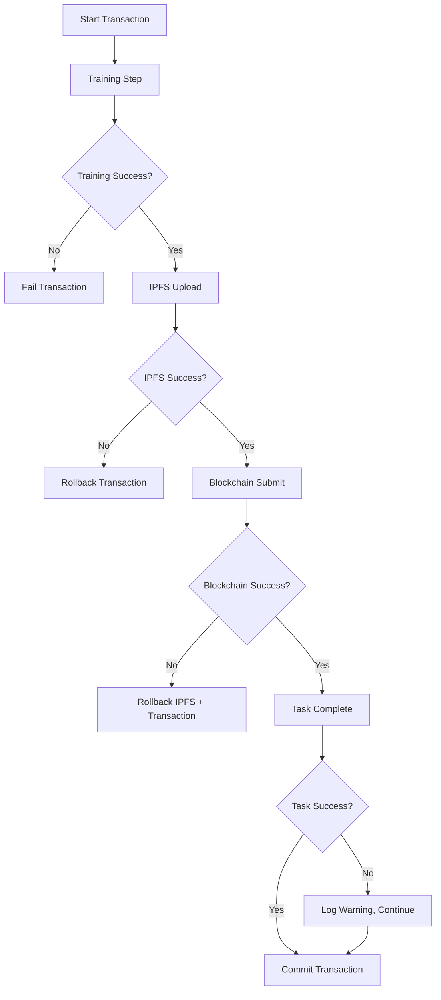

# Mining Engine Error Handling Guide

## 🎯 Overview

This guide documents the comprehensive error handling improvements implemented in the Mining Engine, focusing on atomic transaction semantics, retry mechanisms, and graceful degradation.

## 🔧 Error Handling Architecture

### 1. Exception Hierarchy

```python
Exception
├── RetryableError (Base for retryable errors)
│   ├── NetworkError (Connection, timeout issues)
│   └── ResourceError (Memory, disk space issues)
├── AuthenticationError (Non-retryable auth issues)
└── ValidationError (Input validation failures)
```

### 2. Retry Mechanisms

#### Exponential Backoff Decorator
```python
@exponential_backoff(
    max_retries=3,
    initial_delay=1.0,
    max_delay=60.0,
    backoff_factor=2.0,
    retryable_exceptions=[NetworkError, ConnectionError, TimeoutError]
)
async def network_operation():
    # Your network operation here
    pass
```

#### Error Classification Decorator
```python
@handle_specific_errors
def operation_with_error_handling():
    # Automatically converts standard exceptions to appropriate types
    # ConnectionError -> NetworkError
    # TimeoutError -> NetworkError
    # PermissionError -> AuthenticationError
    # MemoryError -> ResourceError
    pass
```

## 🔄 Atomic Transaction Error Handling

### Transaction States and Error Recovery

| State | Possible Errors | Recovery Action |
|-------|----------------|-----------------|
| `TRAINING` | ResourceError, ValidationError | Fail fast, no rollback needed |
| `IPFS_UPLOAD` | NetworkError, ResourceError | Retry network errors, rollback on failure |
| `BLOCKCHAIN_SUBMIT` | NetworkError, AuthenticationError | Retry network errors, rollback IPFS on failure |
| `TASK_COMPLETE` | NetworkError | Retry, but don't fail transaction |

### Error Handling Flow



## 🛠️ Implementation Details

### 1. IPFS Upload Error Handling

```python
@handle_specific_errors
@exponential_backoff(max_retries=3, retryable_exceptions=[NetworkError, ConnectionError, TimeoutError])
async def _step_ipfs_upload(self, context, miner_address, training_round_id):
    try:
        # Validate serialized data size
        if len(serialized) > 100 * 1024 * 1024:  # 100MB limit
            raise ResourceError(f"Serialized gradient size too large: {len(serialized)} bytes")
        
        # Upload to IPFS (retry logic handled by decorator)
        ipfs_hash = self.ipfs_client.upload_lora_state(serialized)
        
        if not ipfs_hash:
            raise NetworkError("IPFS upload returned empty hash")
        
        # Validate IPFS hash format
        if not ipfs_hash.startswith(('Qm', 'bafy')):
            raise ValueError(f"Invalid IPFS hash format: {ipfs_hash}")
        
        return True
        
    except (NetworkError, ConnectionError, TimeoutError) as e:
        context.error_message = f"IPFS upload network error: {e}"
        context.failed_step = "ipfs_upload"
        raise  # Let decorator handle retry
    except ResourceError as e:
        context.error_message = f"IPFS upload resource error: {e}"
        context.failed_step = "ipfs_upload"
        return False  # Don't retry resource errors
```

### 2. Blockchain Submission Error Handling

```python
@handle_specific_errors
@exponential_backoff(max_retries=3, retryable_exceptions=[NetworkError, ConnectionError, TimeoutError])
async def _step_blockchain_submit(self, context, miner_address, training_round_id, model_version):
    try:
        # Validate blockchain client connection
        if not hasattr(self.blockchain_client, 'get_block_hash'):
            raise AuthenticationError("Blockchain client not properly initialized")
        
        # Submit to blockchain
        response = self.blockchain_client.submit_gradient(...)
        
        # Validate response
        if not response:
            raise NetworkError("Blockchain submission returned empty response")
        
        if not response.get("success"):
            error_msg = response.get("error", "Unknown blockchain error")
            if "insufficient funds" in error_msg.lower():
                raise AuthenticationError(f"Insufficient funds: {error_msg}")
            elif "invalid signature" in error_msg.lower():
                raise AuthenticationError(f"Invalid signature: {error_msg}")
            else:
                raise NetworkError(f"Blockchain submission failed: {error_msg}")
        
        return True
        
    except (NetworkError, ConnectionError, TimeoutError) as e:
        context.error_message = f"Blockchain submission network error: {e}"
        context.failed_step = "blockchain_submit"
        raise  # Let decorator handle retry
    except AuthenticationError as e:
        context.error_message = f"Blockchain submission auth error: {e}"
        context.failed_step = "blockchain_submit"
        return False  # Don't retry auth errors
```

### 3. Rollback Mechanism

```python
async def _rollback_transaction(self, context):
    """Rollback the transaction with enhanced error handling."""
    rollback_errors = []
    
    # Execute rollback actions in reverse order
    for action in reversed(context.rollback_actions):
        try:
            await self._execute_rollback_action(action)
        except Exception as e:
            error_msg = f"Rollback action failed: {action}: {e}"
            rollback_errors.append(error_msg)
    
    # Update context with rollback information
    context.state = TransactionState.ROLLED_BACK
    if rollback_errors:
        context.error_message = f"{context.error_message}. Rollback errors: {'; '.join(rollback_errors)}"
```

## 📊 Monitoring and Observability

### 1. Error Metrics

The atomic coordinator tracks comprehensive error metrics:

```python
{
    "total_transactions": 100,
    "committed_transactions": 85,
    "failed_transactions": 15,
    "rolled_back_transactions": 12,
    "success_rate": 0.85,
    "failure_rate": 0.15,
    "rollback_rate": 0.12,
    "error_breakdown": {
        "network_errors": 8,
        "authentication_errors": 3,
        "resource_errors": 2,
        "validation_errors": 1,
        "unknown_errors": 1
    }
}
```

### 2. Transaction Status Tracking

Each transaction provides detailed status information:

```python
{
    "transaction_id": "mining_tx_1234567890",
    "state": "blockchain_submit",
    "age_seconds": 45.2,
    "failed_step": null,
    "error_message": null,
    "progress": {
        "training": true,
        "ipfs_upload": true,
        "blockchain_submit": false,
        "task_complete": false
    }
}
```

## 🚨 Error Response Strategies

### 1. Network Errors
- **Strategy**: Retry with exponential backoff
- **Max Retries**: 3
- **Backoff**: 1s, 2s, 4s
- **Action**: Log warning, retry automatically

### 2. Authentication Errors
- **Strategy**: Fail fast, no retry
- **Action**: Log error, rollback transaction, alert operator

### 3. Resource Errors
- **Strategy**: Fail fast, no retry
- **Action**: Log error, rollback transaction, check system resources

### 4. Validation Errors
- **Strategy**: Fail fast, no retry
- **Action**: Log error, fix input data, retry manually

## 🔧 Configuration

### Environment Variables

```bash
# Error handling configuration
R3MES_TRANSACTION_TIMEOUT=300          # Transaction timeout in seconds
R3MES_MAX_RETRIES=3                    # Maximum retry attempts
R3MES_RETRY_INITIAL_DELAY=1.0          # Initial retry delay in seconds
R3MES_RETRY_MAX_DELAY=60.0             # Maximum retry delay in seconds
R3MES_RETRY_BACKOFF_FACTOR=2.0         # Exponential backoff factor

# Resource limits
R3MES_MAX_GRADIENT_SIZE_MB=100         # Maximum gradient size in MB
R3MES_MAX_ACTIVE_TRANSACTIONS=10       # Maximum concurrent transactions
```

## 🧪 Testing

### Unit Tests

Run the comprehensive test suite:

```bash
cd miner-engine
python -m pytest tests/test_atomic_coordinator.py -v
```

### Test Coverage

The test suite covers:
- ✅ Successful atomic transactions
- ✅ IPFS failure rollback
- ✅ Blockchain failure rollback
- ✅ Task completion failure (non-critical)
- ✅ Stale transaction cleanup
- ✅ Force transaction cleanup
- ✅ Statistics collection
- ✅ Transaction status tracking

### Integration Tests

```bash
# Test with real IPFS and blockchain (requires setup)
python -m pytest tests/test_integration.py -v --integration
```

## 📋 Troubleshooting

### Common Issues

1. **High Network Error Rate**
   - Check IPFS daemon status
   - Verify blockchain node connectivity
   - Monitor network latency

2. **Authentication Errors**
   - Verify private key configuration
   - Check account balance
   - Validate miner registration

3. **Resource Errors**
   - Monitor GPU memory usage
   - Check disk space
   - Verify gradient size limits

4. **Transaction Timeouts**
   - Increase timeout configuration
   - Check system performance
   - Monitor transaction queue

### Debug Commands

```bash
# Check transaction status
curl http://localhost:8080/stats | jq '.atomic_coordinator'

# Force cleanup stale transactions
curl -X POST http://localhost:8080/cleanup-stale

# Get detailed error breakdown
curl http://localhost:8080/error-breakdown
```

## 🎯 Best Practices

1. **Always use atomic transactions** for mining submissions
2. **Monitor error rates** and set up alerts
3. **Configure appropriate timeouts** based on network conditions
4. **Implement circuit breakers** for external services
5. **Log all errors** with sufficient context
6. **Test rollback mechanisms** regularly
7. **Monitor resource usage** to prevent resource errors
8. **Use structured logging** for better observability

## 🔄 Future Improvements

1. **Circuit Breaker Pattern**: Implement circuit breakers for external services
2. **Adaptive Retry Logic**: Adjust retry parameters based on error patterns
3. **Error Prediction**: Use ML to predict and prevent errors
4. **Advanced Rollback**: Implement more sophisticated rollback mechanisms
5. **Error Recovery**: Automatic recovery from certain error conditions